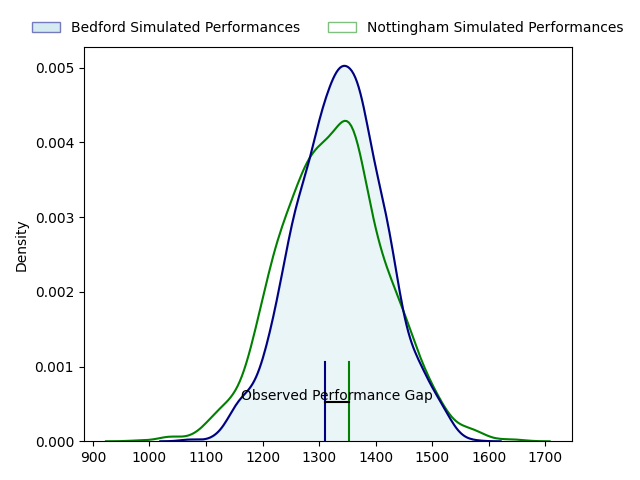
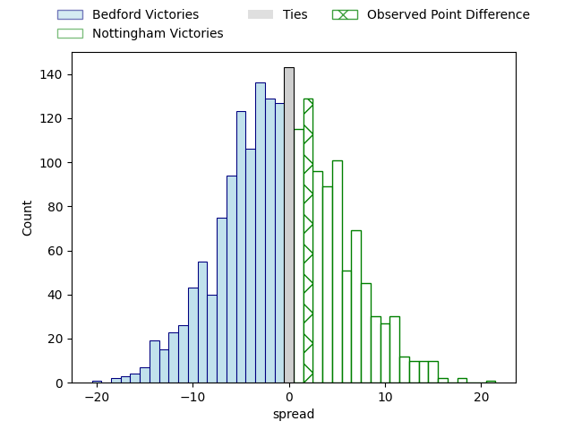

---  
layout: page  
title: Bedford at Nottingham; 24-26  
date: 2023-03-26 16:00:00 18:00:00 -0500  
categories: match review  
---
# Bedford at Nottingham; 24-26

# Club Level Predictions

The first set of predictions treats a club as the smallest object, as the club develops its members, organizes a gameplan, and deploys its players as needed for each match. This club model has a prediction of 0.48, which translates to predicting Bedford to win by 0.7.

Each club has a rating and a rating deviation (simiar to a Glicko system), and expected performances can be generated. This allows for simulated matches and spreads like the ones below.
## Projected Performances

## Projected Spreads

## Projected Results

# Player Level Predictions

Treating teams instead as an entity made up of the currently active players, I have ratings for each player in an altogether different system. These can be combined to form team ratings once teamsheets are announced, weighting starters a bit higher than the reserves. After the match is played, players can be weighted by their minutes on the field, allowing for an accurate measure of the team's composition. With these compiled team ratings, we can make predictions, measure inaccuracy, and update the individual player ratings.
## Prediction with Player Minutes: Bedford by 5.5

Bedford by 9.5 on a neutral field

There were 9 large changes in win probability in this match
## Prediction without Player Minutes: Bedford by 9.7

Bedford by 13.7 on a neutral pitch

|   Away Minutes | Away Player     |   Away elo |   Away Percentile |   Number |   Home Percentile |   Home elo | Home Player               |   Home Minutes |
|---------------:|:----------------|-----------:|------------------:|---------:|------------------:|-----------:|:--------------------------|---------------:|
|             63 | Joey Conway     |      91.39 |                35 |        1 |                50 |      95.09 | Aniseko Sio               |             54 |
|             63 | James Fish      |      94.07 |                47 |        2 |                62 |      98.47 | Harry Clayton             |             63 |
|             49 | Ed Prowse       |     108.93 |                87 |        3 |                28 |      91.58 | Xavier Valentine          |             54 |
|             63 | Robin Williams  |     111.47 |                85 |        4 |                81 |     108.79 | Callum Allen              |             63 |
|             80 | Tom Lockett     |     103.32 |                76 |        5 |                61 |      99.25 | Iosefa Danny Wayne Fiaola |             80 |
|             80 | Luke Frost      |     112.98 |                87 |        6 |                65 |     100.68 | Carl Kirwan               |             80 |
|             30 | Kayde Sylvester |      83.66 |                15 |        7 |                92 |     119.91 | Nathan Tweedy             |             80 |
|             80 | Tui Uru         |      86.51 |                22 |        8 |                24 |      87.54 | George Cox                |             80 |
|             80 | Alex Day        |     126.49 |                97 |        9 |                44 |      93.41 | Micheal Stronge           |             63 |
|             63 | William Maisey  |     145.67 |                98 |       10 |                19 |      85.17 | Sam Hollingsworth         |             63 |
|             80 | Dean Adamson    |      97.65 |                55 |       11 |                75 |     105.59 | Tayie Ryan Olowofela      |             80 |
|             80 | Joel Matavesi   |      91.62 |                38 |       12 |               nan |      95    | Charlie Thacker           |             80 |
|             49 | Jamie Elliott   |      92.42 |                40 |       13 |                16 |      83.49 | John Joseph Neville       |             80 |
|             80 | Sean French     |      95.28 |                47 |       14 |                24 |      87.37 | David Williams            |             80 |
|             63 | George Hendy    |      95.63 |                48 |       15 |                32 |      89.19 | Jordan Kehinde Olowofela  |             80 |
|             50 | Charles Rylands |      88.1  |                32 |       16 |                 3 |      70.39 | Toby Williams             |             26 |
|             31 | Corrie Barrett  |      85.79 |                25 |       17 |                67 |     100.15 | Dan Richardson            |             26 |
|             31 | Ethan Grayson   |     114.19 |                90 |       18 |                64 |     101.85 | Jack Dickinson            |             17 |
|             17 | Monty Royston   |      97.65 |               nan |       19 |                39 |      94.07 | Jack Shine                |             17 |
|             17 | Jake Garside    |      94.8  |                47 |       20 |                27 |      88.53 | Sam Edwards               |             17 |
|             17 | Jack Hughes     |     103.79 |                79 |       21 |                27 |      88.3  | Morgan Bunting            |             17 |
|             17 | Emeka Atuanya   |      94.83 |               nan |       22 |               nan |     nan    | nan                       |            nan |
|             17 | Louis Grimoldby |      90.32 |                32 |       23 |               nan |     nan    | nan                       |            nan |

