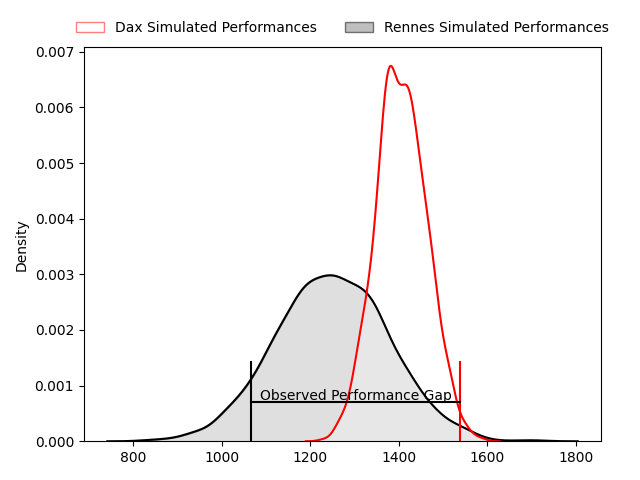
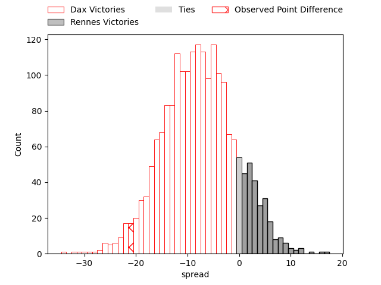
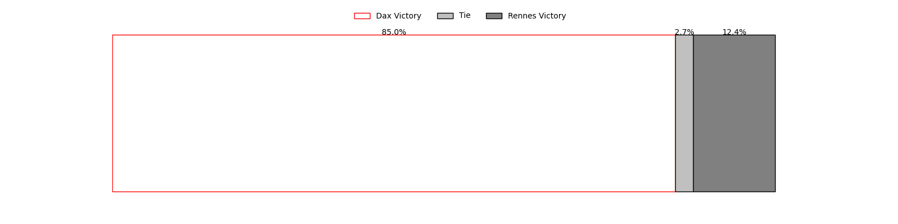

---  
layout: page  
title: Dax at Rennes; 27-6  
date: 2023-03-26 15:00:00 18:00:00 -0500  
categories: match review  
---
# Dax at Rennes; 27-6

# Club Level Predictions

The first set of predictions treats a club as the smallest object, as the club develops its members, organizes a gameplan, and deploys its players as needed for each match. This club model has a prediction of 0.29, which translates to predicting Dax to win by 7.9.

Each club has a rating and a rating deviation (simiar to a Glicko system), and expected performances can be generated. This allows for simulated matches and spreads like the ones below.
## Projected Performances

## Projected Spreads

## Projected Results

# Player Level Predictions

Treating teams instead as an entity made up of the currently active players, I have ratings for each player in an altogether different system. These can be combined to form team ratings once teamsheets are announced, weighting starters a bit higher than the reserves. After the match is played, players can be weighted by their minutes on the field, allowing for an accurate measure of the team's composition. With these compiled team ratings, we can make predictions, measure inaccuracy, and update the individual player ratings.
## Prediction with Player Minutes: Dax by 1.3

Dax by 5.3 on a neutral field

There were 6 large changes in win probability in this match
## Prediction without Player Minutes: Dax by 0.3

Dax by 4.3 on a neutral pitch

|   Away Minutes | Away Player          |   Away elo |   Away Percentile |   Number |   Home Percentile |   Home elo | Home Player          |   Home Minutes |
|---------------:|:---------------------|-----------:|------------------:|---------:|------------------:|-----------:|:---------------------|---------------:|
|             55 | Asa Faitotoa         |     117.58 |                93 |        1 |                70 |     102.84 | Grégory Querin       |             51 |
|             55 | Louis Barrere        |      94.61 |                42 |        2 |                13 |      82.49 | Alexandre Fau        |             55 |
|             55 | Diogo Hasse Ferreira |      85.16 |                16 |        3 |                42 |      95.32 | Luvuyo Pupuma        |             57 |
|             65 | Brice Ferrer         |      78.36 |                 9 |        4 |                27 |      90.99 | Gabriel Quesmel      |             55 |
|             65 | Matt Luamanu         |      86.69 |                23 |        5 |                60 |      98.67 | Clément Fontaine     |             80 |
|             80 | Arnaud Aletti        |      99.16 |                60 |        6 |                70 |     103.23 | Baptiste Beaujouan   |             80 |
|             80 | Diaby Doucouré       |      81.23 |                15 |        7 |                 9 |      82.17 | Pedro Ortega         |             57 |
|             80 | Paul Arnaud Ausset   |     108.77 |                81 |        8 |                61 |     101.79 | Guillaume Cazette    |             30 |
|             55 | Simon Garrouteigt    |      86.47 |                22 |        9 |                34 |      90.56 | Maxime Le Viavant    |             57 |
|             80 | Hugo Cerisier        |      90.74 |                33 |       10 |                42 |      92.99 | Lucas Ollion         |             80 |
|             80 | Théo Gatelier        |     104.08 |                71 |       11 |                12 |      80.05 | Romuald François     |             55 |
|             65 | Ilikena Bolakoro     |      86.81 |                25 |       12 |                52 |      96.9  | Ryan Dubois          |             80 |
|             80 | Sylvère Reteau       |      98.78 |                59 |       13 |                48 |      95.95 | Clément Lepresle     |             80 |
|             80 | Guillaume Bouche     |     115.93 |                88 |       14 |                72 |     105.8  | Enzo Salvai          |             80 |
|             65 | Théo Duprat          |     106.88 |                75 |       15 |                21 |      85.1  | Pedro Soto           |             80 |
|             25 | Louis Mary           |     104.51 |                77 |       16 |                22 |      87.41 | Baptiste Le Jallé    |             29 |
|             25 | Elvis Levi           |     130.6  |                98 |       17 |                72 |     101.73 | Patrick Tu'ugahala   |             25 |
|             25 | Thibaud Dréan        |      67.82 |                 2 |       18 |                28 |      89.57 | Atonio Ulutuipalelei |             23 |
|             15 | Étienne Loiret       |      90.88 |                34 |       19 |                19 |      84.64 | Victor Fromenteze    |             25 |
|             15 | Yoan Gaune           |     109.92 |                84 |       20 |                 3 |      67.14 | Gaétan Béraud        |             50 |
|             25 | Jules Bousquet       |      95.33 |               nan |       21 |                60 |      98.18 | Victor Danielli      |             23 |
|             15 | Hugo Fourquet        |     109.73 |                81 |       22 |                87 |     119.38 | Joaquin Diaz Luzzi   |             23 |
|             15 | Julien Dechavanne    |      88.98 |                29 |       23 |                61 |     104.22 | Hypolite Cornu       |             25 |

