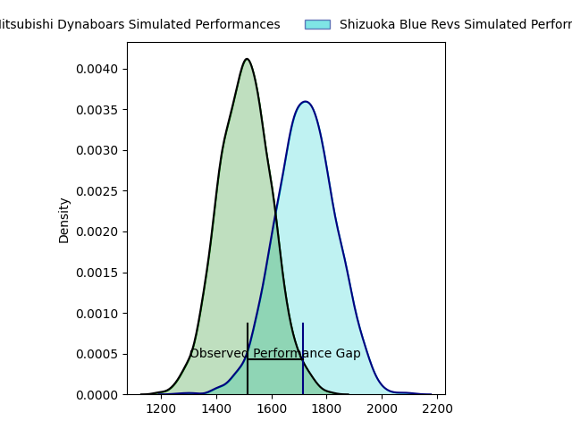
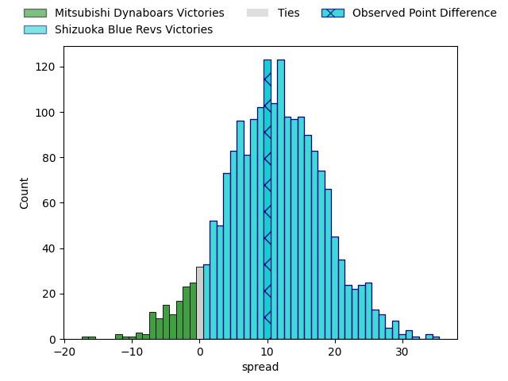
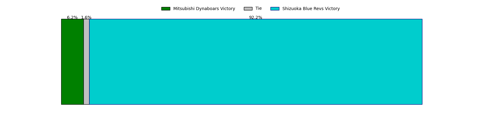

---  
layout: page  
title: Mitsubishi Dynaboars at Shizuoka Blue Revs; 20-30  
date: 2023-03-26 00:00:00 18:00:00 -0500  
categories: match review  
---
# Mitsubishi Dynaboars at Shizuoka Blue Revs; 20-30

# Club Level Predictions

The first set of predictions treats a club as the smallest object, as the club develops its members, organizes a gameplan, and deploys its players as needed for each match. This club model has a prediction of 0.767, which translates to predicting Shizuoka Blue Revs to win by 10.8.

Each club has a rating and a rating deviation (simiar to a Glicko system), and expected performances can be generated. This allows for simulated matches and spreads like the ones below.
## Projected Performances

## Projected Spreads

## Projected Results

# Player Level Predictions

Treating teams instead as an entity made up of the currently active players, I have ratings for each player in an altogether different system. These can be combined to form team ratings once teamsheets are announced, weighting starters a bit higher than the reserves. After the match is played, players can be weighted by their minutes on the field, allowing for an accurate measure of the team's composition. With these compiled team ratings, we can make predictions, measure inaccuracy, and update the individual player ratings.
## Prediction with Player Minutes: Shizuoka Blue Revs by 31.8

Shizuoka Blue Revs by 27.8 on a neutral field

There were 7 large changes in win probability in this match
## Prediction without Player Minutes: Shizuoka Blue Revs by 27.9

Shizuoka Blue Revs by 23.9 on a neutral pitch

|   Away Minutes | Away Player            |   Away elo |   Away Percentile |   Number |   Home Percentile |   Home elo | Home Player        |   Home Minutes |
|---------------:|:-----------------------|-----------:|------------------:|---------:|------------------:|-----------:|:-------------------|---------------:|
|             72 | Hayato Hosoda          |      73.8  |                 5 |        1 |                81 |     105.45 | Kazuhiro Kawata    |             80 |
|             72 | Yuki Miyazato          |      78.42 |                 8 |        2 |                75 |     102.99 | Takeshi Hino       |             80 |
|             63 | Tomoaki Ishii          |     134.39 |                98 |        3 |                86 |     108.28 | Heiichiro Ito      |             63 |
|             80 | Daniel Linde           |      83.43 |                17 |        4 |                97 |     130.11 | Eishin Kuwano      |             50 |
|             80 | Walt Steenkamp         |      77.28 |                10 |        5 |                75 |     105.06 | Murray Douglas     |             80 |
|             80 | Masataka Tsuruya       |     111.31 |                84 |        6 |                87 |     114.7  | Yuya Odo           |             80 |
|             72 | Yusuke Sakamoto        |      86.92 |                23 |        7 |                69 |     102.96 | Richard Goh Jones  |             80 |
|             80 | Jackson Hemopo         |      76.84 |                 9 |        8 |                46 |      95.73 | Malgene Ilaua      |             72 |
|             80 | Kota Iwamura           |      96.43 |                53 |        9 |                76 |     105.13 | Bryn Hall          |             80 |
|             80 | Jamie Shillcock        |      68.77 |                 3 |       10 |                60 |      99.69 | Kenta Iemura       |             80 |
|             80 | Honeti Taumoha'apai    |     105.14 |                75 |       11 |                80 |     107.9  | Keagan Faria       |             80 |
|             80 | Brackin Karauria-Henry |      76.46 |                13 |       12 |                75 |     106.12 | Viliami Tahitu'a   |             80 |
|             80 | Curtis Rona            |      79.96 |                12 |       13 |                97 |     131.74 | Hiroto Kobayashi   |             70 |
|             40 | Nozomi Nara            |      95.38 |                48 |       14 |                55 |      97.48 | Chikara Ito        |             80 |
|             72 | Roland Alaiasa         |      78.65 |                13 |       15 |                46 |      94.48 | Sam Greene         |             40 |
|             17 | Mototsugu Hachiya      |      90.71 |                47 |       16 |                50 |      96.55 | Tomokazu Kira      |             40 |
|             40 | Epineri Uluviti        |      82.16 |                22 |       17 |                59 |      98.57 | Samuela Anise      |             30 |
|              8 | Yoshimitsu Yasue       |      88.2  |                44 |       18 |                33 |      88.26 | Takayoshi Mohara   |             17 |
|              8 | Shunsuke Sakamoto      |      80.28 |                13 |       19 |                35 |      91.37 | Clinton Ryno Swart |             10 |
|              8 | Koki Sato              |      72.86 |                 5 |       20 |                26 |      85.61 | Shoji Takuma       |              8 |
|              8 | Kazuki Ishida          |      89.63 |                34 |       21 |               nan |     nan    | nan                |            nan |

