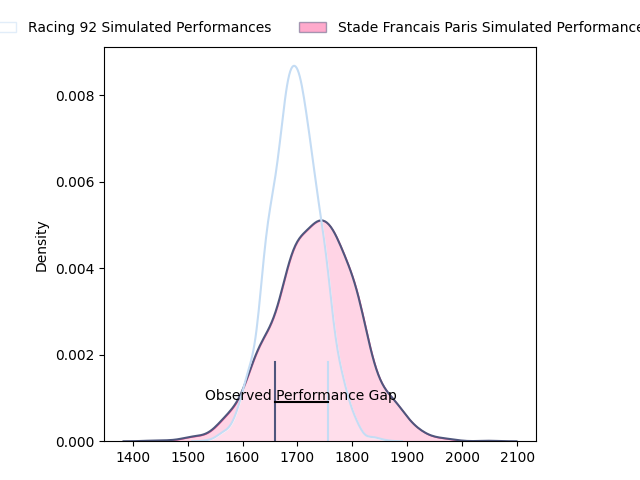
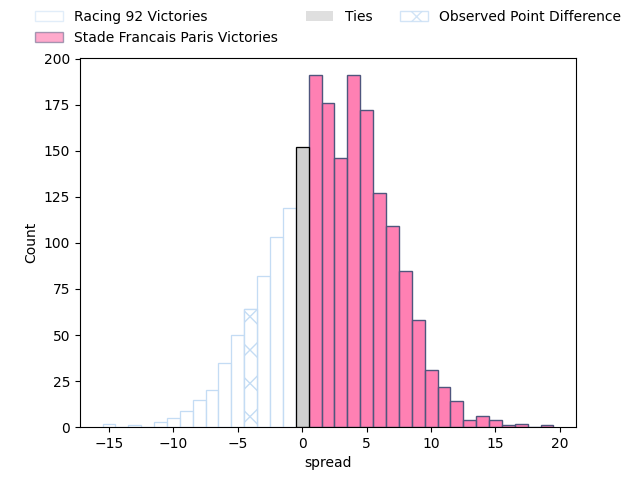

---  
layout: page  
title: Racing 92 at Stade Francais Paris; 17-13  
date: 2023-03-26 21:05:00 18:00:00 -0500  
categories: match review  
---
# Racing 92 at Stade Francais Paris; 17-13

# Club Level Predictions

The first set of predictions treats a club as the smallest object, as the club develops its members, organizes a gameplan, and deploys its players as needed for each match. This club model has a prediction of 0.564, which translates to predicting Stade Francais Paris to win by 2.3.

Each club has a rating and a rating deviation (simiar to a Glicko system), and expected performances can be generated. This allows for simulated matches and spreads like the ones below.
## Projected Performances

## Projected Spreads

## Projected Results

# Player Level Predictions

Treating teams instead as an entity made up of the currently active players, I have ratings for each player in an altogether different system. These can be combined to form team ratings once teamsheets are announced, weighting starters a bit higher than the reserves. After the match is played, players can be weighted by their minutes on the field, allowing for an accurate measure of the team's composition. With these compiled team ratings, we can make predictions, measure inaccuracy, and update the individual player ratings.
## Prediction with Player Minutes: Stade Francais Paris by 12.8

Stade Francais Paris by 8.8 on a neutral field

There were 12 large changes in win probability in this match
## Prediction without Player Minutes: Stade Francais Paris by 11.7

Stade Francais Paris by 7.7 on a neutral pitch

|   Away Minutes | Away Player                                                                |   Away elo |   Away Percentile |   Number |   Home Percentile |   Home elo | Home Player                                                                  |   Home Minutes |
|---------------:|:---------------------------------------------------------------------------|-----------:|------------------:|---------:|------------------:|-----------:|:-----------------------------------------------------------------------------|---------------:|
|             52 | [Eddy Ben Arous](..//playerfiles//EddyBenArous_cleaned.md)                 |      90.73 |                32 |        1 |                52 |      95.58 | [Moses Eneliko Alo-Emile](..//playerfiles//MosesEnelikoAlo-Emile_cleaned.md) |             67 |
|             61 | [Janick Tarrit](..//playerfiles//JanickTarrit_cleaned.md)                  |      81.45 |                11 |        2 |                56 |      96.82 | [Mickaël Ivaldi](..//playerfiles//MickaëlIvaldi_cleaned.md)                  |             63 |
|             52 | [Trevor Ntando Nyakane](..//playerfiles//TrevorNtandoNyakane_cleaned.md)   |     100.7  |                71 |        3 |                67 |     100.1  | [Giorgi Melikidze](..//playerfiles//GiorgiMelikidze_cleaned.md)              |             53 |
|             80 | [Fabien Sanconnie](..//playerfiles//FabienSanconnie_cleaned.md)            |      88.76 |                30 |        4 |                53 |      96.39 | [Paul Gabrillagues](..//playerfiles//PaulGabrillagues_cleaned.md)            |             80 |
|             80 | [Veikoso Poloniati](..//playerfiles//VeikosoPoloniati_cleaned.md)          |      83.64 |                17 |        5 |                37 |      91.43 | [Marcos Kremer](..//playerfiles//MarcosKremer_cleaned.md)                    |             80 |
|             53 | [Ibrahim Diallo](..//playerfiles//IbrahimDiallo_cleaned.md)                |      86.55 |                21 |        6 |                58 |      98.57 | [Romain Briatte](..//playerfiles//RomainBriatte_cleaned.md)                  |             66 |
|             53 | [Baptiste Chouzenoux](..//playerfiles//BaptisteChouzenoux_cleaned.md)      |      88.54 |                28 |        7 |                72 |     104.74 | [Sekou Macalou](..//playerfiles//SekouMacalou_cleaned.md)                    |             80 |
|             34 | [Anthime Hemery](..//playerfiles//AnthimeHemery_cleaned.md)                |      93.97 |               nan |        8 |                63 |      98.29 | [Giovanni Habel Kuffner](..//playerfiles//GiovanniHabelKuffner_cleaned.md)   |             80 |
|             80 | [Nolann Le Garrec](..//playerfiles//NolannLeGarrec_cleaned.md)             |     105.11 |                75 |        9 |                69 |     102.32 | [Morgan Parra](..//playerfiles//MorganParra_cleaned.md)                      |             21 |
|             80 | [Antoine Gibert](..//playerfiles//AntoineGibert_cleaned.md)                |      83.18 |                18 |       10 |                30 |      89.68 | [Joris Segonds](..//playerfiles//JorisSegonds_cleaned.md)                    |             80 |
|             60 | [Vinaya Habosi](..//playerfiles//VinayaHabosi_cleaned.md)                  |      87.15 |                23 |       11 |                49 |      95.78 | [Lester Etien](..//playerfiles//LesterEtien_cleaned.md)                      |             80 |
|             80 | [Henry Chavancy](..//playerfiles//HenryChavancy_cleaned.md)                |      82.44 |                15 |       12 |                83 |     111.15 | [Julien Delbouis](..//playerfiles//JulienDelbouis_cleaned.md)                |             80 |
|             80 | [Francis Saili](..//playerfiles//FrancisSaili_cleaned.md)                  |      94.98 |                47 |       13 |                52 |      96.74 | [Jeremy Charles Ward](..//playerfiles//JeremyCharlesWard_cleaned.md)         |             80 |
|             80 | [Christian Wade](..//playerfiles//ChristianWade_cleaned.md)                |      98.2  |                57 |       14 |               nan |      94.63 | [Harry Glover](..//playerfiles//HarryGlover_cleaned.md)                      |             51 |
|             74 | [Max Spring](..//playerfiles//MaxSpring_cleaned.md)                        |      85.77 |                22 |       15 |                77 |     104.7  | [Léo Barré](..//playerfiles//LéoBarré_cleaned.md)                            |             71 |
|             46 | [Boris Palu](..//playerfiles//BorisPalu_cleaned.md)                        |      88.56 |                27 |       16 |                16 |      80.87 | [James Hall](..//playerfiles//JamesHall_cleaned.md)                          |             59 |
|             28 | [Guram Gogichashvili](..//playerfiles//GuramGogichashvili_cleaned.md)      |      98.4  |                62 |       17 |                32 |      89.89 | [Peniasi Dakuwaqa](..//playerfiles//PeniasiDakuwaqa_cleaned.md)              |             29 |
|             28 | [Gia Kharaishvili](..//playerfiles//GiaKharaishvili_cleaned.md)            |     104.05 |                78 |       18 |                44 |      93.64 | [Paul Alo-Emile](..//playerfiles//PaulAlo-Emile_cleaned.md)                  |             27 |
|             27 | [Wenceslas Lauret](..//playerfiles//WenceslasLauret_cleaned.md)            |      95.46 |                49 |       19 |                28 |      87.61 | [Kylan Hamdaoui](..//playerfiles//KylanHamdaoui_cleaned.md)                  |              9 |
|             27 | [Cameron Woki](..//playerfiles//CameronWoki_cleaned.md)                    |      98.08 |                58 |       20 |                42 |      92.65 | [Laurent Panis](..//playerfiles//LaurentPanis_cleaned.md)                    |             17 |
|             20 | [Warrick Wayne Gelant](..//playerfiles//WarrickWayneGelant_cleaned.md)     |      96.9  |                51 |       21 |                18 |      83.81 | [Mathieu Hirigoyen](..//playerfiles//MathieuHirigoyen_cleaned.md)            |             14 |
|             19 | [Peniami Nasali Narisia](..//playerfiles//PeniamiNasaliNarisia_cleaned.md) |      90.64 |                35 |       22 |               nan |      92.36 | [Vasil Kakovin](..//playerfiles//VasilKakovin_cleaned.md)                    |             13 |
|              6 | [Ben Volavola](..//playerfiles//BenVolavola_cleaned.md)                    |      91.84 |               nan |       23 |               nan |     nan    | nan                                                                          |            nan |

