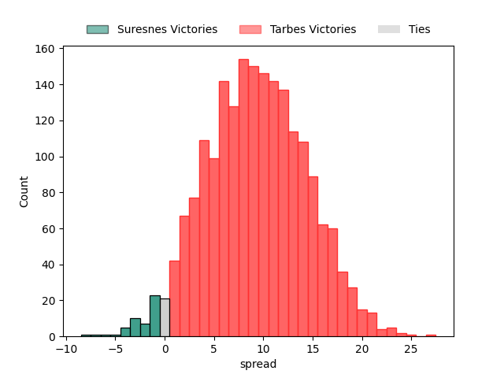

---  
layout: page  
title: Suresnes at Tarbes; 19-19  
date: 2023-03-26 15:00:00 18:00:00 -0500  
categories: match review  
---
# Suresnes at Tarbes; 19-19

# Club Level Predictions

The first set of predictions treats a club as the smallest object, as the club develops its members, organizes a gameplan, and deploys its players as needed for each match. This club model has a prediction of 0.741, which translates to predicting Tarbes to win by 9.3.

Each club has a rating and a rating deviation (simiar to a Glicko system), and expected performances can be generated. This allows for simulated matches and spreads like the ones below.
## Projected Performances

## Projected Spreads

## Projected Results

# Player Level Predictions

Treating teams instead as an entity made up of the currently active players, I have ratings for each player in an altogether different system. These can be combined to form team ratings once teamsheets are announced, weighting starters a bit higher than the reserves. After the match is played, players can be weighted by their minutes on the field, allowing for an accurate measure of the team's composition. With these compiled team ratings, we can make predictions, measure inaccuracy, and update the individual player ratings.
## Prediction with Player Minutes: Tarbes by 16.3

Tarbes by 12.3 on a neutral field

There were 1 large changes in win probability in this match
## Prediction without Player Minutes: Tarbes by 20.0

Tarbes by 16.0 on a neutral pitch

|   Away Minutes | Away Player                                                                  |   Away elo |   Away Percentile |   Number |   Home Percentile |   Home elo | Home Player                                                                 |   Home Minutes |
|---------------:|:-----------------------------------------------------------------------------|-----------:|------------------:|---------:|------------------:|-----------:|:----------------------------------------------------------------------------|---------------:|
|             44 | [Beka Kakabadze](..//playerfiles//BekaKakabadze_cleaned.md)                  |      91.01 |               nan |        1 |                38 |      92.4  | [Antoine Palisse](..//playerfiles//AntoinePalisse_cleaned.md)               |             49 |
|             60 | [Thomas Bordes](..//playerfiles//ThomasBordes_cleaned.md)                    |      84.16 |                18 |        2 |                84 |     108.42 | [Enzo Mondon](..//playerfiles//EnzoMondon_cleaned.md)                       |             49 |
|             69 | [Leandro Mario Assi](..//playerfiles//LeandroMarioAssi_cleaned.md)           |      90.61 |                37 |        3 |                23 |      85.84 | [Aleksi Tchitchiashvili](..//playerfiles//AleksiTchitchiashvili_cleaned.md) |             25 |
|             67 | [Florian Desbordes](..//playerfiles//FlorianDesbordes_cleaned.md)            |      81.82 |                12 |        4 |                59 |      98.36 | [Aurelien Ricart](..//playerfiles//AurelienRicart_cleaned.md)               |             49 |
|             80 | [Wian Vosloo](..//playerfiles//WianVosloo_cleaned.md)                        |      83.49 |                17 |        5 |                47 |      94.54 | [Antoine Bousquet](..//playerfiles//AntoineBousquet_cleaned.md)             |             80 |
|             74 | [Louis-Mathieu Jazeix](..//playerfiles//Louis-MathieuJazeix_cleaned.md)      |      89.35 |                29 |        6 |                75 |     103.62 | [Mattéo Coustalat](..//playerfiles//MattéoCoustalat_cleaned.md)             |             52 |
|             80 | [Bastien Berenguel](..//playerfiles//BastienBerenguel_cleaned.md)            |      97.94 |                56 |        7 |                78 |     107.13 | [Léo Saint-Guilhem](..//playerfiles//LéoSaint-Guilhem_cleaned.md)           |             80 |
|             80 | [Antonie Delport Claasen](..//playerfiles//AntonieDelportClaasen_cleaned.md) |      88.48 |                23 |        8 |                38 |      93.14 | [Willem Leon Massyn](..//playerfiles//WillemLeonMassyn_cleaned.md)          |             80 |
|             74 | [Théo Bachiri](..//playerfiles//ThéoBachiri_cleaned.md)                      |      82.53 |                15 |        9 |                24 |      87.25 | [Thibaut Dulucq](..//playerfiles//ThibautDulucq_cleaned.md)                 |             63 |
|             80 | [Ignacio Mieres](..//playerfiles//IgnacioMieres_cleaned.md)                  |      88.46 |                27 |       10 |                72 |     104.07 | [Anthony  Fuertes](..//playerfiles//AnthonyFuertes_cleaned.md)              |             80 |
|             80 | [Alexis Clement](..//playerfiles//AlexisClement_cleaned.md)                  |      82.01 |                14 |       11 |                85 |     112.88 | [Jonathan Duffau](..//playerfiles//JonathanDuffau_cleaned.md)               |             80 |
|             80 | [Arthur Proult](..//playerfiles//ArthurProult_cleaned.md)                    |      90.96 |                35 |       12 |                59 |      97.13 | [Josaia Vakacegu](..//playerfiles//JosaiaVakacegu_cleaned.md)               |             75 |
|             80 | [Lilan Savioz Fouillet](..//playerfiles//LilanSaviozFouillet_cleaned.md)     |      91.8  |                38 |       13 |                50 |      96.3  | [Alofa Alofa](..//playerfiles//AlofaAlofa_cleaned.md)                       |             80 |
|             80 | [Pierre Le Huby](..//playerfiles//PierreLeHuby_cleaned.md)                   |      89.07 |                37 |       14 |                 1 |      57.91 | [Maxime Oltmann](..//playerfiles//MaximeOltmann_cleaned.md)                 |             40 |
|             80 | [Goulwen Gueho](..//playerfiles//GoulwenGueho_cleaned.md)                    |      74.11 |                 8 |       15 |                74 |     105.05 | [William Pees](..//playerfiles//WilliamPees_cleaned.md)                     |             80 |
|             36 | [Sébastien Lafrancesca](..//playerfiles//SébastienLafrancesca_cleaned.md)    |      93.77 |                31 |       16 |                12 |      81.42 | [Alexandre Combier](..//playerfiles//AlexandreCombier_cleaned.md)           |             31 |
|             20 | [Hayam El Bibouji](..//playerfiles//HayamElBibouji_cleaned.md)               |      85.94 |                19 |       17 |                66 |      99.82 | [Johan Mees Erasmus](..//playerfiles//JohanMeesErasmus_cleaned.md)          |             31 |
|             11 | [Victor Damian Arias](..//playerfiles//VictorDamianArias_cleaned.md)         |      99.82 |                66 |       18 |                10 |      83.37 | [Alexandre Duny](..//playerfiles//AlexandreDuny_cleaned.md)                 |             55 |
|             13 | [Sacha Yahi](..//playerfiles//SachaYahi_cleaned.md)                          |      65.27 |                 3 |       19 |                 4 |      66.63 | [Paul Sajous](..//playerfiles//PaulSajous_cleaned.md)                       |             31 |
|              6 | [Youssouf Yatera](..//playerfiles//YoussoufYatera_cleaned.md)                |      88.81 |                36 |       20 |                26 |      88.17 | [Loan Real](..//playerfiles//LoanReal_cleaned.md)                           |             28 |
|              6 | [Quentin Dauvergne](..//playerfiles//QuentinDauvergne_cleaned.md)            |      79.3  |                12 |       21 |                29 |      87.92 | [Alexis Levron](..//playerfiles//AlexisLevron_cleaned.md)                   |             17 |
|            nan | nan                                                                          |     nan    |               nan |       22 |                32 |      88.35 | [Julien Cantan](..//playerfiles//JulienCantan_cleaned.md)                   |              5 |
|            nan | nan                                                                          |     nan    |               nan |       23 |                18 |      83    | [Thibaut Trotta](..//playerfiles//ThibautTrotta_cleaned.md)                 |             40 |

