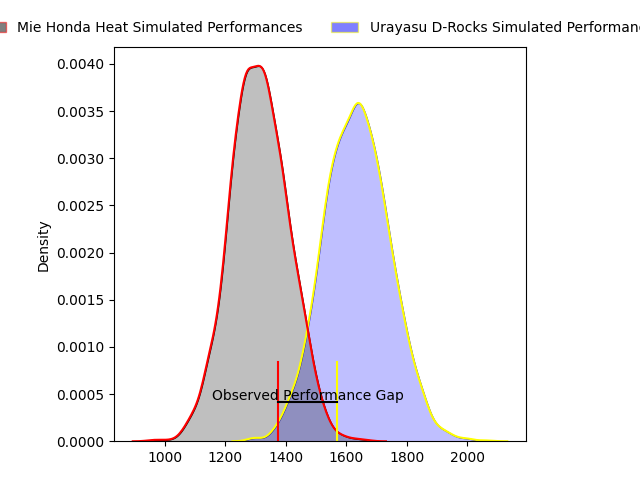
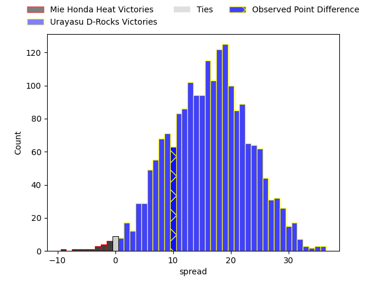

---  
layout: page  
title: Mie Honda Heat at Urayasu D-Rocks; 10-20  
date: 2023-03-26 00:00:00 18:00:00 -0500  
categories: match review  
---
# Mie Honda Heat at Urayasu D-Rocks; 10-20

# Club Level Predictions

The first set of predictions treats a club as the smallest object, as the club develops its members, organizes a gameplan, and deploys its players as needed for each match. This club model has a prediction of 0.856, which translates to predicting Urayasu D-Rocks to win by 16.2.

Each club has a rating and a rating deviation (simiar to a Glicko system), and expected performances can be generated. This allows for simulated matches and spreads like the ones below.
## Projected Performances

## Projected Spreads

## Projected Results

# Player Level Predictions

Treating teams instead as an entity made up of the currently active players, I have ratings for each player in an altogether different system. These can be combined to form team ratings once teamsheets are announced, weighting starters a bit higher than the reserves. After the match is played, players can be weighted by their minutes on the field, allowing for an accurate measure of the team's composition. With these compiled team ratings, we can make predictions, measure inaccuracy, and update the individual player ratings.
## Prediction with Player Minutes: Urayasu D-Rocks by 17.1

Urayasu D-Rocks by 13.1 on a neutral field

There were 6 large changes in win probability in this match
## Prediction without Player Minutes: Urayasu D-Rocks by 18.5

Urayasu D-Rocks by 14.5 on a neutral pitch

|   Away Minutes | Away Player           |   Away elo |   Away Percentile |   Number |   Home Percentile |   Home elo | Home Player             |   Home Minutes |
|---------------:|:----------------------|-----------:|------------------:|---------:|------------------:|-----------:|:------------------------|---------------:|
|             33 | Tatsuhiko Tsurukawa   |     100.5  |                69 |        1 |                55 |      96.52 | Kabuto Anoku            |             60 |
|             61 | Lee Seung Hyok        |     101.82 |                72 |        2 |                79 |     106.76 | Shokei Kin              |             60 |
|             61 | Taiki Yoshioka        |     100.24 |                68 |        3 |                27 |      89.46 | Syuhei Takeuchi         |             76 |
|             61 | Viliami Vuli          |      96.36 |               nan |        4 |                50 |      95.74 | Ryeongji Kim            |             76 |
|             80 | Francois John Mostert |     114.48 |                89 |        5 |                87 |     113.81 | Lourens Jacobus Erasmus |             80 |
|             80 | Ryota Kobayashi       |     100.21 |                63 |        6 |                88 |     114.99 | Jimmy Tupou             |             80 |
|             80 | Ryo Furuta            |      98.65 |                58 |        7 |                88 |     115.37 | Tetta Shigemitsu        |             80 |
|             65 | Pablo Matera          |     110.44 |                84 |        8 |                86 |     112.44 | Liam Gill               |             67 |
|             65 | Kenta Yamaji          |     104.55 |                75 |        9 |                88 |     113.41 | Ren Iinuma              |             55 |
|             80 | Gwangtee Oh           |     120.54 |                90 |       10 |                85 |     115.04 | Otere Black             |             55 |
|             65 | Naoki Motomura        |     118.38 |                90 |       11 |                97 |     132.44 | Kai Ishii               |             80 |
|             80 | Fraser Quirk          |     110.68 |                82 |       12 |                73 |     105    | Samisoni Ahokovi Tua    |             71 |
|             80 | Clinton Knox          |      86.27 |                23 |       13 |                95 |     125.42 | Shane Edwards Gates     |             80 |
|             80 | Yoshizaku Fujita      |     114.44 |                87 |       14 |                97 |     133.61 | Larry Steven Sulunga    |             80 |
|             80 | Thomas Banks          |     112.94 |                86 |       15 |                98 |     135.62 | Takuhei Yasuda          |             80 |
|             47 | Takumi Fuji           |      69.18 |                 3 |       16 |                74 |     105.41 | Hayden Cripps           |             25 |
|             19 | Matthys Basson        |     101.56 |                58 |       17 |                86 |     110.93 | Greig Laidlaw           |             25 |
|             19 | Tateo Kanai           |     150.98 |                99 |       18 |                24 |      90.53 | Kazuma Nishikawa        |             20 |
|             19 | Masaki Kondo          |     101.04 |               nan |       19 |                74 |     107.97 | Ryuji Fujimura          |             20 |
|             15 | Kosuke Hattori        |      97.57 |               nan |       20 |                89 |     119.22 | Shingo Nakashima        |             13 |
|             15 | Shogo Nezuka          |      96.75 |                34 |       21 |                99 |     145.38 | Tone Tukufuka           |              9 |
|             15 | Dawid Kellerman       |      94.46 |                46 |       22 |                96 |     127.86 | Yuta Kojima             |              4 |
|            nan | nan                   |     nan    |               nan |       23 |               nan |      95    | Hidetomo Nabeshima      |              4 |

