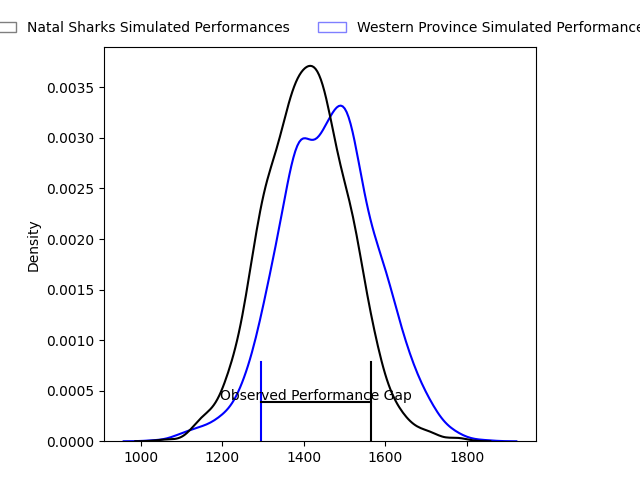
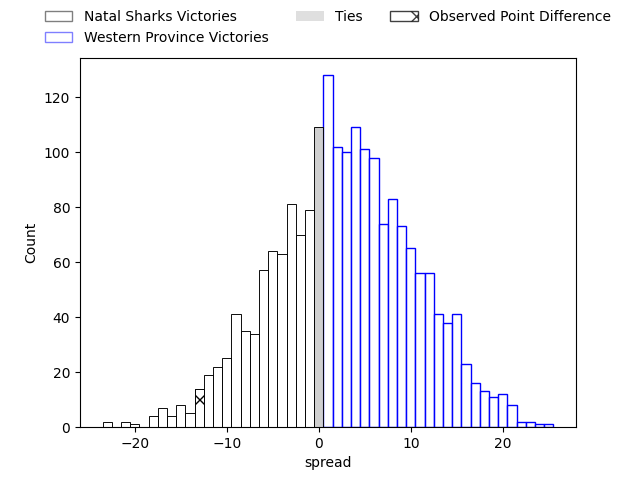
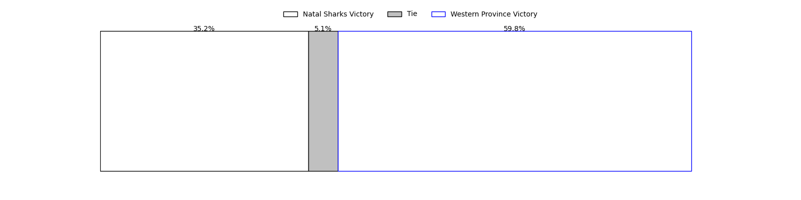

---  
layout: page  
title: Natal Sharks at Western Province; 20-7  
date: 2023-03-26 14:00:00 18:00:00 -0500  
categories: match review  
---
# Natal Sharks at Western Province; 20-7

# Club Level Predictions

The first set of predictions treats a club as the smallest object, as the club develops its members, organizes a gameplan, and deploys its players as needed for each match. This club model has a prediction of 0.572, which translates to predicting Western Province to win by 2.7.

Each club has a rating and a rating deviation (simiar to a Glicko system), and expected performances can be generated. This allows for simulated matches and spreads like the ones below.
## Projected Performances

## Projected Spreads

## Projected Results

# Player Level Predictions

Treating teams instead as an entity made up of the currently active players, I have ratings for each player in an altogether different system. These can be combined to form team ratings once teamsheets are announced, weighting starters a bit higher than the reserves. After the match is played, players can be weighted by their minutes on the field, allowing for an accurate measure of the team's composition. With these compiled team ratings, we can make predictions, measure inaccuracy, and update the individual player ratings.
## Prediction with Player Minutes: Western Province by 15.1

Western Province by 11.1 on a neutral field

There were 6 large changes in win probability in this match
## Prediction without Player Minutes: Western Province by 19.6

Western Province by 15.6 on a neutral pitch

|   Away Minutes | Away Player                   |   Away elo |   Away Percentile |   Number |   Home Percentile |   Home elo | Home Player                       |   Home Minutes |
|---------------:|:------------------------------|-----------:|------------------:|---------:|------------------:|-----------:|:----------------------------------|---------------:|
|             40 | Khwezi Jongamazizi Mona       |      96.21 |                54 |        1 |                40 |      92.67 | Alistair Fernando Vermaak         |             65 |
|             80 | Fezokuhle Mbatha              |     101.77 |                72 |        2 |                53 |      94.32 | Siyabonga Ntubeni                 |             51 |
|             80 | Khuthuzani Kingdom Mchunu     |      91.06 |               nan |        3 |                40 |      92.91 | Sazi Sandi                        |             35 |
|             65 | Corne Rahl                    |      93.38 |               nan |        4 |                71 |     103.19 | Connor Evans                      |             80 |
|             80 | Daniel Pieter (Reniel) Hugo   |      86.77 |                23 |        5 |                63 |     100.15 | Gary Porter                       |             75 |
|             80 | James Venter                  |      81.56 |                12 |        6 |               nan |      95    | Paul De Villiers                  |             67 |
|             60 | Thembelani Bholi              |      97.3  |                55 |        7 |                81 |     111.09 | Junior Sipato Pokomela            |             65 |
|             80 | Hendrik Petrus (Henco) Venter |      83.45 |                17 |        8 |                80 |     108.26 | Keke Morabe                       |             80 |
|             65 | Bradley Davids                |      97.56 |               nan |        9 |                56 |      96.53 | Godlen Herschelle Derrick Masimla |             66 |
|             80 | Frederik Johannes Zeilinga    |      90.39 |                32 |       10 |                52 |      97.54 | Kade Wolhuter                     |             80 |
|             80 | Marnus Potgieter              |      99.43 |                61 |       11 |                59 |      98.95 | Duncan Rowan Saal                 |             80 |
|             80 | François Venter               |      86.67 |                24 |       12 |               nan |      94.96 | Bruce Sherwood                    |             80 |
|             80 | Murray Koster                 |      92.57 |                40 |       13 |                35 |      90.75 | Juan de Jongh                     |             80 |
|             67 | Phiko Sobahle                 |      95    |               nan |       14 |               nan |      95    | Fazeel Robertson                  |             51 |
|             80 | Yaw Osei Penxe                |      91.83 |                38 |       15 |                61 |     101.8  | Sacha Mngomezulu                  |             80 |
|             40 | Dian Bleuler                  |      91.43 |                32 |       16 |                94 |     118.04 | Lee-Marvin Lofty Siyanda Mazibuko |             45 |
|             20 | Dylan Richardson              |      86.01 |                20 |       17 |                88 |     111.17 | Andre-Hugo Venter                 |             29 |
|             15 | Hyron Diego Andrews           |      84.87 |                19 |       18 |               nan |      95    | Edward Coulson                    |             29 |
|             15 | Tiaan Fourie                  |      94    |               nan |       19 |               nan |      95.41 | Leon Lyons                        |             15 |
|             13 | Alwayno Visagie               |     108.56 |                69 |       20 |               nan |      97.06 | Albertus Horn                     |             15 |
|            nan | nan                           |     nan    |               nan |       21 |               nan |      95    | Moegamat Kannemeyer               |             14 |
|            nan | nan                           |     nan    |               nan |       22 |               nan |      95    | Armand Maritz                     |             13 |
|            nan | nan                           |     nan    |               nan |       23 |               nan |      95.89 | Dylan De Leeuw                    |              5 |

