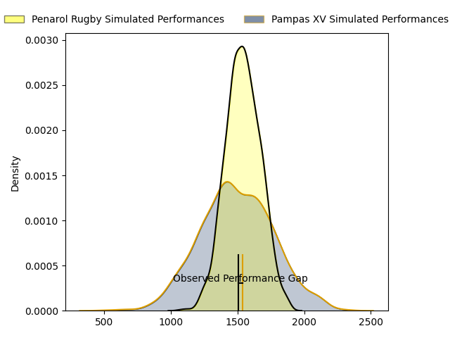
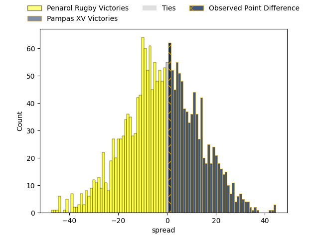

---  
layout: page  
title: Penarol Rugby at Pampas XV; 19-20  
date: 2023-03-29 22:00:00 18:00:00 -0500  
categories: match review  
---
# Penarol Rugby at Pampas XV; 19-20

# Club Level Predictions

The first set of predictions treats a club as the smallest object, as the club develops its members, organizes a gameplan, and deploys its players as needed for each match. This club model has a prediction of 0.439, which translates to predicting Penarol Rugby to win by 2.3.

Each club has a rating and a rating deviation (simiar to a Glicko system), and expected performances can be generated. This allows for simulated matches and spreads like the ones below.
## Projected Performances

## Projected Spreads

## Projected Results

# Player Level Predictions

Treating teams instead as an entity made up of the currently active players, I have ratings for each player in an altogether different system. These can be combined to form team ratings once teamsheets are announced, weighting starters a bit higher than the reserves. After the match is played, players can be weighted by their minutes on the field, allowing for an accurate measure of the team's composition. With these compiled team ratings, we can make predictions, measure inaccuracy, and update the individual player ratings.
## Prediction with Player Minutes: Pampas XV by 0.2

Penarol Rugby by 3.8 on a neutral field

There were 12 large changes in win probability in this match
## Prediction without Player Minutes: Penarol Rugby by 1.6

Penarol Rugby by 5.6 on a neutral pitch

|   Away Minutes | Away Player                        |   Away elo |   Away Percentile |   Number |   Home Percentile |   Home elo | Home Player               |   Home Minutes |
|---------------:|:-----------------------------------|-----------:|------------------:|---------:|------------------:|-----------:|:--------------------------|---------------:|
|             55 | Edgardo Matias Benitez Santin      |     101.71 |                73 |        1 |                79 |     104.39 | Rodrigo Martinez Manzano  |             39 |
|             58 | Guillermo Pujadas Leon             |     104.35 |                78 |        2 |                64 |      98.97 | Ramiro Gurovich           |             80 |
|             55 | Diego Arbelo                       |     101.05 |                41 |        3 |                50 |      95.11 | Javier Angel Coronel      |             67 |
|             80 | Felipe Aliaga                      |      97.48 |                55 |        4 |                68 |     102.48 | Lorenzo Colidio           |             62 |
|             44 | Agustin Morales                    |      96.72 |                54 |        5 |                12 |      79.59 | Federico Ignacio Lavanini |             80 |
|             79 | Carlos Manuel Deus Lopes de Amorin |      85.85 |                19 |        6 |                91 |     118.3  | Nicolas Damorim           |             62 |
|             80 | Lucas Bianchi                      |      95.2  |                48 |        7 |                83 |     110.36 | Jeronimo Ureta            |             80 |
|             80 | Manuel Diana                       |     104.06 |                70 |        8 |                53 |      98.28 | Santiago Ruiz             |             80 |
|             80 | Santiago Álvarez Viera Da Cunha    |      99.08 |                60 |        9 |                84 |     109.63 | Mateo Albanese            |             55 |
|             80 | Felipe Etcheverry                  |     106.61 |                76 |       10 |                 1 |      48.38 | Joaquin de la Vega Mendia |             80 |
|             80 | Juan Manuel Alonso                 |      97.32 |                54 |       11 |               nan |      95.51 | Lucio Auad                |             80 |
|             67 | Guillermo Storace                  |      99.77 |                50 |       12 |                31 |      89.35 | Manuel Alfaro Torneiro    |             63 |
|             80 | Tomas Inciarte Rachetti            |     104.82 |                73 |       13 |                48 |      95.88 | Benjamin Elizalde         |             80 |
|             24 | Gaston Mieres Valente              |     102.11 |                68 |       14 |                80 |     108.49 | Inaki Delguy              |             80 |
|             80 | Alfonso Silva                      |      99.38 |                61 |       15 |                91 |     117.91 | Juan Ignacio Lando        |             80 |
|             56 | Icaro Amarillo                     |      95    |               nan |       16 |                76 |     103.77 | Matias Medrano            |             41 |
|             36 | Juan Manuel Rodriguez              |     103.62 |               nan |       17 |                58 |      99.52 | Rafael Iriarte            |             25 |
|             25 | Ignacio Alfredo Peculo Rodriguez   |     106.08 |                83 |       18 |                 2 |      61.2  | Eliseo Fourcade           |             18 |
|             25 | Mateo Perillo                      |      98.24 |                59 |       19 |                64 |     100.85 | Eliseo Chiavassa          |             18 |
|             22 | Emiliano Faccennini                |     102.25 |                71 |       20 |                62 |      98.11 | Joaquin Lamas             |             17 |
|             13 | Juan Zuccarino                     |     112.36 |                84 |       21 |               nan |      97.43 | Renzo Zanella             |             13 |
|              1 | Manuel Rosmarino                   |      96.08 |               nan |       22 |               nan |     nan    | nan                       |            nan |

