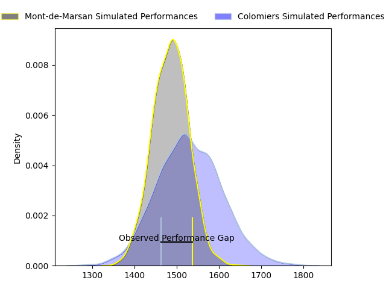
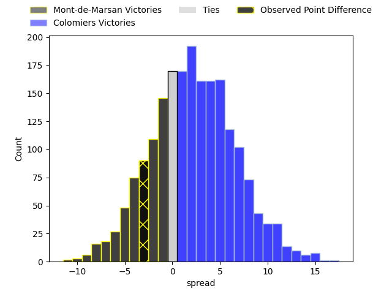
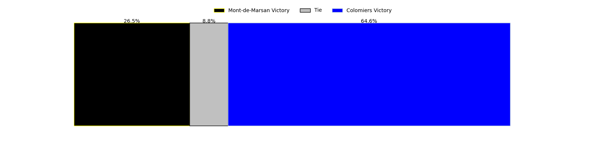

---  
layout: page  
title: Mont-de-Marsan at Colomiers; 26-23  
date: 2023-03-30 21:00:00 18:00:00 -0500  
categories: match review  
---
# Mont-de-Marsan at Colomiers; 26-23

# Club Level Predictions

The first set of predictions treats a club as the smallest object, as the club develops its members, organizes a gameplan, and deploys its players as needed for each match. This club model has a prediction of 0.565, which translates to predicting Colomiers to win by 2.3.

Each club has a rating and a rating deviation (simiar to a Glicko system), and expected performances can be generated. This allows for simulated matches and spreads like the ones below.
## Projected Performances

## Projected Spreads

## Projected Results

# Player Level Predictions

Treating teams instead as an entity made up of the currently active players, I have ratings for each player in an altogether different system. These can be combined to form team ratings once teamsheets are announced, weighting starters a bit higher than the reserves. After the match is played, players can be weighted by their minutes on the field, allowing for an accurate measure of the team's composition. With these compiled team ratings, we can make predictions, measure inaccuracy, and update the individual player ratings.
## Prediction with Player Minutes: Mont-de-Marsan by 1.9

Mont-de-Marsan by 5.9 on a neutral field

There were 10 large changes in win probability in this match
## Prediction without Player Minutes: Mont-de-Marsan by 3.4

Mont-de-Marsan by 7.4 on a neutral pitch

|   Away Minutes | Away Player           |   Away elo |   Away Percentile |   Number |   Home Percentile |   Home elo | Home Player           |   Home Minutes |
|---------------:|:----------------------|-----------:|------------------:|---------:|------------------:|-----------:|:----------------------|---------------:|
|             64 | Max Curie             |     105.83 |                82 |        1 |                39 |      92.47 | Thomas Dubois         |             54 |
|             53 | Jose Luis Gonzalez    |     119.94 |                95 |        2 |                70 |      98.39 | Andrew Ready          |             54 |
|             30 | Gheorge Gajion        |     110.75 |                89 |        3 |                 6 |      74.85 | Hugo Pirlet           |             46 |
|             80 | Nicolas Garrault      |      82.34 |                13 |        4 |                83 |     109.66 | Jean Thomas           |             80 |
|             57 | Andrei Ostrikov       |      92.63 |                40 |        5 |                88 |     109.95 | Maxime Granouillet    |             68 |
|             57 | Aurélien Lisena       |     115.93 |                89 |        6 |                34 |      90.32 | Pierre-Samuel Pacheco |             60 |
|             80 | Léo Banos             |      93.35 |                43 |        7 |                24 |      87.41 | Waël Ponpon           |             80 |
|             80 | Michael Faleafa       |      96.46 |                46 |        8 |                90 |     116.49 | Aldric Lescure        |             80 |
|             80 | Christophe Loustalot  |      90.97 |                35 |        9 |                36 |      91.25 | Ugo Seguela           |             76 |
|             80 | Willie du Plessis     |      99.9  |                61 |       10 |                77 |     106.92 | Maxime Javaux         |             60 |
|             80 | Alexandre de Nardi    |     108.33 |                80 |       11 |                42 |      93.09 | Alexis Palisson       |             80 |
|             64 | Lucas Mensa           |      86.47 |                21 |       12 |                98 |     132.93 | Paul Pimienta         |             80 |
|             80 | Nacani Wakaya         |     124.34 |                94 |       13 |                 1 |      54.5  | Victor Moro           |             60 |
|             80 | Ambrose Curtis        |     100.86 |                65 |       14 |                58 |      98.56 | Valentin Saurs        |             80 |
|             60 | Yoann Laousse Azpiazu |     127.16 |                95 |       15 |                57 |      99.01 | Thomas Girard         |             80 |
|             50 | Lasha Macharashvili   |      81.79 |                11 |       16 |                34 |      91.15 | Marco Fepulea'i       |             34 |
|             27 | Romain Laterrade      |      89.14 |                46 |       17 |                57 |      98.62 | Hikawera Elliot       |             26 |
|             23 | Romain Durand         |     120.56 |                93 |       18 |                10 |      76.63 | Hugo Djehi            |             26 |
|             23 | William Wavrin        |     119.53 |                94 |       19 |                56 |      98.15 | Johan Deysel          |             20 |
|             20 | Simon Renda           |     108.35 |                78 |       20 |               nan |     125.97 | Romain Bezian         |             20 |
|             16 | Thomas Bultel         |     110.48 |                88 |       21 |                84 |     111.35 | Max Auriac            |             20 |
|             16 | Jules Even            |      93.41 |                43 |       22 |                15 |      82.58 | Jack Whetton          |             12 |
|            nan | nan                   |     nan    |               nan |       23 |               nan |      95.17 | Arthur Diaz           |              4 |

