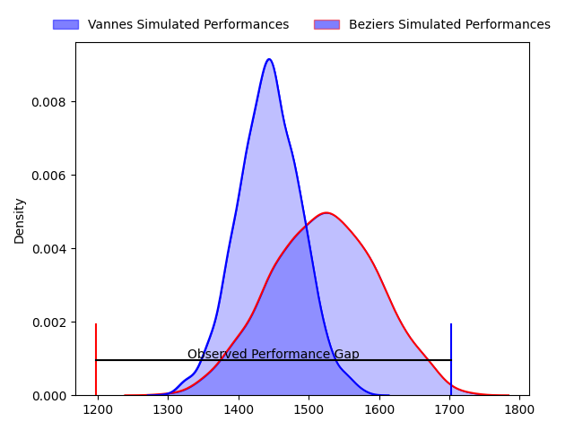
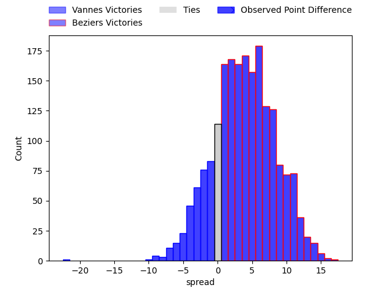
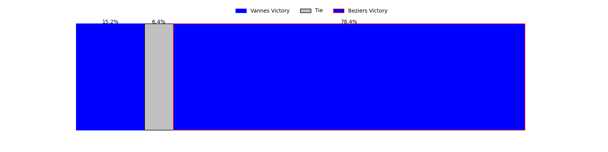

---  
layout: page  
title: Vannes at Beziers; 40-18  
date: 2023-03-31 19:30:00 18:00:00 -0500  
categories: match review  
---
# Vannes at Beziers; 40-18

# Club Level Predictions

The first set of predictions treats a club as the smallest object, as the club develops its members, organizes a gameplan, and deploys its players as needed for each match. This club model has a prediction of 0.613, which translates to predicting Beziers to win by 4.0.

Each club has a rating and a rating deviation (simiar to a Glicko system), and expected performances can be generated. This allows for simulated matches and spreads like the ones below.
## Projected Performances

## Projected Spreads

## Projected Results

# Player Level Predictions

Treating teams instead as an entity made up of the currently active players, I have ratings for each player in an altogether different system. These can be combined to form team ratings once teamsheets are announced, weighting starters a bit higher than the reserves. After the match is played, players can be weighted by their minutes on the field, allowing for an accurate measure of the team's composition. With these compiled team ratings, we can make predictions, measure inaccuracy, and update the individual player ratings.
## Prediction with Player Minutes: Vannes by 11.5

Vannes by 15.5 on a neutral field

There were 6 large changes in win probability in this match
## Prediction without Player Minutes: Vannes by 13.3

Vannes by 17.3 on a neutral pitch

|   Away Minutes | Away Player             |   Away elo |   Away Percentile |   Number |   Home Percentile |   Home elo | Home Player           |   Home Minutes |
|---------------:|:------------------------|-----------:|------------------:|---------:|------------------:|-----------:|:----------------------|---------------:|
|             62 | Charles-Henri Berguet   |      92.37 |                34 |        1 |                17 |      84.86 | Francisco Fernandes   |             50 |
|             69 | Cyril Blanchard         |     104.12 |                78 |        2 |                 3 |      70.66 | Clément Esteriola     |             52 |
|             53 | John Afoa               |      99.93 |               nan |        3 |                26 |      86.76 | Yannick Arroyo        |             41 |
|             62 | Éric Marks              |      99.37 |                62 |        4 |                75 |     104.99 | Pierre Gayraud        |             80 |
|             80 | Ewan Thomas Johnson     |     112.98 |                88 |        5 |                 9 |      76.91 | John Madigan          |             60 |
|             62 | Juan Bautista Pedemonte |      93.21 |                43 |        6 |                 4 |      70.71 | Jean-Baptiste Barrère |             60 |
|             80 | Francisco Gorrisen      |     108.33 |                77 |        7 |                78 |     107.09 | Gillian Benoy         |             80 |
|             80 | Karl Chateau            |      99.89 |                63 |        8 |                32 |      90.67 | Thomas Hoarau         |             52 |
|             69 | Michael Ruru            |     107.36 |                80 |        9 |                45 |      93.63 | Jean Victor Goillot   |             60 |
|             69 | Maxime Lafage           |     106.29 |                73 |       10 |                47 |      95.86 | Romain Uruty          |             52 |
|             80 | Théo Bastardie          |     101.28 |                66 |       11 |                15 |      82.57 | Nicolas Plazy         |             80 |
|             65 | Andres Vilaseca         |     112.26 |                84 |       12 |                87 |     114.25 | Paul Recor            |             80 |
|             80 | Sacha Valleau           |     102.31 |                68 |       13 |                98 |     135.16 | Maxime Espeut         |             80 |
|             80 | Nathanael Hulleu        |     108.78 |                79 |       14 |                43 |      93.13 | Watisoni Votu         |             80 |
|             80 | Gwenaël Duplenne        |     110.45 |                83 |       15 |                19 |      83.93 | Charly Malié          |             80 |
|             27 | Phil Kite               |      97.96 |                60 |       16 |                69 |     100.56 | Jon Zabala Arrieta    |             39 |
|             18 | Edoardo Iachizzi        |     105.7  |                75 |       17 |                64 |      99.06 | Giorgi Akhaladze      |             30 |
|             18 | Léon Boulier            |     129.45 |                97 |       18 |                14 |      82.46 | Marco Pinto Ferrer    |             28 |
|             15 | Kevin Burgaud           |      82.96 |                16 |       19 |                56 |      98.82 | Sias Koen             |             28 |
|             11 | Louis-Marie Suta        |      93.74 |               nan |       20 |                32 |      89.03 | Victor Dreuille       |             28 |
|             11 | Jean Chezeau            |      98.27 |                56 |       21 |                51 |      95.93 | William van Bost      |             20 |
|             18 | Andy Bordelai           |     131.82 |                98 |       22 |                19 |      83.74 | Mitchell Short        |             20 |
|             11 | Alexandre Gouaux        |     100.34 |                65 |       23 |                11 |      79.83 | Éloi Massot           |             20 |

