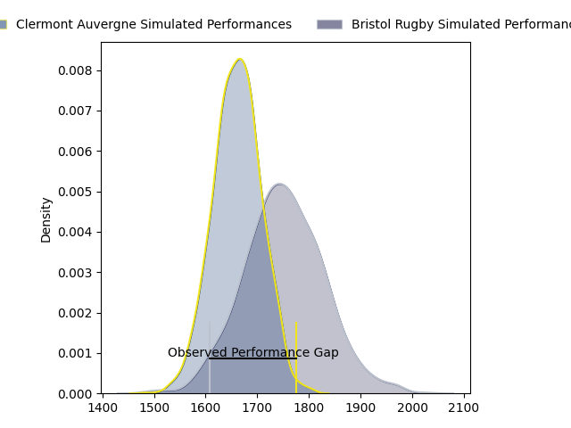
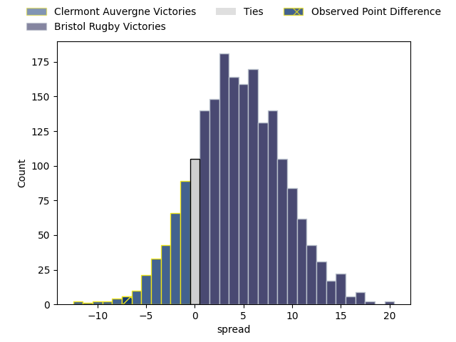
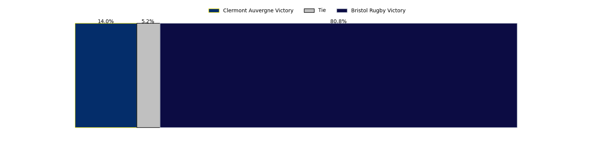

---  
layout: page  
title: Clermont Auvergne at Bristol Rugby; 33-26  
date: 2023-03-31 21:00:00 18:00:00 -0500  
categories: match review  
---
# Clermont Auvergne at Bristol Rugby; 33-26

# Club Level Predictions

The first set of predictions treats a club as the smallest object, as the club develops its members, organizes a gameplan, and deploys its players as needed for each match. This club model has a prediction of 0.631, which translates to predicting Bristol Rugby to win by 4.7.

Each club has a rating and a rating deviation (simiar to a Glicko system), and expected performances can be generated. This allows for simulated matches and spreads like the ones below.
## Projected Performances

## Projected Spreads

## Projected Results

# Player Level Predictions

Treating teams instead as an entity made up of the currently active players, I have ratings for each player in an altogether different system. These can be combined to form team ratings once teamsheets are announced, weighting starters a bit higher than the reserves. After the match is played, players can be weighted by their minutes on the field, allowing for an accurate measure of the team's composition. With these compiled team ratings, we can make predictions, measure inaccuracy, and update the individual player ratings.
## Prediction with Player Minutes: Bristol Rugby by 11.2

Bristol Rugby by 7.2 on a neutral field

There were 8 large changes in win probability in this match
## Prediction without Player Minutes: Bristol Rugby by 6.0

Bristol Rugby by 2.0 on a neutral pitch

|   Away Minutes | Away Player                |   Away elo |   Away Percentile |   Number |   Home Percentile |   Home elo | Home Player     |   Home Minutes |
|---------------:|:---------------------------|-----------:|------------------:|---------:|------------------:|-----------:|:----------------|---------------:|
|             60 | Etienne Falgoux            |     105.29 |                81 |        1 |                57 |      96.45 | Ellis Genge     |             58 |
|             76 | Étienne Fourcade           |      93.19 |                44 |        2 |                30 |      89.39 | Harry Thacker   |             80 |
|             69 | Cristian Ojovan            |      98.86 |                63 |        3 |                90 |     112.88 | Kyle Sinckler   |             58 |
|             80 | Thibault Lanen             |     105.68 |                76 |        4 |                32 |      90.77 | Magnus Bradbury |             80 |
|             79 | Tomas Lavanini             |      90.07 |                32 |        5 |                83 |     110.17 | Chris Vui       |             80 |
|             69 | Killian Tixeront           |     102.5  |                68 |        6 |                96 |     131.63 | Steven Luatua   |             80 |
|             80 | Lucas Dessaigne            |     105.69 |                75 |        7 |                97 |     133.55 | Sam Jeffries    |             17 |
|             80 | Fritz Lee                  |     102.42 |                69 |        8 |                80 |     108.67 | Fitz Harding    |             80 |
|             56 | Sebastien Bézy             |     101.24 |                68 |        9 |                86 |     110.84 | Harry Randall   |             80 |
|             71 | Anthony Belleau            |      95.31 |                45 |       10 |                77 |     106.76 | AJ MacGinty     |             80 |
|             80 | Bautista Delguy            |      92.62 |                41 |       11 |                70 |     103.12 | Gabriel Ibitoye |             80 |
|             80 | George Moala               |     102.35 |                68 |       12 |                59 |      99.17 | James Williams  |             80 |
|             72 | Irae Simone                |      96.83 |                51 |       13 |                96 |     127.05 | Semi Radradra   |             38 |
|             80 | Damian Penaud              |     113.67 |                86 |       14 |                78 |     107.22 | Ratu Naulago    |             80 |
|             80 | Alex Newsome               |     107.5  |                76 |       15 |                91 |     118.71 | Charles Piutau  |             80 |
|             20 | Giorgi Beria               |      89.52 |                35 |       16 |                23 |      87.78 | Yann Thomas     |             22 |
|              4 | Jean-Maxence Jules-Rosette |      95    |               nan |       17 |                31 |      90.37 | George Kloska   |             22 |
|             11 | Rabah Slimani              |      97.76 |                52 |       18 |                28 |      90.58 | Jake Heenan     |             63 |
|              1 | Edward Annandale           |      94.48 |               nan |       19 |                13 |      80.52 | Ioan Lloyd      |             42 |
|             11 | Loïc Godener               |      89.83 |                27 |       20 |               nan |     nan    | nan             |            nan |
|             24 | Baptiste Jauneau           |      98.55 |                53 |       21 |               nan |     nan    | nan             |            nan |
|              9 | Jules Plisson              |      99.03 |                61 |       22 |               nan |     nan    | nan             |            nan |
|              8 | Alivereti Raka             |      95.76 |                49 |       23 |               nan |     nan    | nan             |            nan |

