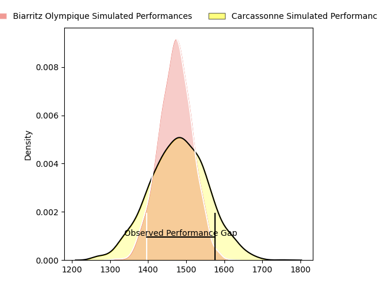

---  
layout: page  
title: Biarritz Olympique at Carcassonne; 12-20  
date: 2023-03-31 19:30:00 18:00:00 -0500  
categories: match review  
---
# Biarritz Olympique at Carcassonne; 12-20

# Club Level Predictions

The first set of predictions treats a club as the smallest object, as the club develops its members, organizes a gameplan, and deploys its players as needed for each match. This club model has a prediction of 0.513, which translates to predicting Carcassonne to win by 0.5.

Each club has a rating and a rating deviation (simiar to a Glicko system), and expected performances can be generated. This allows for simulated matches and spreads like the ones below.
## Projected Performances

## Projected Spreads

## Projected Results

# Player Level Predictions

Treating teams instead as an entity made up of the currently active players, I have ratings for each player in an altogether different system. These can be combined to form team ratings once teamsheets are announced, weighting starters a bit higher than the reserves. After the match is played, players can be weighted by their minutes on the field, allowing for an accurate measure of the team's composition. With these compiled team ratings, we can make predictions, measure inaccuracy, and update the individual player ratings.
## Prediction with Player Minutes: Carcassonne by 6.7

Carcassonne by 2.7 on a neutral field

There were 9 large changes in win probability in this match
## Prediction without Player Minutes: Carcassonne by 5.3

Carcassonne by 1.3 on a neutral pitch

|   Away Minutes | Away Player        |   Away elo |   Away Percentile |   Number |   Home Percentile |   Home elo | Home Player              |   Home Minutes |
|---------------:|:-------------------|-----------:|------------------:|---------:|------------------:|-----------:|:-------------------------|---------------:|
|             55 | Guy Millar         |      94.61 |                48 |        1 |                84 |     106.8  | Sami Mavinga             |             65 |
|             55 | Thomas Sauveterre  |     113.93 |                90 |        2 |                85 |     108.92 | Raphaël Carbou           |             65 |
|             55 | Luka Azariashvili  |      98.94 |                67 |        3 |                38 |      98.17 | Soso Bekoshvili          |             63 |
|             80 | Johan Aliouat      |     102.83 |                70 |        4 |                 6 |      72.67 | Romain Manchia           |             80 |
|             21 | Adrian Motoc       |      90.88 |                35 |        5 |                75 |     104.83 | Rynard Ligtoring Landman |             60 |
|             80 | Josh Tyrell        |     100.75 |                65 |        6 |                68 |     102.2  | Robert Harley            |             80 |
|             80 | Thomas Hebert      |     112.76 |                86 |        7 |                81 |     109.13 | Étienne Herjean          |             80 |
|             80 | Tornike Jalagonia  |     109.2  |                82 |        8 |                89 |     116.09 | Pierre Reynaud           |             52 |
|             55 | Tomas Cubelli      |      93.34 |               nan |        9 |                57 |      98.49 | Samuel Marques           |             80 |
|             80 | Baptiste Germain   |      98.22 |                55 |       10 |                64 |     102.08 | Christopher Hilsenbeck   |             80 |
|             80 | Tyler Morgan       |     100.2  |                64 |       11 |                68 |     102.11 | Clément Clavières        |             80 |
|             55 | Auguste Cadot      |      88.54 |                28 |       12 |                84 |     112.11 | Jordan Puletua           |             80 |
|             80 | Joseph Tomane      |      95.63 |                48 |       13 |                46 |      99.74 | Pierre Aguillon          |             79 |
|             69 | Steeve Barry       |      97.84 |                56 |       14 |                86 |     113.44 | Léo Darrelatour          |             80 |
|             11 | Joe Jonas          |      95.65 |                49 |       15 |                24 |      86.54 | Baptiste Mouchous        |             70 |
|             69 | Gilles Bosch       |      96.67 |               nan |       16 |                72 |     104.09 | Simon Meka               |             28 |
|             59 | John Dyer          |      94.87 |                40 |       17 |                66 |     103.52 | Aaron Carroll            |             20 |
|             25 | Killian Taofifenua |     104.89 |                81 |       18 |                83 |     106.07 | Jérémy Boyadjis          |             17 |
|             25 | Quentin Samaran    |      90.6  |                32 |       19 |                46 |      98.25 | Luka Petriashvili        |             15 |
|             25 | Baptiste Erdocio   |      95.19 |                54 |       20 |                 4 |      68.35 | Jules Martinez           |             15 |
|             25 | Barnabé Couilloud  |      94.57 |                47 |       21 |                24 |      91.52 | Damien Añon              |             10 |
|             25 | Francois Vergnaud  |      97.1  |                56 |       22 |                65 |     101.12 | Brieuc Plessis Couillaud |              1 |
|             11 | Vincent Martin     |      95    |               nan |       23 |               nan |     nan    | nan                      |            nan |

