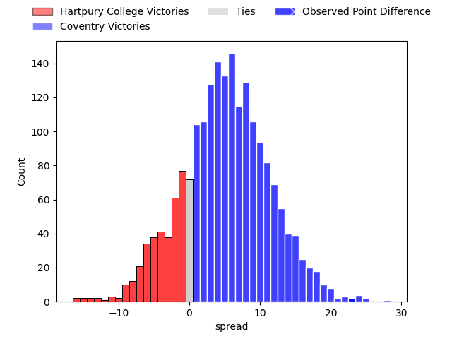

---  
layout: page  
title: Hartpury College at Coventry; 19-42  
date: 2023-03-31 20:45:00 18:00:00 -0500  
categories: match review  
---
# Hartpury College at Coventry; 19-42

# Club Level Predictions

The first set of predictions treats a club as the smallest object, as the club develops its members, organizes a gameplan, and deploys its players as needed for each match. This club model has a prediction of 0.642, which translates to predicting Coventry to win by 5.2.

Each club has a rating and a rating deviation (simiar to a Glicko system), and expected performances can be generated. This allows for simulated matches and spreads like the ones below.
## Projected Performances

## Projected Spreads

## Projected Results

# Player Level Predictions

Treating teams instead as an entity made up of the currently active players, I have ratings for each player in an altogether different system. These can be combined to form team ratings once teamsheets are announced, weighting starters a bit higher than the reserves. After the match is played, players can be weighted by their minutes on the field, allowing for an accurate measure of the team's composition. With these compiled team ratings, we can make predictions, measure inaccuracy, and update the individual player ratings.
## Prediction with Player Minutes: Coventry by 3.0

Hartpury College by 1.0 on a neutral field

There were 4 large changes in win probability in this match
## Prediction without Player Minutes: Coventry by 3.7

Hartpury College by 0.3 on a neutral pitch

|   Away Minutes | Away Player          |   Away elo |   Away Percentile |   Number |   Home Percentile |   Home elo | Home Player        |   Home Minutes |
|---------------:|:---------------------|-----------:|------------------:|---------:|------------------:|-----------:|:-------------------|---------------:|
|             60 | Joe Wrafter          |      96.16 |                53 |        1 |                49 |      91.86 | James Kenny        |             40 |
|             50 | Luke Stratford       |     100.34 |                70 |        2 |                56 |      96.53 | Will Biggs         |             40 |
|             60 | Sam Rodman           |     110.72 |                89 |        3 |                72 |     101.26 | Ollie Andrews      |             66 |
|             80 | Jack Davies          |      99.31 |                61 |        4 |                 8 |      76.06 | James Tyas         |             56 |
|             80 | Dale Lemon           |     101.64 |                68 |        5 |                82 |     109.29 | Adam Peters        |             80 |
|             80 | Sam Lewis            |      83.33 |                15 |        6 |                88 |     115.21 | Tom Ball           |             51 |
|             23 | Oli Robinson         |      76.25 |                 7 |        7 |                86 |     112.33 | Josh Bainbridge    |             80 |
|             50 | Nahum Merigan        |      95.77 |                50 |        8 |                40 |      92.27 | Tom Dodd           |             80 |
|             71 | Matty Jones          |     110.96 |                86 |        9 |                31 |      89.73 | Will Chudley       |             60 |
|             80 | Tommy Mathews        |      98.4  |                56 |       10 |                 8 |      77.1  | Evan Mitchell      |             80 |
|             80 | Jacob Morris         |      84.33 |                20 |       11 |                33 |      90.07 | James Martin       |             80 |
|             80 | Harry Ascherl        |      98.23 |                56 |       12 |                55 |      98.02 | Lucas Titherington |             60 |
|             80 | Jack Bates           |      95.71 |                49 |       13 |                57 |      98.78 | Will Rigg          |             40 |
|             60 | Gabriel Hamer-Webb   |      89.14 |                29 |       14 |                22 |      86.76 | Will Talbot-Davies |             80 |
|             48 | Alex Morgan          |     115.53 |                88 |       15 |                77 |     107.56 | Louis Brown        |             80 |
|             57 | Harry Short          |     128.22 |                96 |       16 |                50 |      95.91 | Will Wand          |             40 |
|             32 | Jack Reeves          |      65.36 |                 3 |       17 |                63 |      98.95 | Toby Trinder       |             40 |
|             30 | Will Tanner          |      88.63 |                28 |       18 |                50 |      94.86 | Suva Ma'asi        |             40 |
|             30 | Joe Howard           |      81.41 |                13 |       19 |                46 |      94.6  | Ollie Betteridge   |             20 |
|             20 | Sam Smith            |     117.81 |                91 |       20 |                56 |     104.18 | Will Lane          |             20 |
|             20 | Alex Gibson          |      67.32 |                 2 |       21 |                71 |     101.46 | Rhys Thomas        |             24 |
|             20 | Aristot Benz-Salomon |      96.44 |                65 |       22 |                17 |      84.5  | Jake Bridges       |             14 |
|              9 | Owen Randell         |      96.59 |               nan |       23 |                70 |     104.24 | Senitiki Nayalo    |             29 |

