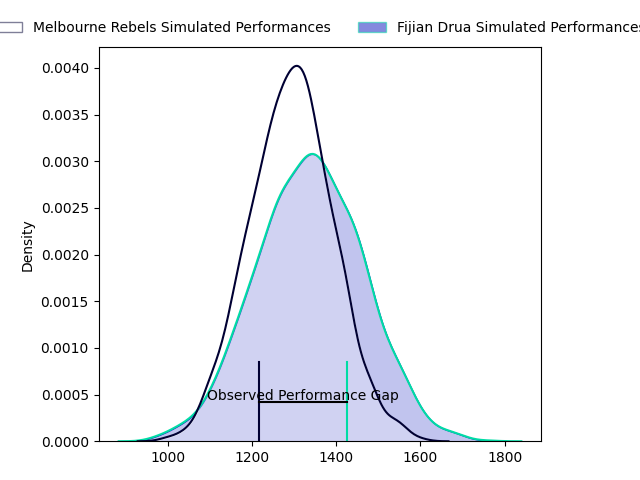
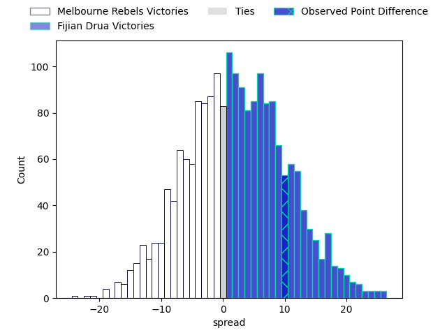

---  
layout: page  
title: Melbourne Rebels at Fijian Drua; 28.0-38.0  
date: 2023-03-31 23:35:00 18:00:00 -0500  
categories: match review  
---
# Melbourne Rebels at Fijian Drua; 28.0-38.0

# Club Level Predictions

The first set of predictions treats a club as the smallest object, as the club develops its members, organizes a gameplan, and deploys its players as needed for each match. This club model has a prediction of 0.56, which translates to predicting Fijian Drua to win by 2.2.

Each club has a rating and a rating deviation (simiar to a Glicko system), and expected performances can be generated. This allows for simulated matches and spreads like the ones below.
## Projected Performances

## Projected Spreads

## Projected Results

# Player Level Predictions

Treating teams instead as an entity made up of the currently active players, I have ratings for each player in an altogether different system. These can be combined to form team ratings once teamsheets are announced, weighting starters a bit higher than the reserves. After the match is played, players can be weighted by their minutes on the field, allowing for an accurate measure of the team's composition. With these compiled team ratings, we can make predictions, measure inaccuracy, and update the individual player ratings.
## Prediction with Player Minutes: Fijian Drua by 0.3

Melbourne Rebels by 3.7 on a neutral field

There were 3 large changes in win probability in this match
## Prediction without Player Minutes: Fijian Drua by 0.1

Melbourne Rebels by 3.9 on a neutral pitch

|   Away Minutes | Away Player         |   Away elo |   Away Percentile |   Number |   Home Percentile |   Home elo | Home Player             |   Home Minutes |
|---------------:|:--------------------|-----------:|------------------:|---------:|------------------:|-----------:|:------------------------|---------------:|
|             55 | Matt Gibbon         |     114.56 |                92 |        1 |                63 |      98.96 | Emosi Tuqiri            |             49 |
|             40 | Alex Mafi           |     100.56 |                68 |        2 |                94 |     117.91 | Tevita Ikanivere        |             73 |
|             55 | Sam Talakai         |      96.37 |                55 |        3 |                46 |      93.93 | Jone Tiko               |             58 |
|             37 | Tuaina Taii Tualima |      94.96 |                48 |        4 |                96 |     127.76 | Isoa Nasilasila         |             53 |
|             80 | Josh Canham         |     108.79 |                81 |        5 |                90 |     116.49 | Te Ahiwaru Cirikidaveta |             80 |
|             80 | Josh Kemeny         |      94.29 |                46 |        6 |                22 |      85.86 | Vilive Miramira         |             80 |
|             80 | Brad Wilkin         |     103.73 |                71 |        7 |                 4 |      71.39 | Kitione Salawa          |             80 |
|             62 | Vaiolini Ekuasi     |      92.59 |                37 |        8 |                79 |     107.34 | Ratu Meli Derenalagi    |             47 |
|             65 | Ryan Louwrens       |     132.79 |                98 |        9 |                70 |     101.95 | Peni Matawalu           |             67 |
|             80 | Carter Gordon       |     101.55 |                66 |       10 |                76 |     105.83 | Teti Tela               |             80 |
|             41 | Monty Ioane         |     125.17 |                94 |       11 |                46 |      94.52 | Eroni Sau               |             80 |
|             44 | Stacey Ili          |     115.9  |                89 |       12 |                99 |     146    | Kalaveti Ravouvou       |             65 |
|             80 | Reece Hodge         |     106.64 |                76 |       13 |                50 |      95.89 | Iosefo Masi             |             80 |
|             80 | Lachie Anderson     |      94.47 |                46 |       14 |                26 |      87.4  | Selestino Ravutaumada   |             80 |
|             80 | Joe Pincus          |     104.71 |                70 |       15 |                67 |     103.29 | Ilaisa Droasese         |             71 |
|             40 | Jordan Uelese       |      98.32 |                61 |       16 |                39 |      91.4  | Zuriel Togiatama        |              7 |
|             25 | Cabous Eloff        |     102.02 |                76 |       17 |               nan |      91.28 | Livai Natave            |             31 |
|             25 | Pone Fa'amausili    |      98.2  |                73 |       18 |                37 |      90.68 | Kaliopasi Uluilakepa    |             22 |
|             43 | Angelo Smith        |      96.06 |               nan |       19 |                15 |      83.13 | Joseva Tamani           |             27 |
|             18 | Daniel Maiava       |      95.32 |               nan |       20 |                58 |      98.35 | Elia Canakaivata        |             33 |
|             15 | James Tuttle        |      98.66 |                59 |       21 |               nan |      95    | Phillip Baselala        |             13 |
|             36 | David Feliuai       |      97.46 |                53 |       22 |               nan |      95    | Michael Naitokani       |             15 |
|             39 | Andrew Kellaway     |      95    |               nan |       23 |                33 |      90.18 | Taniela Rakuro          |              9 |

