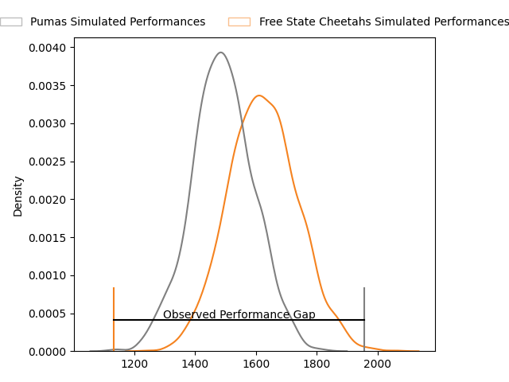
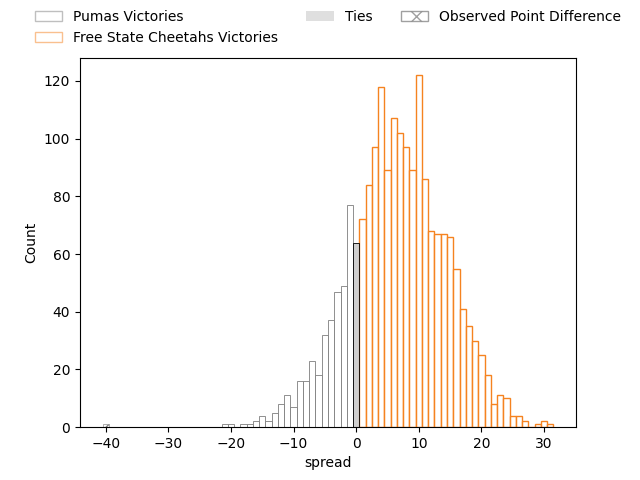
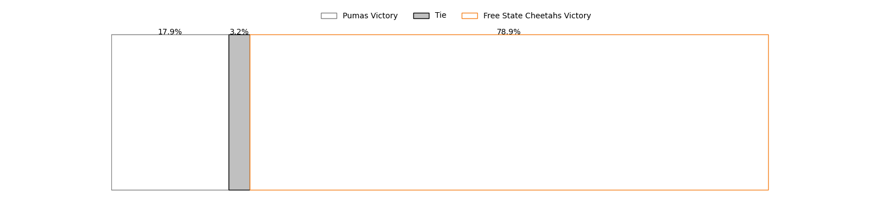

---  
layout: page  
title: Pumas at Free State Cheetahs; 61-21  
date: 2023-03-31 17:00:00 18:00:00 -0500  
categories: match review  
---
# Pumas at Free State Cheetahs; 61-21

# Club Level Predictions

The first set of predictions treats a club as the smallest object, as the club develops its members, organizes a gameplan, and deploys its players as needed for each match. This club model has a prediction of 0.67, which translates to predicting Free State Cheetahs to win by 6.5.

Each club has a rating and a rating deviation (simiar to a Glicko system), and expected performances can be generated. This allows for simulated matches and spreads like the ones below.
## Projected Performances

## Projected Spreads

## Projected Results

# Player Level Predictions

Treating teams instead as an entity made up of the currently active players, I have ratings for each player in an altogether different system. These can be combined to form team ratings once teamsheets are announced, weighting starters a bit higher than the reserves. After the match is played, players can be weighted by their minutes on the field, allowing for an accurate measure of the team's composition. With these compiled team ratings, we can make predictions, measure inaccuracy, and update the individual player ratings.
## Prediction with Player Minutes: Pumas by 14.7

Pumas by 18.7 on a neutral field

There were 5 large changes in win probability in this match
## Prediction without Player Minutes: Pumas by 14.9

Pumas by 18.9 on a neutral pitch

|   Away Minutes | Away Player                    |   Away elo |   Away Percentile |   Number |   Home Percentile |   Home elo | Home Player             |   Home Minutes |
|---------------:|:-------------------------------|-----------:|------------------:|---------:|------------------:|-----------:|:------------------------|---------------:|
|             66 | Corne Fourie                   |      94.23 |                46 |        1 |                57 |      97.13 | Wayrin Losper           |             65 |
|             39 | Eduan Swart                    |     110.5  |                87 |        2 |                41 |      93.91 | Janus Venter            |             65 |
|             56 | Ignatius (IG) Michael Prinsloo |     104.4  |                79 |        3 |               nan |      95.62 | Laurence Herbert Victor |             61 |
|             80 | Deon Slabbert                  |     106.62 |                77 |        4 |                31 |      90.11 | Ruan Janse van Rensburg |             43 |
|             66 | Shane Monro Kirkwood           |     134.52 |                98 |        5 |                 9 |      76.09 | Jean Droste             |             80 |
|             66 | Andre Fouché                   |     115.71 |                89 |        6 |               nan |      95    | Roelof Andries Smit     |             76 |
|             80 | Francois Kleinhans             |      95.7  |                49 |        7 |               nan |      90.46 | George Cronje           |             72 |
|             80 | Kwanda Dimaza                  |      97.26 |                49 |        8 |                61 |     100.11 | Anidisa Ntsila          |             80 |
|             61 | Chriswill September            |     120.39 |                95 |        9 |               nan |      94.7  | Branden de Kock         |             43 |
|             80 | Tinus de Beer                  |     113.98 |                85 |       10 |                27 |      88.72 | John Lourens            |             80 |
|             61 | Lundi Msenge                   |      91.81 |                38 |       11 |               nan |      84.16 | Xolisa Guma             |             80 |
|             80 | Wian van Niekerk               |      95    |               nan |       12 |                15 |      82.48 | Evardi Boshoff          |             80 |
|             25 | Diego Appollis                 |      95.97 |                48 |       13 |                63 |      99.88 | Marcell Muller          |             72 |
|             80 | Etienne Taljaard               |     127.02 |                95 |       14 |               nan |      95    | Sibabalwe Xamlashe      |             80 |
|             80 | Devon Frank Williams           |      95.7  |                49 |       15 |                60 |      99.8  | Andell Loubser          |             80 |
|             41 | Llewellyn Classen              |      99.03 |               nan |       16 |               nan |      95    | Paul Schoeman           |             37 |
|             24 | Njabula Juice Gumede           |      91.01 |                33 |       17 |               nan |      95    | Zenedine Booysen        |             37 |
|             19 | Giovanne Snyman                |      90.13 |                32 |       18 |               nan |      95    | Boeta Loubser           |             19 |
|             19 | Brandon Terry Thomson          |      90.63 |                20 |       19 |               nan |      95    | Kevin Bruce Stevens     |             15 |
|             14 | Etienne Janeke                 |      99.07 |               nan |       20 |               nan |      94.78 | Jacques Goosen          |             15 |
|             14 | Ruwald Van der Merwe           |      96.75 |               nan |       21 |               nan |      90.68 | Dian Maritz Koen        |              8 |
|             14 | Malembe Mpofu                  |      96.44 |                48 |       22 |               nan |      95    | Thoubaan Gabriels       |              8 |
|             55 | Stefan Coetzee                 |      95    |               nan |       23 |               nan |      95    | Johnnre Stopforth       |              4 |

