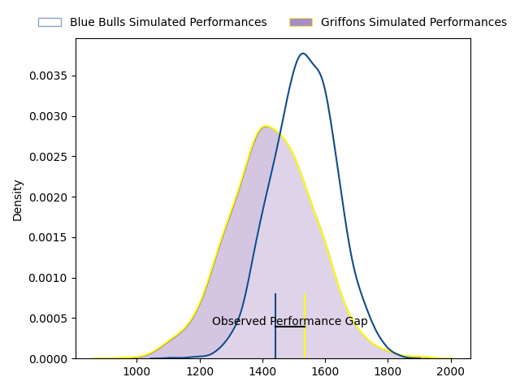
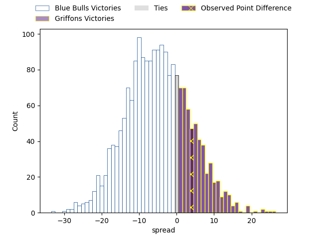

---  
layout: page  
title: Blue Bulls at Griffons; 28-32  
date: 2023-03-31 15:00:00 18:00:00 -0500  
categories: match review  
---
# Blue Bulls at Griffons; 28-32

# Club Level Predictions

The first set of predictions treats a club as the smallest object, as the club develops its members, organizes a gameplan, and deploys its players as needed for each match. This club model has a prediction of 0.363, which translates to predicting Blue Bulls to win by 5.1.

Each club has a rating and a rating deviation (simiar to a Glicko system), and expected performances can be generated. This allows for simulated matches and spreads like the ones below.
## Projected Performances

## Projected Spreads

## Projected Results

# Player Level Predictions

Treating teams instead as an entity made up of the currently active players, I have ratings for each player in an altogether different system. These can be combined to form team ratings once teamsheets are announced, weighting starters a bit higher than the reserves. After the match is played, players can be weighted by their minutes on the field, allowing for an accurate measure of the team's composition. With these compiled team ratings, we can make predictions, measure inaccuracy, and update the individual player ratings.
## Prediction with Player Minutes: Blue Bulls by 9.5

Blue Bulls by 13.5 on a neutral field

There were 11 large changes in win probability in this match
## Prediction without Player Minutes: Blue Bulls by 6.8

Blue Bulls by 10.8 on a neutral pitch

|   Away Minutes | Away Player                       |   Away elo |   Away Percentile |   Number |   Home Percentile |   Home elo | Home Player                 |   Home Minutes |
|---------------:|:----------------------------------|-----------:|------------------:|---------:|------------------:|-----------:|:----------------------------|---------------:|
|             55 | Lizo Pumzile Gqoboka              |      97.26 |                57 |        1 |                24 |      88.05 | Stephan de Jager            |             64 |
|             55 | Jan Hendrik Wessels               |      75.9  |                 6 |        2 |                21 |      86.76 | Dandré Delport              |             64 |
|             77 | Robert Hunt                       |      98.01 |                60 |        3 |                15 |      84.09 | Doctor Booysen              |             64 |
|             80 | Willem Hendrik Jacques du Plessis |      83.53 |                17 |        4 |                45 |      93.76 | Jaco Willemse               |             58 |
|             80 | Reinhardt Ludwig                  |      93.95 |                45 |        5 |                14 |      81.27 | Michael Benadie             |             80 |
|             77 | Phumzile Maqondwana               |      92.89 |                37 |        6 |                76 |     106.16 | Mitch Carstens              |             66 |
|             80 | Nizaam Carr                       |      94.4  |                47 |        7 |                30 |      89.05 | Jean-Jacques Pretorius      |             80 |
|             80 | Hendrik Muller Uys                |      99.55 |                58 |        8 |                14 |      81.88 | Sokuphumla (Soso) Xakalashe |             80 |
|             64 | Keagan Johannes                   |      94.63 |                47 |        9 |                22 |      86.45 | Jaywinn Juries              |             80 |
|             80 | Johannes Lodewikus Goosen         |      92.85 |                43 |       10 |                83 |     111.32 | Duan Pretorius              |             80 |
|             80 | Kabelo Mokoena                    |     103.45 |                71 |       11 |                15 |      82.45 | Jamba Isaac Ulengo          |             63 |
|             80 | Lionel Granton Mapoe              |      87.94 |                27 |       12 |                 1 |      58.33 | Marquit Virgil September    |             66 |
|             57 | Wandisile Simelane                |      90.79 |                35 |       13 |                 0 |      51.21 | Carel-Jan Coetzee           |             80 |
|             80 | Quewin Nortje                     |     101.56 |                67 |       14 |                34 |      90.31 | Randy Fillies               |             80 |
|             80 | Franco Knoetze                    |      99.44 |                59 |       15 |                24 |      87.04 | Domenic Smit                |             80 |
|             25 | Joe van Zyl                       |      95.42 |               nan |       16 |                24 |      84.82 | Keanu Armandio Vers         |             17 |
|             25 | Simphiwe Matanzima                |      89.45 |                38 |       17 |                70 |      95.95 | Wikus Nieuwenhuis           |             22 |
|             23 | Chris Smit                        |     103.47 |                71 |       18 |               nan |      97.83 | Neo Mohapi                  |             16 |
|             16 | Bernard van der Linde             |      99.06 |                56 |       19 |               nan |      89.79 | Hendrik Petrus van Schoor   |             16 |
|              3 | Sebastian Lombard                 |      95.19 |               nan |       20 |               nan |      94.8  | Xolani Jacobs               |             16 |
|              3 | Mihlali Langa Mosi                |     103.96 |                72 |       21 |               nan |      96.03 | Curtley Thomas              |             14 |
|            nan | nan                               |     nan    |               nan |       22 |               nan |      44.65 | Robbie Petzer               |             14 |

