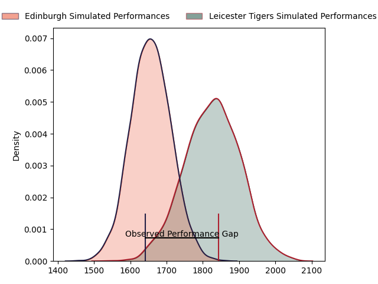
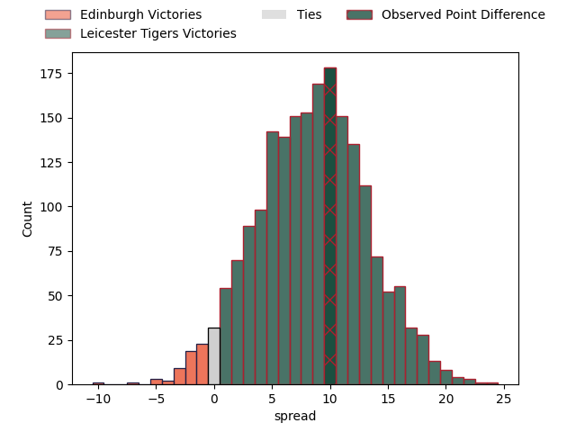

---  
layout: page  
title: Edinburgh at Leicester Tigers; 6-16  
date: 2023-03-31 21:00:00 18:00:00 -0500  
categories: match review  
---
# Edinburgh at Leicester Tigers; 6-16

# Club Level Predictions

The first set of predictions treats a club as the smallest object, as the club develops its members, organizes a gameplan, and deploys its players as needed for each match. This club model has a prediction of 0.724, which translates to predicting Leicester Tigers to win by 8.5.

Each club has a rating and a rating deviation (simiar to a Glicko system), and expected performances can be generated. This allows for simulated matches and spreads like the ones below.
## Projected Performances

## Projected Spreads

## Projected Results

# Player Level Predictions

Treating teams instead as an entity made up of the currently active players, I have ratings for each player in an altogether different system. These can be combined to form team ratings once teamsheets are announced, weighting starters a bit higher than the reserves. After the match is played, players can be weighted by their minutes on the field, allowing for an accurate measure of the team's composition. With these compiled team ratings, we can make predictions, measure inaccuracy, and update the individual player ratings.
## Prediction with Player Minutes: Leicester Tigers by 14.4

Leicester Tigers by 10.4 on a neutral field

There were 10 large changes in win probability in this match
## Prediction without Player Minutes: Leicester Tigers by 14.6

Leicester Tigers by 10.6 on a neutral pitch

|   Away Minutes | Away Player              |   Away elo |   Away Percentile |   Number |   Home Percentile |   Home elo | Home Player         |   Home Minutes |
|---------------:|:-------------------------|-----------:|------------------:|---------:|------------------:|-----------:|:--------------------|---------------:|
|             66 | Pierre Schoeman          |      82.51 |                13 |        1 |                92 |     115.77 | James Cronin        |             50 |
|             50 | Stuart McInally          |      87.35 |                23 |        2 |                29 |      89.09 | Julian Montoya      |             75 |
|             66 | WP Nel                   |     132.29 |                98 |        3 |                16 |      84.38 | Dan Cole            |             50 |
|             70 | Sam Skinner              |     115.09 |                89 |        4 |                72 |     103.44 | George Martin       |             80 |
|             80 | Grant Gilchrist          |     128.3  |                96 |        5 |                96 |     127.85 | Cameron Henderson   |             71 |
|             80 | Jamie Ritchie            |     124.36 |                94 |        6 |                97 |     131.83 | Hanro Liebenberg    |             80 |
|             50 | Hamish Watson            |      94.3  |                46 |        7 |                81 |     113.74 | Tommy Reffell       |             80 |
|             80 | Viliame Mata             |      78.53 |                10 |        8 |                84 |     111.25 | Olly Cracknell      |             41 |
|             67 | Henry Pyrgos             |      92.02 |                39 |        9 |                40 |      92.74 | Jack van Poortvliet |             80 |
|             80 | Blair Kinghorn           |     147.27 |                98 |       10 |                95 |     131.23 | Handre Pollard      |             80 |
|             80 | Duhan van der Merwe      |      94.22 |                45 |       11 |                75 |     105.45 | Harry Potter        |             80 |
|             66 | James Lang               |      85.9  |                22 |       12 |                82 |     110.04 | Jimmy Gopperth      |             56 |
|             80 | Mark Bennett             |      75.23 |                 8 |       13 |                91 |     117.93 | Guy Porter          |             76 |
|             80 | Darcy Graham             |      89.41 |                30 |       14 |                29 |      88.97 | Anthony Watson      |             80 |
|             80 | Emiliano Boffelli        |      84.19 |                19 |       15 |                59 |      99.93 | Freddie Steward     |             80 |
|             14 | Abram Adrian Boan Venter |      79.14 |                 9 |       16 |                 4 |      73.97 | Charlie Clare       |              5 |
|             30 | David Cherry             |      86.31 |                26 |       17 |                92 |     114.29 | Tom West            |             30 |
|             14 | Luan de Bruin            |      91.79 |               nan |       18 |                84 |     106.39 | Joe Heyes           |             30 |
|             10 | Marshall Sykes           |      86.34 |                26 |       19 |                44 |      93.88 | Eli Snyman          |              9 |
|             30 | Luke Crosbie             |     131.48 |                96 |       20 |                81 |     108.54 | Jasper Wiese        |             39 |
|             13 | Ben Vellacott            |      87.78 |                29 |       21 |                15 |      82.82 | Dan Kelly           |             24 |
|             14 | Cameron Hamish Hutchison |      85.01 |                17 |       22 |                50 |      98.7  | Charlie Atkinson    |              4 |

