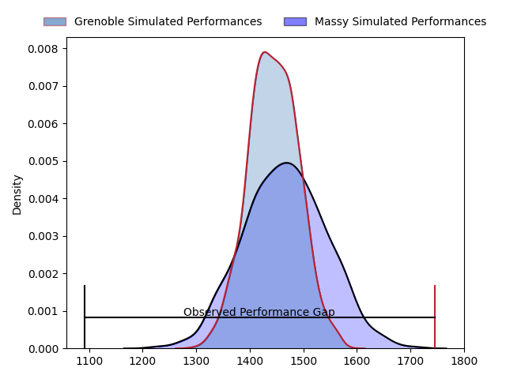
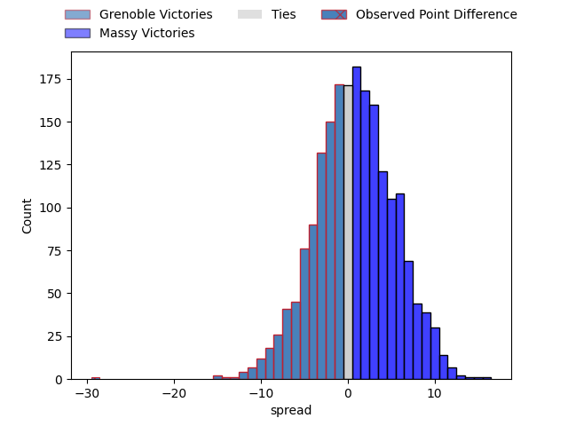

---  
layout: page  
title: Grenoble at Massy; 36-7  
date: 2023-03-31 19:00:00 18:00:00 -0500  
categories: match review  
---
# Grenoble at Massy; 36-7

# Club Level Predictions

The first set of predictions treats a club as the smallest object, as the club develops its members, organizes a gameplan, and deploys its players as needed for each match. This club model has a prediction of 0.53, which translates to predicting Massy to win by 1.1.

Each club has a rating and a rating deviation (simiar to a Glicko system), and expected performances can be generated. This allows for simulated matches and spreads like the ones below.
## Projected Performances

## Projected Spreads

## Projected Results

# Player Level Predictions

Treating teams instead as an entity made up of the currently active players, I have ratings for each player in an altogether different system. These can be combined to form team ratings once teamsheets are announced, weighting starters a bit higher than the reserves. After the match is played, players can be weighted by their minutes on the field, allowing for an accurate measure of the team's composition. With these compiled team ratings, we can make predictions, measure inaccuracy, and update the individual player ratings.
## Prediction with Player Minutes: Grenoble by 9.1

Grenoble by 13.1 on a neutral field

There were 4 large changes in win probability in this match
## Prediction without Player Minutes: Grenoble by 10.0

Grenoble by 14.0 on a neutral pitch

|   Away Minutes | Away Player         |   Away elo |   Away Percentile |   Number |   Home Percentile |   Home elo | Home Player           |   Home Minutes |
|---------------:|:--------------------|-----------:|------------------:|---------:|------------------:|-----------:|:----------------------|---------------:|
|             54 | Luka Goginava       |      81.04 |                10 |        1 |                28 |      88.6  | Fernandez Correa      |             50 |
|             50 | Bernabe Massa       |      98.53 |                63 |        2 |                99 |     134.42 | Pierre Trassoudaine   |             46 |
|             36 | Irakli Aptsiauri    |      96.05 |                53 |        3 |                43 |      93.31 | Tijde Visser          |             50 |
|             80 | José Duarte Madeira |     104.1  |                71 |        4 |                 3 |      64.48 | Andrew Chauveau       |             46 |
|             54 | Tanginoa Halaifonua |     109.63 |                83 |        5 |                32 |      90.28 | Marco Fuser           |             80 |
|             54 | Antonin Berruyer    |      95.53 |                53 |        6 |                45 |      93.92 | Jean Maurice Decubber |             52 |
|             50 | Steeve Blanc-Mappaz |      98.44 |                58 |        7 |                38 |      91.68 | Abongile Nonkontwana  |             80 |
|             80 | Thibaut Martel      |     101.91 |                69 |        8 |                32 |      89.53 | Samuel Nollet         |             80 |
|             54 | Éric Escande        |     107.48 |                81 |        9 |                33 |      90.28 | Gaëtan Pichon         |             54 |
|             54 | Thomas Fortunel     |     108.4  |                79 |       10 |                11 |      80.27 | Massimo Ortolan       |             80 |
|             80 | Lucas Dupont        |     100.95 |                65 |       11 |                32 |      88.75 | Thomas Rozière        |             80 |
|             80 | Romain Trouilloud   |      79.51 |                11 |       12 |                 0 |      50.01 | Mathieu Guillomot     |             50 |
|             80 | Romain Fusier       |      83.59 |                20 |       13 |                12 |      80.12 | Victorien Jacomme     |             80 |
|             80 | Erwan Dridi         |      90.44 |                37 |       14 |                82 |     109.66 | Alex Preira           |             80 |
|             80 | Julien Farnoux      |     112.2  |                85 |       15 |                14 |      80.58 | Juan Kotze            |             50 |
|             30 | Jean-Charles Orioli |      94.96 |                45 |       16 |                52 |      93.64 | Randy Grelleaud       |             34 |
|             30 | Clément Ancely      |      92.64 |                41 |       17 |                 5 |      72.3  | Louis Bruinsma        |             34 |
|             26 | Felipe Ezcurra      |      89.35 |                27 |       18 |                40 |      92.55 | Alexandre Candel      |             30 |
|             26 | Romain Barthélémy   |     111.18 |                83 |       19 |                46 |      95.01 | Arthur Seigneuret     |             30 |
|             26 | Adrien Vigne        |      93.83 |                50 |       20 |                24 |      86.57 | Guiterembi Vickos     |             30 |
|             26 | Marnus Schoeman     |     101.31 |                66 |       21 |                49 |      95.63 | Martin Carré          |             30 |
|             26 | Zack Gauthier       |     120.93 |                96 |       22 |                17 |      83.66 | Andy Timo             |             28 |
|             44 | Sam Nixon           |      93.74 |               nan |       23 |                87 |     111.37 | Benjamin Prier        |             26 |

