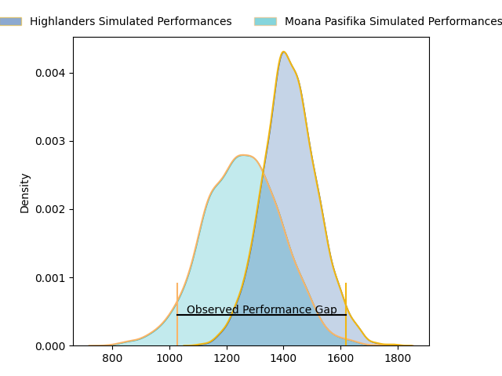
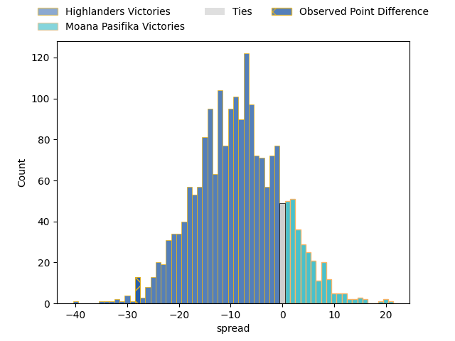

---  
layout: page  
title: Highlanders at Moana Pasifika; 45.0-17.0  
date: 2023-03-31 02:05:00 18:00:00 -0500  
categories: match review  
---
# Highlanders at Moana Pasifika; 45.0-17.0

# Club Level Predictions

The first set of predictions treats a club as the smallest object, as the club develops its members, organizes a gameplan, and deploys its players as needed for each match. This club model has a prediction of 0.286, which translates to predicting Highlanders to win by 8.3.

Each club has a rating and a rating deviation (simiar to a Glicko system), and expected performances can be generated. This allows for simulated matches and spreads like the ones below.
## Projected Performances

## Projected Spreads

## Projected Results

# Player Level Predictions

Treating teams instead as an entity made up of the currently active players, I have ratings for each player in an altogether different system. These can be combined to form team ratings once teamsheets are announced, weighting starters a bit higher than the reserves. After the match is played, players can be weighted by their minutes on the field, allowing for an accurate measure of the team's composition. With these compiled team ratings, we can make predictions, measure inaccuracy, and update the individual player ratings.
## Prediction with Player Minutes: Highlanders by 7.5

Highlanders by 11.5 on a neutral field

There were 8 large changes in win probability in this match
## Prediction without Player Minutes: Highlanders by 9.1

Highlanders by 13.1 on a neutral pitch

|   Away Minutes | Away Player         |   Away elo |   Away Percentile |   Number |   Home Percentile |   Home elo | Home Player          |   Home Minutes |
|---------------:|:--------------------|-----------:|------------------:|---------:|------------------:|-----------:|:---------------------|---------------:|
|             61 | Ethan de Groot      |     111.37 |                89 |        1 |                 5 |      73.69 | Ezekiel Lindenmuth   |             50 |
|             53 | Leni Apisai         |      82.85 |                14 |        2 |                 7 |      77.21 | Samiuela Moli        |             44 |
|             67 | Jermaine Ainsley    |     106.51 |                84 |        3 |                 8 |      77.45 | Suetena Asomua       |             50 |
|             57 | Pari Pari Parkinson |     154.25 |                99 |        4 |                83 |     110.71 | Michael Curry        |             67 |
|             27 | Will Tucker         |      92.31 |                40 |        5 |                 5 |      70.29 | Samuel Slade         |             80 |
|             80 | Sean Withy          |      86.37 |                21 |        6 |                55 |      93.75 | Miracle Faiilagi     |             80 |
|             80 | Billy Harmon        |     116.94 |                90 |        7 |                19 |      85.76 | Alamanda Motuga      |             62 |
|             61 | Hugh Renton         |      62.24 |                 2 |        8 |                35 |      90.61 | Solomone Funaki      |             80 |
|             64 | Aaron Smith         |      98.81 |                59 |        9 |                69 |     101.98 | Ere Enari            |             64 |
|             71 | Mitch Hunt          |     121.66 |                90 |       10 |                48 |      96.39 | Lincoln McClutchie   |             69 |
|             80 | Jonah Lowe          |     105.8  |                76 |       11 |                41 |      92.66 | Neria Fomai          |             80 |
|             80 | Thomas Umaga-Jensen |      88.76 |                29 |       12 |                86 |     113.38 | Danny Toala          |             80 |
|             80 | Fetuli Paea         |     118.56 |                91 |       13 |                91 |     118.21 | Levi Aumua           |             62 |
|             80 | Mosese Dawai        |     114.42 |                87 |       14 |                27 |      88.42 | Timoci Tavatavanawai |             80 |
|             80 | Sam Gilbert         |      85.93 |                22 |       15 |                93 |     120.99 | William Havili       |             80 |
|             27 | Andrew Makalio      |     103.13 |                75 |       16 |                67 |     102.9  | Luteru Tolai         |             36 |
|             19 | Dan Lienert-Brown   |     100.23 |                71 |       17 |                71 |     101.1  | Abraham Pole         |             30 |
|             13 | Saula Mau           |     100.71 |                79 |       18 |               nan |      95    | Joe Apikotoa         |             30 |
|             53 | Max Hicks           |      89.54 |                42 |       19 |                 7 |      74.5  | Mike McKee           |             13 |
|             23 | Shannon Frizell     |     117.83 |                91 |       20 |                64 |     102.59 | Jonah Mau'u          |             18 |
|             16 | Folau Fakatava      |      82.75 |                16 |       21 |                41 |      92.32 | Manu Paea            |             16 |
|              9 | Cameron Millar      |     103.66 |                70 |       22 |                60 |     100.79 | D'Angelo Leuila      |             11 |
|             19 | Marino Mikaele-Tu'u |      98.73 |                55 |       23 |                 7 |      73.73 | Fine Inisi           |             18 |

