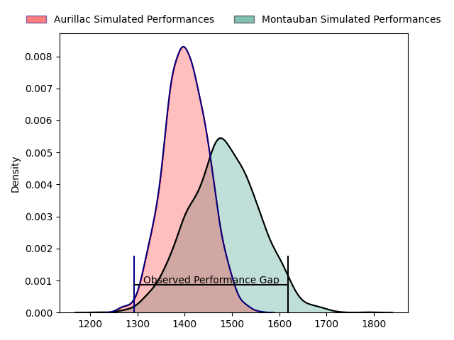
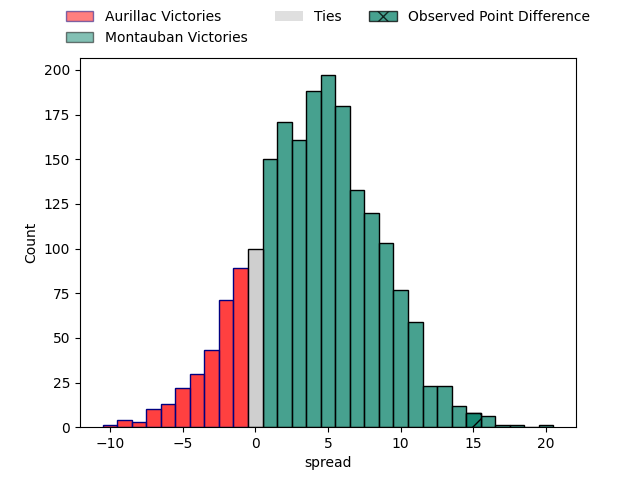
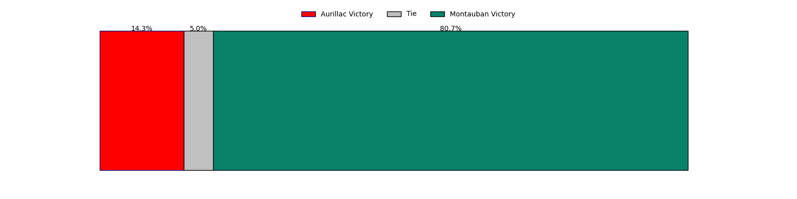

---  
layout: page  
title: Aurillac at Montauban; 15-30  
date: 2023-03-31 19:30:00 18:00:00 -0500  
categories: match review  
---
# Aurillac at Montauban; 15-30

# Club Level Predictions

The first set of predictions treats a club as the smallest object, as the club develops its members, organizes a gameplan, and deploys its players as needed for each match. This club model has a prediction of 0.611, which translates to predicting Montauban to win by 4.0.

Each club has a rating and a rating deviation (simiar to a Glicko system), and expected performances can be generated. This allows for simulated matches and spreads like the ones below.
## Projected Performances

## Projected Spreads

## Projected Results

# Player Level Predictions

Treating teams instead as an entity made up of the currently active players, I have ratings for each player in an altogether different system. These can be combined to form team ratings once teamsheets are announced, weighting starters a bit higher than the reserves. After the match is played, players can be weighted by their minutes on the field, allowing for an accurate measure of the team's composition. With these compiled team ratings, we can make predictions, measure inaccuracy, and update the individual player ratings.
## Prediction with Player Minutes: Montauban by 4.7

Montauban by 0.7 on a neutral field

There were 9 large changes in win probability in this match
## Prediction without Player Minutes: Montauban by 4.7

Montauban by 0.7 on a neutral pitch

|   Away Minutes | Away Player               |   Away elo |   Away Percentile |   Number |   Home Percentile |   Home elo | Home Player       |   Home Minutes |
|---------------:|:--------------------------|-----------:|------------------:|---------:|------------------:|-----------:|:------------------|---------------:|
|             56 | Alexandre Plantier        |     111.26 |                84 |        1 |                21 |      87.19 | Lucas Seyrolle    |             56 |
|             68 | Luka Nioradze             |     118.74 |                94 |        2 |                63 |      98.64 | Cyril Deligny     |             55 |
|             47 | Henzo Kiteau              |      78.85 |                13 |        3 |                37 |      91.9  | Tietie Tuimauga   |             48 |
|             48 | Martial Rolland           |      93.41 |                43 |        4 |                61 |      99.31 | Dimitri Vaotoa    |             80 |
|             65 | Cam Dodson                |     104.67 |                74 |        5 |                21 |      86.91 | Dan Malafosse     |             55 |
|             56 | Steve Moukete             |      85.28 |                19 |        6 |                 1 |      57.84 | Frédéric Quercy   |             65 |
|             80 | Maxime Profit             |      79.05 |                13 |        7 |                72 |     105.45 | Otar Giorgadze    |             62 |
|             80 | Didier Tison              |     101.54 |                60 |        8 |                28 |      89.15 | Quentin Witt      |             80 |
|             55 | Mikheil Alania            |      90.6  |                34 |        9 |                62 |     100.02 | Alexis Bernadet   |             70 |
|             80 | Antoine Aucagne           |      92.51 |                38 |       10 |                69 |     102.6  | Jérôme Bosviel    |             80 |
|             80 | Jordon Janse Van Rensburg |      89.15 |                29 |       11 |                46 |      94.39 | Bastien Guillemin |             80 |
|             80 | Marc Palmier              |     111.57 |                81 |       12 |                79 |     108.15 | Sevenaia Galala   |             55 |
|             80 | Christa Powell            |      84.48 |                18 |       13 |                67 |     101.82 | Josua Vici        |             80 |
|             80 | Jimmy Yobo                |      95.87 |                48 |       14 |                34 |      90.21 | Semesa Rokoduguni |             80 |
|             55 | Jules Margarit            |      85.91 |                22 |       15 |                72 |     105.73 | Segundo Tuculet   |             80 |
|             33 | Giorgi Kartvelishvili     |     120.63 |                96 |       16 |                51 |      98.24 | Mirian Burduli    |             32 |
|             32 | Yann Tivoli               |     101    |                65 |       17 |                20 |      89.06 | Kevin Firmin      |             25 |
|             25 | Hugo Bouyssou             |      69.79 |                 5 |       18 |                51 |      94.4  | Tjiuee Uanivi     |             25 |
|             25 | Hugo Bastard              |      91.57 |                38 |       19 |                68 |     104.03 | Maxime Mathy      |             25 |
|             24 | Robert Rodgers            |      96.29 |                54 |       20 |                97 |     125.44 | Nicolas Agnesi    |             24 |
|             24 | Mosa'ati Moala            |      83.81 |                21 |       21 |               nan |      95    | Maselino Paulino  |             18 |
|             15 | Mehdi Slamani             |      93.3  |               nan |       22 |               nan |      94.26 | Tomas Lezana      |             15 |
|             12 | Lilian Djomboue           |      93.15 |               nan |       23 |                38 |      91.79 | Anthony Meric     |             10 |

