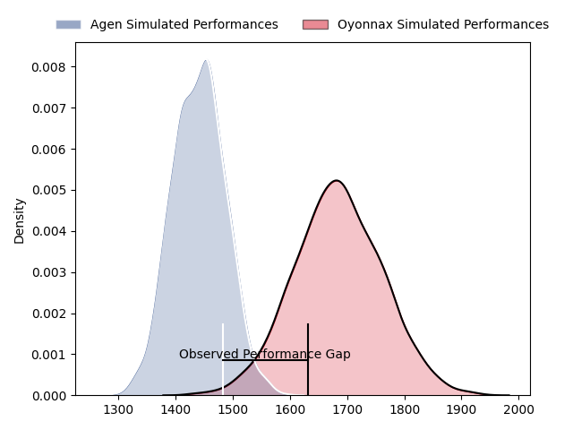
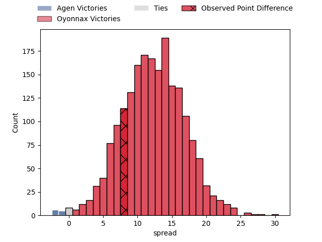
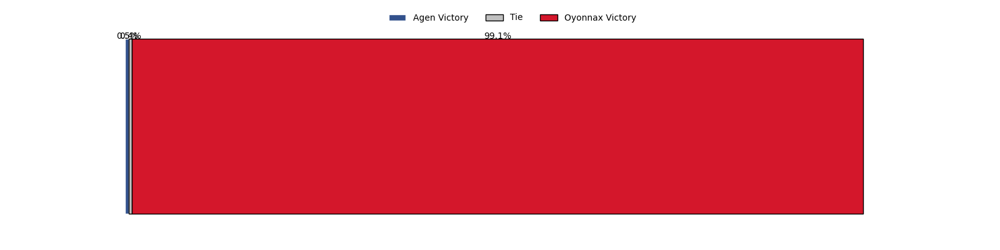

---  
layout: page  
title: Agen at Oyonnax; 29-37  
date: 2023-03-31 21:00:00 18:00:00 -0500  
categories: match review  
---
# Agen at Oyonnax; 29-37

# Club Level Predictions

The first set of predictions treats a club as the smallest object, as the club develops its members, organizes a gameplan, and deploys its players as needed for each match. This club model has a prediction of 0.801, which translates to predicting Oyonnax to win by 12.3.

Each club has a rating and a rating deviation (simiar to a Glicko system), and expected performances can be generated. This allows for simulated matches and spreads like the ones below.
## Projected Performances

## Projected Spreads

## Projected Results

# Player Level Predictions

Treating teams instead as an entity made up of the currently active players, I have ratings for each player in an altogether different system. These can be combined to form team ratings once teamsheets are announced, weighting starters a bit higher than the reserves. After the match is played, players can be weighted by their minutes on the field, allowing for an accurate measure of the team's composition. With these compiled team ratings, we can make predictions, measure inaccuracy, and update the individual player ratings.
## Prediction with Player Minutes: Oyonnax by 20.6

Oyonnax by 16.6 on a neutral field

There were 9 large changes in win probability in this match
## Prediction without Player Minutes: Oyonnax by 20.1

Oyonnax by 16.1 on a neutral pitch

|   Away Minutes | Away Player           |   Away elo |   Away Percentile |   Number |   Home Percentile |   Home elo | Home Player         |   Home Minutes |
|---------------:|:----------------------|-----------:|------------------:|---------:|------------------:|-----------:|:--------------------|---------------:|
|             60 | Richard Barrington    |      91.06 |                33 |        1 |                56 |      96.6  | Tommy Raynaud       |             57 |
|             48 | Mike Sosene-Feagai    |      96.93 |                57 |        2 |                22 |      86.87 | Teddy Durand        |             57 |
|             48 | Beau Farrance         |      95.99 |                48 |        3 |                60 |      97.92 | Thomas Laclayat     |             57 |
|             80 | Corentin Vernet       |      92.47 |               nan |        4 |                76 |     105.94 | Phoenix Battye      |             80 |
|             48 | Zak Farrance          |      88.43 |                39 |        5 |                43 |      93.2  | Hugo Fabregue       |             51 |
|             47 | Julien Lebian         |      97.22 |                54 |        6 |                99 |     149.41 | Kevin Lebreton      |             80 |
|             47 | Vincent Farré         |      79.54 |                10 |        7 |                64 |     101.47 | Loïc Credoz         |             80 |
|             80 | Afa Amosa             |      92.44 |                52 |        8 |                52 |      97.79 | Rory Grice          |             62 |
|             75 | Dorian Bellot         |      92.18 |                46 |        9 |                51 |      96.14 | Charlie Cassang     |             68 |
|             48 | Elton Thomas Jantjies |      88.88 |                27 |       10 |                83 |     110.65 | Justin Bouraux      |             80 |
|             80 | Loris Tolot           |      90.02 |                35 |       11 |                72 |     105.41 | Aurelien Callandret |             51 |
|             80 | Kolinio Ramoka        |      92.66 |                41 |       12 |                65 |     101.48 | Théo Millet         |             51 |
|             80 | Théo Belan            |      85.76 |                22 |       13 |                39 |      92.06 | Chris Farrell       |             80 |
|             80 | Timilai Rokoduru      |      78.27 |                11 |       14 |                79 |     108.09 | Gavin Stark         |             80 |
|             80 | Jean-Marcellin Buttin |     106.59 |                74 |       15 |                69 |     104.37 | Tony Ensor          |             80 |
|             33 | Valentin Gayraud      |     101.74 |                65 |       16 |                74 |     104.95 | Enzo Reybier        |             29 |
|             33 | Matthieu Bonnet       |     104.13 |                72 |       17 |                44 |      93.17 | Florian Vialelle    |             29 |
|             32 | Théo Sauzaret         |     102.98 |                80 |       18 |                69 |     102.29 | Steve Mafi          |             29 |
|             32 | William Demotte       |      99.98 |                63 |       19 |               nan |      99.74 | Victor Delmas       |             23 |
|             32 | Loris Zarantonello    |      89.74 |                36 |       20 |                40 |      92.13 | Adrien Bordenave    |             23 |
|             32 | Thomas Vincent        |      99.27 |                60 |       21 |                73 |     102.29 | Benjamin Geledan    |             23 |
|             20 | Florent Guion         |      56.71 |                 1 |       22 |                27 |      88.89 | Victor Lebas        |             18 |
|              5 | Theo Idjellidaine     |      90.65 |                41 |       23 |                12 |      80.81 | Ilan El Khattabi    |             12 |

