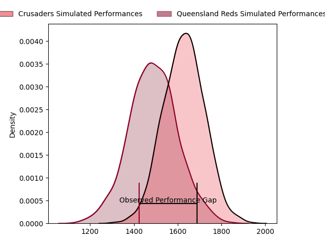
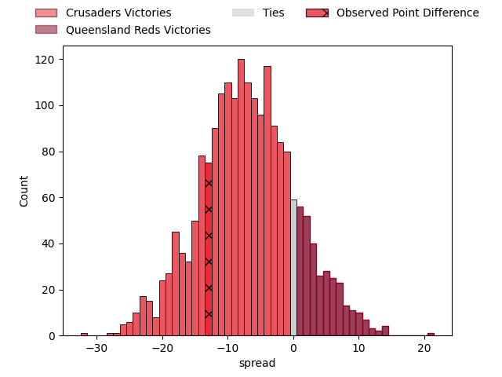

---  
layout: page  
title: Crusaders at Queensland Reds; 25.0-12.0  
date: 2023-03-31 04:35:00 18:00:00 -0500  
categories: match review  
---
# Crusaders at Queensland Reds; 25.0-12.0

# Club Level Predictions

The first set of predictions treats a club as the smallest object, as the club develops its members, organizes a gameplan, and deploys its players as needed for each match. This club model has a prediction of 0.32, which translates to predicting Crusaders to win by 6.8.

Each club has a rating and a rating deviation (simiar to a Glicko system), and expected performances can be generated. This allows for simulated matches and spreads like the ones below.
## Projected Performances

## Projected Spreads

## Projected Results

# Player Level Predictions

Treating teams instead as an entity made up of the currently active players, I have ratings for each player in an altogether different system. These can be combined to form team ratings once teamsheets are announced, weighting starters a bit higher than the reserves. After the match is played, players can be weighted by their minutes on the field, allowing for an accurate measure of the team's composition. With these compiled team ratings, we can make predictions, measure inaccuracy, and update the individual player ratings.
## Prediction with Player Minutes: Crusaders by 3.0

Crusaders by 7.0 on a neutral field

There were 7 large changes in win probability in this match
## Prediction without Player Minutes: Crusaders by 3.5

Crusaders by 7.5 on a neutral pitch

|   Away Minutes | Away Player            |   Away elo |   Away Percentile |   Number |   Home Percentile |   Home elo | Home Player           |   Home Minutes |
|---------------:|:-----------------------|-----------:|------------------:|---------:|------------------:|-----------:|:----------------------|---------------:|
|             55 | Joe Moody              |      88.71 |                26 |        1 |               nan |      94.6  | Peni Ravai            |             44 |
|             55 | Codie Taylor           |     108.42 |                84 |        2 |                51 |      95.34 | Matt Faessler         |             51 |
|             55 | Tamaiti Williams       |      93.2  |                42 |        3 |                50 |      95.07 | Zane Nonggorr         |             51 |
|             80 | Scott Barrett          |     123.01 |                94 |        4 |                40 |      92.7  | Ryan Smith            |             78 |
|             72 | Dom Gardiner           |      97.35 |                55 |        5 |                48 |      95.02 | Seru Uru              |             62 |
|             64 | Sione Havili           |     105.88 |                76 |        6 |                95 |     126.92 | Liam Wright           |             80 |
|             80 | Tom Christie           |     109.43 |                82 |        7 |                82 |     109.69 | Fraser McReight       |             80 |
|             80 | Christian Lio-Willie   |      85.35 |                15 |        8 |                76 |     105.99 | Harry Wilson          |             80 |
|             44 | Noah Hotham            |      99.89 |                59 |        9 |                69 |     101.49 | Tate McDermott        |             66 |
|             80 | Richie Mo'unga         |     150.32 |                99 |       10 |                37 |      92.12 | James O'Connor        |             72 |
|             80 | Leicester Fainga'anuku |      97.15 |                54 |       11 |                47 |      94.72 | Jordan Petaia         |             80 |
|             75 | Dallas McLeod          |     109.04 |                80 |       12 |                51 |      94.67 | Isaac Henry           |             80 |
|             80 | Braydon Ennor          |     115.5  |                88 |       13 |                42 |      92.75 | Josh Flook            |             80 |
|             56 | Pepesana Patafilo      |     101.08 |                65 |       14 |                52 |      96.74 | Suliasi Vunivalu      |             62 |
|             80 | Fergus Burke           |      91.54 |                39 |       15 |                62 |     100.33 | Jock Campbell         |             80 |
|             25 | Brodie McAlister       |     108    |                84 |       16 |                89 |     115.39 | Richie Asiata         |             29 |
|             25 | George Bower           |      81.66 |                11 |       17 |                78 |     104.07 | Dane Zander           |             36 |
|             25 | Seb Calder             |      97.64 |               nan |       18 |               nan |      93.9  | Phransis Sula- Siaosi |             29 |
|              8 | Jamie Hannah           |      96.21 |               nan |       19 |               nan |      95    | Angus Blyth           |             18 |
|             16 | Corey Kellow           |      97.04 |                58 |       20 |               nan |      95.93 | Jake Upfield          |              2 |
|             36 | Willi Heinz            |      94.32 |                44 |       21 |                50 |      95.67 | Kalani Thomas         |             14 |
|             24 | Willi Gualter          |      89.5  |                31 |       22 |                31 |      89.66 | Taj Annan             |             18 |
|              5 | Chay Fihaki            |     110.2  |                81 |       23 |               nan |      91.6  | Mac Grealy            |              8 |

