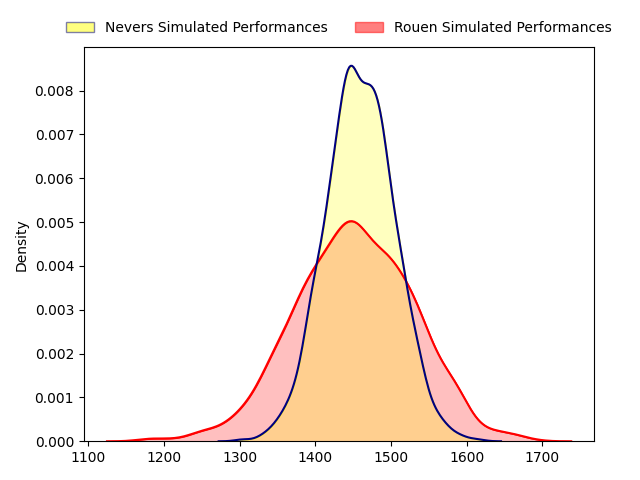
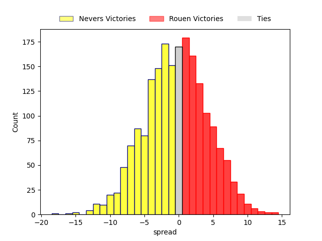

---  
layout: page  
title: Nevers at Rouen; 19-19  
date: 2023-03-31 19:30:00 18:00:00 -0500  
categories: match review  
---
# Nevers at Rouen; 19-19

# Club Level Predictions

The first set of predictions treats a club as the smallest object, as the club develops its members, organizes a gameplan, and deploys its players as needed for each match. This club model has a prediction of 0.493, which translates to predicting Nevers to win by 0.3.

Each club has a rating and a rating deviation (simiar to a Glicko system), and expected performances can be generated. This allows for simulated matches and spreads like the ones below.
## Projected Performances

## Projected Spreads

## Projected Results

# Player Level Predictions

Treating teams instead as an entity made up of the currently active players, I have ratings for each player in an altogether different system. These can be combined to form team ratings once teamsheets are announced, weighting starters a bit higher than the reserves. After the match is played, players can be weighted by their minutes on the field, allowing for an accurate measure of the team's composition. With these compiled team ratings, we can make predictions, measure inaccuracy, and update the individual player ratings.
## Prediction with Player Minutes: Nevers by 7.1

Nevers by 11.1 on a neutral field

There were 7 large changes in win probability in this match
## Prediction without Player Minutes: Nevers by 6.6

Nevers by 10.6 on a neutral pitch

|   Away Minutes | Away Player         |   Away elo |   Away Percentile |   Number |   Home Percentile |   Home elo | Home Player           |   Home Minutes |
|---------------:|:--------------------|-----------:|------------------:|---------:|------------------:|-----------:|:----------------------|---------------:|
|             65 | Kamaliele Tufele    |     100.65 |                70 |        1 |                86 |     108.13 | Soulemane Camara      |             57 |
|             63 | Issam Hamel         |     100.01 |                67 |        2 |                48 |      94.37 | Efitusi Ma'afu        |             68 |
|             61 | Ilia Kaikatsishvili |     106.17 |                83 |        3 |                49 |      94.89 | Hugo Ndiaye           |             53 |
|             58 | Lasha Jaiani        |      93.15 |               nan |        4 |                54 |      96.9  | John Charles Astle    |             21 |
|             80 | Maka Polutele       |      96    |                51 |        5 |                41 |      92.73 | Toby Salmon           |             80 |
|             80 | Luka Plataret       |      85.66 |                20 |        6 |                33 |      89.77 | Samuel Maximin        |             80 |
|             80 | Julien Kazubek      |      95.41 |                48 |        7 |                42 |      93.59 | Willy N'Diaye         |             80 |
|             61 | Jason-Collin Fraser |     106.53 |                77 |        8 |                37 |      92.44 | Valentino Mapapalangi |             15 |
|             51 | Yoan Cottin         |     100.15 |                60 |        9 |                 7 |      72.67 | Florent Campeggia     |             66 |
|              9 | Shaun Reynolds      |     110.29 |                81 |       10 |                19 |      85.14 | Franck Pourteau       |             80 |
|             80 | Lucas Blanc         |      96.16 |                50 |       11 |                30 |      89.49 | Benito Masilevu       |             71 |
|             80 | Mattéo Faucher      |      99.17 |                57 |       12 |                11 |      79.82 | John Thomas Jackson   |             80 |
|             80 | Alifereti Loaloa    |      90.81 |                36 |       13 |                30 |      89.16 | Opetera Peleseuma     |             57 |
|             80 | Christian Ambadiang |     103.7  |                72 |       14 |                15 |      82.19 | Paul Surano           |             80 |
|             63 | Thomas Zenon        |      92.67 |                40 |       15 |                93 |     120.91 | Peter Lydon           |             80 |
|             71 | Yohan Le Bourhis    |      98.41 |                54 |       16 |                14 |      83.05 | Lucas Costa           |             65 |
|             29 | Arthurs Barbier     |     111.63 |                87 |       17 |                13 |      80.04 | Jean Leleu            |             59 |
|             22 | Lado Chachanidze    |     112.25 |                80 |       18 |                25 |      87.44 | Cody Thomas           |             27 |
|             19 | Shaun Adendorff     |     100.18 |                61 |       19 |               nan |      93.78 | Dylan Jacquot         |             23 |
|             19 | Aselo Ikahehegi     |      97.07 |                53 |       20 |                52 |      96.99 | Taylor Gontineac      |             23 |
|             17 | Quentin Beaudaux    |      93.7  |                42 |       21 |                29 |      85.34 | Jean-Étienne Lesueur  |             12 |
|             17 | Benjamin Dumas      |      99.22 |                57 |       22 |                18 |      84.96 | Théo Nanette          |             14 |
|             15 | Jordan Seneca       |      95    |               nan |       23 |                49 |      95.88 | Malcolm Bertschy      |              9 |

