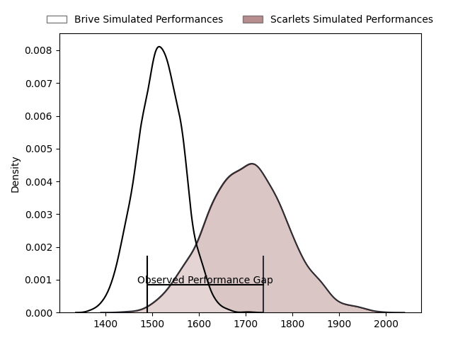
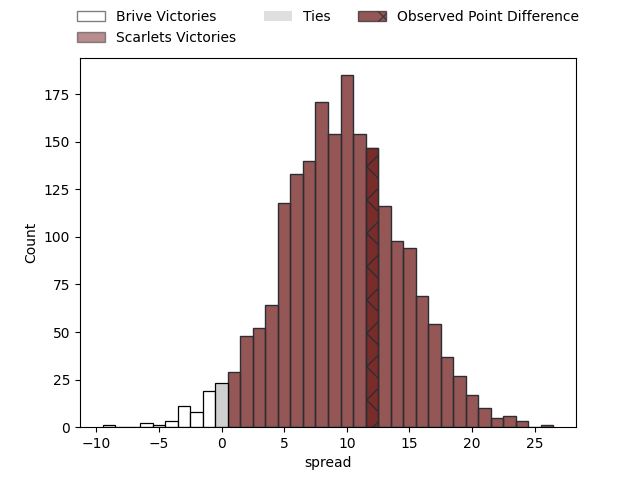

---  
layout: page  
title: Brive at Scarlets; 7-19  
date: 2023-03-31 21:00:00 18:00:00 -0500  
categories: match review  
---
# Brive at Scarlets; 7-19

# Club Level Predictions

The first set of predictions treats a club as the smallest object, as the club develops its members, organizes a gameplan, and deploys its players as needed for each match. This club model has a prediction of 0.747, which translates to predicting Scarlets to win by 9.5.

Each club has a rating and a rating deviation (simiar to a Glicko system), and expected performances can be generated. This allows for simulated matches and spreads like the ones below.
## Projected Performances

## Projected Spreads

## Projected Results

# Player Level Predictions

Treating teams instead as an entity made up of the currently active players, I have ratings for each player in an altogether different system. These can be combined to form team ratings once teamsheets are announced, weighting starters a bit higher than the reserves. After the match is played, players can be weighted by their minutes on the field, allowing for an accurate measure of the team's composition. With these compiled team ratings, we can make predictions, measure inaccuracy, and update the individual player ratings.
## Prediction with Player Minutes: Scarlets by 28.3

Scarlets by 24.3 on a neutral field

There were 4 large changes in win probability in this match
## Prediction without Player Minutes: Scarlets by 22.6

Scarlets by 18.6 on a neutral pitch

|   Away Minutes | Away Player               |   Away elo |   Away Percentile |   Number |   Home Percentile |   Home elo | Home Player      |   Home Minutes |
|---------------:|:--------------------------|-----------:|------------------:|---------:|------------------:|-----------:|:-----------------|---------------:|
|             55 | Daniel Brennan            |      93.98 |                55 |        1 |                84 |     106.87 | Kemsley Mathias  |             52 |
|             49 | Lucas Da Silva            |      93.22 |                60 |        2 |                86 |     109.85 | Ken Owens        |             52 |
|             52 | Francisco Coria Marchetti |      80.83 |                15 |        3 |                57 |      96.97 | Javan Sebastian  |             51 |
|             57 | Mesulame Kunavula         |      91.62 |                34 |        4 |                87 |     113.16 | Vaea Fifita      |             80 |
|             80 | Lucas Martin Paulos Adler |      91.1  |                46 |        5 |                88 |     113.68 | Sam Lousi        |             80 |
|             80 | Rodrigo Bruni             |      92.09 |               nan |        6 |                86 |     110.62 | Aaron Shingler   |             80 |
|             80 | Saïd Hireche              |      89.33 |                32 |        7 |                50 |      96.04 | Joshua McLeod    |             80 |
|             41 | Retief Marais             |      87.63 |                24 |        8 |                88 |     114.61 | Sione Kalamafoni |             80 |
|             57 | Vasil Lobzhanidze         |     109.39 |                84 |        9 |                73 |     103.6  | Gareth Davies    |             71 |
|             80 | Stuart Olding             |      89.03 |                28 |       10 |                76 |     106.32 | Sam Costelow     |             30 |
|             52 | Kevin Fabien              |      93.21 |                43 |       11 |                64 |     100.19 | Ryan Conbeer     |             80 |
|             80 | Sam Arnold                |      87.87 |               nan |       12 |                49 |      96.04 | Johnny Williams  |             80 |
|             80 | Nicolaas Jacobus Lee      |      85.36 |                35 |       13 |                86 |     114.05 | Joe Roberts      |             60 |
|             80 | Arthur Bonneval           |      84.59 |                18 |       14 |                86 |     114.11 | Steffan Evans    |             80 |
|             44 | Nic Krone                 |      95    |               nan |       15 |                54 |      97.59 | Tom Rogers       |             80 |
|             25 | Nathan Fraissenon         |      92.96 |                59 |       16 |                98 |     132.05 | Wyn Jones        |             28 |
|             31 | Motu Farao Matu'u         |      83.78 |                15 |       17 |                70 |     101.05 | Shaun Evans      |             28 |
|             28 | Wesley Tapueluelu         |      92.38 |                39 |       18 |                33 |      90.86 | Sam Wainwright   |             29 |
|             23 | Renger Van Eerten         |      79.01 |                11 |       19 |               nan |      97.01 | Kieran Hardy     |              9 |
|             39 | Sasha Gue                 |      87.97 |                23 |       20 |                58 |      99.78 | Rhys Patchell    |             50 |
|             23 | Paul Abadie               |      90.12 |                34 |       21 |                83 |     110.74 | Ioan Nicholas    |             20 |
|             28 | Tom Raffy                 |      81.79 |                14 |       22 |               nan |     nan    | nan              |            nan |
|             36 | Setariki Tuicuvu          |      87.78 |                27 |       23 |               nan |     nan    | nan              |            nan |

