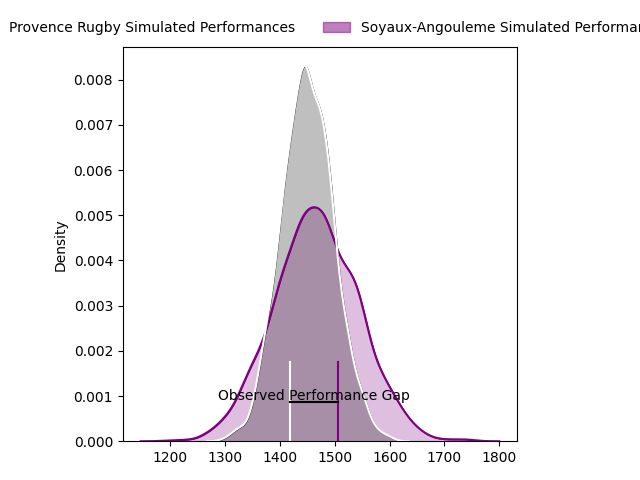
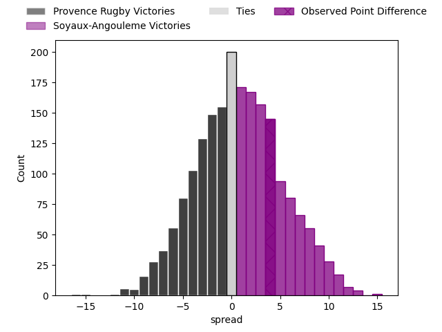

---  
layout: page  
title: Provence Rugby at Soyaux-Angouleme; 8-12  
date: 2023-03-31 19:30:00 18:00:00 -0500  
categories: match review  
---
# Provence Rugby at Soyaux-Angouleme; 8-12

# Club Level Predictions

The first set of predictions treats a club as the smallest object, as the club develops its members, organizes a gameplan, and deploys its players as needed for each match. This club model has a prediction of 0.523, which translates to predicting Soyaux-Angouleme to win by 0.8.

Each club has a rating and a rating deviation (simiar to a Glicko system), and expected performances can be generated. This allows for simulated matches and spreads like the ones below.
## Projected Performances

## Projected Spreads

## Projected Results

# Player Level Predictions

Treating teams instead as an entity made up of the currently active players, I have ratings for each player in an altogether different system. These can be combined to form team ratings once teamsheets are announced, weighting starters a bit higher than the reserves. After the match is played, players can be weighted by their minutes on the field, allowing for an accurate measure of the team's composition. With these compiled team ratings, we can make predictions, measure inaccuracy, and update the individual player ratings.
## Prediction with Player Minutes: Provence Rugby by 1.1

Provence Rugby by 5.1 on a neutral field

There were 7 large changes in win probability in this match
## Prediction without Player Minutes: Soyaux-Angouleme by 2.3

Provence Rugby by 1.7 on a neutral pitch

|   Away Minutes | Away Player       |   Away elo |   Away Percentile |   Number |   Home Percentile |   Home elo | Home Player                      |   Home Minutes |
|---------------:|:------------------|-----------:|------------------:|---------:|------------------:|-----------:|:---------------------------------|---------------:|
|             40 | Thomas Vernet     |      95.13 |                29 |        1 |                69 |      94.46 | Omar Odishvili                   |             45 |
|             40 | German Kessler    |     105.87 |                81 |        2 |                53 |      96.07 | Ole Avei                         |             40 |
|             22 | Luke Tagi         |      98.11 |                61 |        3 |                74 |     103.31 | Michael Masimba Tingini Kumbirai |             45 |
|             80 | Jérôme Dufour     |     107.82 |                78 |        4 |                 8 |      75.27 | Matt Beukeboom                   |             80 |
|             61 | Hans Nkinsi       |      93.59 |                44 |        5 |                76 |     104.3  | Sikeli Nabou                     |             59 |
|             40 | Nicolas Mousties  |      69.33 |                 3 |        6 |                11 |      81.02 | Gautier Gibouin                  |             80 |
|             80 | Jessy Jegerlhener |     101.27 |                61 |        7 |                88 |     114.12 | Germain Burgaud                  |             68 |
|             80 | Carl Axtens       |      99.24 |                60 |        8 |                68 |     102.79 | Matt Va'ai                       |             80 |
|             40 | Jeremie Martin    |      97.31 |                55 |        9 |                 1 |      56.59 | Adrien Bau                       |             61 |
|             80 | Jonny McPhillips  |      98.15 |                55 |       10 |                85 |     112.37 | Rémi Brosset                     |             68 |
|             80 | Léo Drouet        |     100.01 |                63 |       11 |                68 |     101    | Marvin Lestremau                 |             80 |
|             80 | Dorian Lavernhe   |     109.81 |                82 |       12 |                91 |     118.58 | Nasoni Naqiri Kunavore           |             58 |
|             80 | Louis Marrou      |      91.53 |                38 |       13 |                52 |      95.76 | Ledua Mau                        |             80 |
|             80 | Nadir Bouhedjeur  |      97.78 |                56 |       14 |                51 |      96.36 | Junior Ratuva                    |             80 |
|             40 | Florent Massip    |     110.23 |                82 |       15 |                17 |      82.65 | Pierre Lafitte                   |             80 |
|             58 | David Lolohea     |      75.34 |                 5 |       16 |                25 |      87.59 | Patxi Bidart                     |             40 |
|             40 | Federico Wegrzyn  |      99.66 |                60 |       17 |                36 |      91.68 | Khatchik Vartan                  |             35 |
|             40 | Adrian Sanday     |     117.97 |                86 |       18 |                83 |     106.03 | Shota Gogisvanidze               |             35 |
|             40 | Malohi Suta       |      99.39 |                57 |       19 |                34 |      90.34 | Inaki Ayarza Saporta             |             22 |
|             40 | Leonel Oviedo     |     109.23 |                83 |       20 |                29 |      89.16 | Ian Kitwanga                     |             21 |
|             40 | Joris Cazenave    |      82.16 |                14 |       21 |               nan |      99.13 | Lucas Rubio                      |             19 |
|             19 | Charly Gambini    |      95.34 |                49 |       22 |                41 |      93.58 | Jacob Botica                     |             12 |
|            nan | nan               |     nan    |               nan |       23 |                57 |      98.43 | Nicolas Martins                  |             12 |

