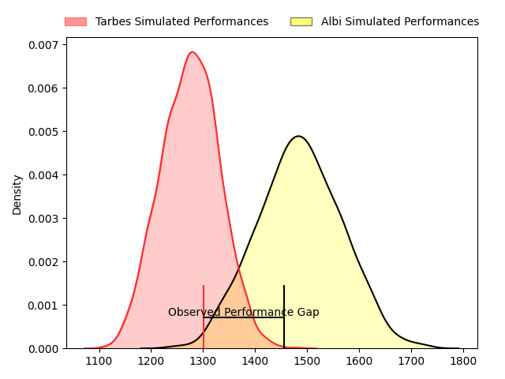
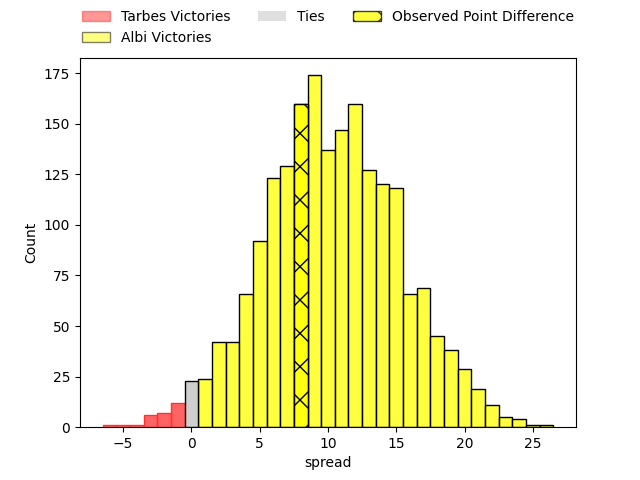
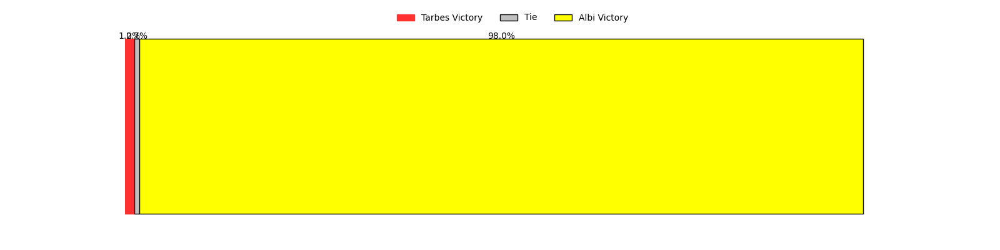

---  
layout: page  
title: Tarbes at Albi; 16-24  
date: 2023-04-01 18:30:00 18:00:00 -0500  
categories: match review  
---
# Tarbes at Albi; 16-24

# Club Level Predictions

The first set of predictions treats a club as the smallest object, as the club develops its members, organizes a gameplan, and deploys its players as needed for each match. This club model has a prediction of 0.763, which translates to predicting Albi to win by 10.3.

Each club has a rating and a rating deviation (simiar to a Glicko system), and expected performances can be generated. This allows for simulated matches and spreads like the ones below.
## Projected Performances

## Projected Spreads

## Projected Results

# Player Level Predictions

Treating teams instead as an entity made up of the currently active players, I have ratings for each player in an altogether different system. These can be combined to form team ratings once teamsheets are announced, weighting starters a bit higher than the reserves. After the match is played, players can be weighted by their minutes on the field, allowing for an accurate measure of the team's composition. With these compiled team ratings, we can make predictions, measure inaccuracy, and update the individual player ratings.
## Prediction with Player Minutes: Albi by 17.1

Albi by 13.1 on a neutral field

There were 14 large changes in win probability in this match
## Prediction without Player Minutes: Albi by 17.0

Albi by 13.0 on a neutral pitch

|   Away Minutes | Away Player               |   Away elo |   Away Percentile |   Number |   Home Percentile |   Home elo | Home Player                 |   Home Minutes |
|---------------:|:--------------------------|-----------:|------------------:|---------:|------------------:|-----------:|:----------------------------|---------------:|
|             52 | Alexandre Combier         |      78.34 |                11 |        1 |                63 |      98.82 | Pierre Commenge             |             51 |
|             46 | Enzo Mondon               |     103.56 |                77 |        2 |                77 |     104.24 | Arthur Castant              |             59 |
|             48 | Alexandre Duny            |      77.91 |                10 |        3 |                68 |      97.67 | Dimitri Tchapnga            |             79 |
|             80 | Paul Sajous               |      63.55 |                 4 |        4 |                74 |     103.63 | Mohsen Essid                |             80 |
|             80 | Léo Saint-Guilhem         |      99.19 |                60 |        5 |                43 |      93.28 | John Henry Heath Backhouse  |             51 |
|             52 | Mattéo Coustalat          |      98.46 |                58 |        6 |                61 |      99.69 | Pierre Roussel              |             67 |
|             52 | Aurelien Ricart           |      93.49 |                43 |        7 |                26 |      86.3  | Vincent Calas               |             61 |
|             80 | Loan Real                 |      85.39 |                27 |        8 |                69 |     102.66 | Camille Jarreau             |             80 |
|             67 | Thibaut Dulucq            |      80.99 |                12 |        9 |                19 |      85.45 | Gilen Queheille             |             51 |
|             80 | Anthony  Fuertes          |      96.13 |                48 |       10 |                88 |     117.74 | Benjamin Pehau              |             80 |
|             80 | Jonathan Duffau           |     104.93 |                74 |       11 |                74 |     104.87 | Louis Decrop                |             80 |
|             80 | Josaia Vakacegu           |      89.69 |                32 |       12 |                44 |      94.4  | François Fontaine           |             80 |
|             59 | Alofa Alofa               |      88.35 |                28 |       13 |                23 |      86.07 | Wandile Gabada  Mjekevu     |             80 |
|             53 | Johan Paulet              |      83.42 |                16 |       14 |               nan |      95    | Luca Sperandio              |             80 |
|             80 | William Pees              |      97.11 |                52 |       15 |                67 |     103.37 | Téo Dospital                |             74 |
|             28 | Antoine Palisse           |      87.54 |                22 |       16 |                11 |      78.13 | Maxime Escur                |             29 |
|             34 | Johan Mees Erasmus        |      96.74 |                66 |       17 |                52 |      94.72 | Romain Maurice              |             21 |
|             32 | Mariano Ezequiel Filomeno |      90.23 |                30 |       18 |                23 |      87.32 | Kevin Brou                  |              1 |
|             28 | Willem Leon Massyn        |      85.2  |                19 |       19 |                56 |      97.67 | Jacques Jacobus Engelbrecht |             29 |
|             28 | Léo Estaque               |      93.97 |               nan |       20 |                64 |      98.63 | Luke Joseph Stringer        |             13 |
|             13 | Alexis Levron             |      86.28 |                29 |       21 |                89 |     115.71 | Lucas Guillaume             |             19 |
|             21 | Julien Cantan             |      87.85 |                32 |       22 |                21 |      85.18 | Titouan Pouzoullic          |             29 |
|             27 | Thibaut Trotta            |      79.03 |                18 |       23 |                82 |     107.51 | Paul Clergue                |              6 |

