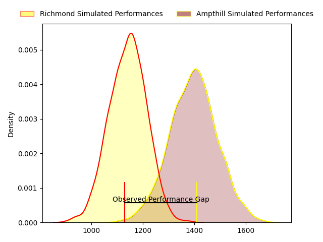
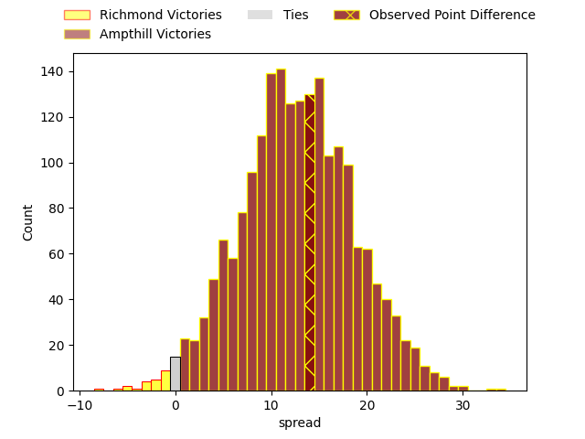

---  
layout: page  
title: Richmond at Ampthill; 19-33  
date: 2023-04-01 16:00:00 18:00:00 -0500  
categories: match review  
---
# Richmond at Ampthill; 19-33

# Club Level Predictions

The first set of predictions treats a club as the smallest object, as the club develops its members, organizes a gameplan, and deploys its players as needed for each match. This club model has a prediction of 0.802, which translates to predicting Ampthill to win by 12.5.

Each club has a rating and a rating deviation (simiar to a Glicko system), and expected performances can be generated. This allows for simulated matches and spreads like the ones below.
## Projected Performances

## Projected Spreads

## Projected Results

# Player Level Predictions

Treating teams instead as an entity made up of the currently active players, I have ratings for each player in an altogether different system. These can be combined to form team ratings once teamsheets are announced, weighting starters a bit higher than the reserves. After the match is played, players can be weighted by their minutes on the field, allowing for an accurate measure of the team's composition. With these compiled team ratings, we can make predictions, measure inaccuracy, and update the individual player ratings.
## Prediction with Player Minutes: Ampthill by 36.8

Ampthill by 32.8 on a neutral field

There were 5 large changes in win probability in this match
## Prediction without Player Minutes: Ampthill by 32.3

Ampthill by 28.3 on a neutral pitch

|   Away Minutes | Away Player       |   Away elo |   Away Percentile |   Number |   Home Percentile |   Home elo | Home Player     |   Home Minutes |
|---------------:|:------------------|-----------:|------------------:|---------:|------------------:|-----------:|:----------------|---------------:|
|             61 | George Cave       |      86.59 |                19 |        1 |                65 |      98.93 | Zac Nearchou    |             62 |
|             50 | Alexander Post    |      91.78 |                39 |        2 |                71 |     101.66 | Matt Gallagher  |             46 |
|             68 | Jimmy Litchfield  |      46.3  |                 0 |        3 |                33 |      90.97 | Joe Sproston    |             62 |
|             80 | Rhys Anstey       |      88.18 |                26 |        4 |                80 |     107.59 | Charlie Beckett |             80 |
|             68 | Tevita Cavubati   |      91.84 |                38 |        5 |                32 |      90.34 | Harry Wilson    |             74 |
|             80 | David Massey      |      86.04 |                20 |        6 |                71 |     103.58 | Fyn Brown       |             80 |
|             34 | Miles Wakeling    |      95.97 |                42 |        7 |                94 |     124.32 | Paddy Ryan      |             80 |
|             80 | Ethan Benson      |      64.54 |                 2 |        8 |                49 |      97.36 | Morgan Strong   |             80 |
|             68 | Jack Stafford     |      99.24 |                61 |        9 |                40 |      94.39 | Lewis Finlay    |             76 |
|             59 | Bill Johnston     |      82.35 |                14 |       10 |                79 |     107.59 | Tom Hardwick    |             80 |
|             80 | Jack Caddy        |      59.91 |                 2 |       11 |                28 |      88.61 | Ben Harris      |             80 |
|             80 | Craig Duncan      |      67.15 |                 4 |       12 |                60 |      99.71 | Gwyn Parks      |             46 |
|             80 | Paul Kiernan      |      63.97 |                 3 |       13 |                68 |     102.9  | George Worth    |             80 |
|             80 | Alexander O'Meara |      74.31 |                 9 |       14 |                80 |     107.76 | Josh Skelcey    |             40 |
|             68 | Darren Atkins     |      90.81 |                37 |       15 |                76 |     107.59 | Tomas Bacon     |             80 |
|             46 | Edward Johnson    |      90.69 |               nan |       16 |                82 |     109.48 | Ben Cambriani   |             40 |
|             30 | Joseph Vajner     |      84.59 |                37 |       17 |               nan |      96.71 | Samson Adejimi  |             34 |
|             21 | Alex Burrage      |      96.41 |               nan |       18 |                46 |      95.46 | Olly Hartley    |             34 |
|             19 | Conor Maguire     |      75.55 |                 8 |       19 |                14 |      84.01 | Jake Ellwood    |             18 |
|             12 | Luke Spring       |      91.38 |                62 |       20 |                45 |      97.11 | Jevaughn Warren |             18 |
|             12 | Stephen Kerins    |      89.94 |               nan |       21 |                71 |     102.8  | Cai Devine      |              6 |
|             12 | George Nugent     |      95    |               nan |       22 |               nan |      95    | Murdock Lock    |              4 |
|             12 | Zuriel Makele     |      96.44 |                50 |       23 |               nan |     nan    | nan             |            nan |

