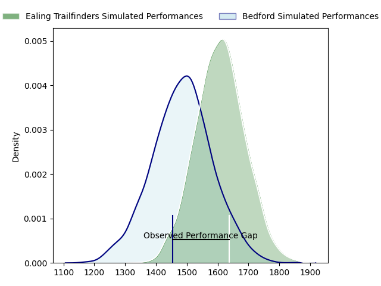
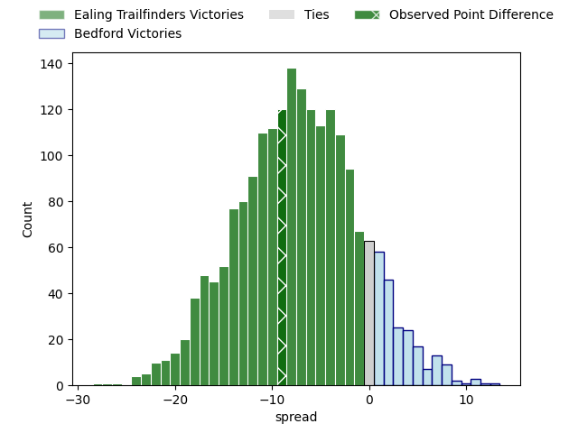

---  
layout: page  
title: Ealing Trailfinders at Bedford; 40-31  
date: 2023-04-01 16:00:00 18:00:00 -0500  
categories: match review  
---
# Ealing Trailfinders at Bedford; 40-31

# Club Level Predictions

The first set of predictions treats a club as the smallest object, as the club develops its members, organizes a gameplan, and deploys its players as needed for each match. This club model has a prediction of 0.333, which translates to predicting Ealing Trailfinders to win by 6.2.

Each club has a rating and a rating deviation (simiar to a Glicko system), and expected performances can be generated. This allows for simulated matches and spreads like the ones below.
## Projected Performances

## Projected Spreads

## Projected Results

# Player Level Predictions

Treating teams instead as an entity made up of the currently active players, I have ratings for each player in an altogether different system. These can be combined to form team ratings once teamsheets are announced, weighting starters a bit higher than the reserves. After the match is played, players can be weighted by their minutes on the field, allowing for an accurate measure of the team's composition. With these compiled team ratings, we can make predictions, measure inaccuracy, and update the individual player ratings.
## Prediction with Player Minutes: Ealing Trailfinders by 0.5

Ealing Trailfinders by 4.5 on a neutral field

There were 11 large changes in win probability in this match
## Prediction without Player Minutes: Bedford by 7.0

Bedford by 3.0 on a neutral pitch

|   Away Minutes | Away Player             |   Away elo |   Away Percentile |   Number |   Home Percentile |   Home elo | Home Player          |   Home Minutes |
|---------------:|:------------------------|-----------:|------------------:|---------:|------------------:|-----------:|:---------------------|---------------:|
|             80 | Will Davis              |     120.31 |                95 |        1 |                21 |      87.16 | Joey Conway          |             63 |
|             59 | Alun Walker             |     100.41 |                68 |        2 |                32 |      89.83 | James Fish           |             58 |
|             50 | George Davis            |     100.31 |                68 |        3 |                82 |     105.64 | Ed Prowse            |             29 |
|             59 | Andrew Davidson         |     106.12 |                77 |        4 |                79 |     107.23 | Robin Williams       |             57 |
|             80 | Barney Maddison         |      97.89 |                57 |        5 |                57 |      97.95 | Tom Lockett          |             80 |
|             80 | Will Montgomery         |      96.03 |                44 |        6 |                79 |     107.6  | Luke Frost           |             80 |
|             80 | Adam Korczyk            |      96.83 |               nan |        7 |                43 |      92.97 | Kieran Curran        |             24 |
|             50 | Simon Uzokwe            |     106.65 |                75 |        8 |                13 |      81.13 | Tui Uru              |             80 |
|             80 | Craig Hampson           |     104.56 |                75 |        9 |                95 |     121.11 | Alex Day             |             55 |
|             80 | Dan Lancaster           |      57.69 |                 1 |       10 |                32 |      89.63 | Louis Grimoldby      |             50 |
|             80 | Cian Kelleher           |     111.7  |                84 |       11 |                46 |      94.42 | Dean Adamson         |             80 |
|             71 | Patrick Benjamin Howard |     107.24 |                77 |       12 |                23 |      86.24 | Joel Matavesi        |             80 |
|             80 | Max Bodilly             |     111.29 |                83 |       13 |                91 |     112.11 | Ethan Grayson        |             50 |
|             80 | Luke Daniels            |      93.81 |                34 |       14 |                32 |      89.9  | Sean French          |             80 |
|             80 | Jonah Holmes            |     103.31 |                67 |       15 |                52 |      96.53 | Richard Lane         |             80 |
|             30 | Ross Kane               |      96.31 |                31 |       16 |                46 |     101.54 | Geordie Irvine       |             56 |
|             30 | Carlo Tizzano           |      96.45 |                51 |       17 |                25 |      83.71 | Corrie Barrett       |             51 |
|             21 | Simon Linsell           |     119.35 |                92 |       18 |                98 |     141.43 | William Maisey       |             30 |
|             21 | Shaun Malton            |      96.3  |                50 |       19 |                80 |     109.13 | Michael Le Bourgeois |             30 |
|              9 | Reuben Bird-Tulloch     |      81.13 |                13 |       20 |                46 |      93.65 | Jake Garside         |             25 |
|            nan | nan                     |     nan    |               nan |       21 |               nan |      93.68 | Emeka Atuanya        |             23 |
|            nan | nan                     |     nan    |               nan |       22 |                79 |     102.65 | Jack Hughes          |             22 |
|            nan | nan                     |     nan    |               nan |       23 |               nan |      96.51 | Monty Royston        |             17 |

