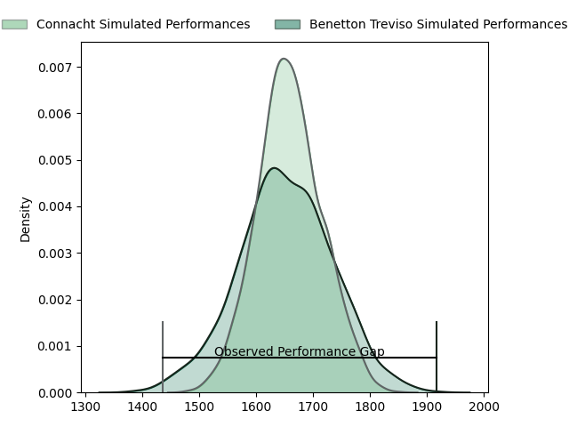
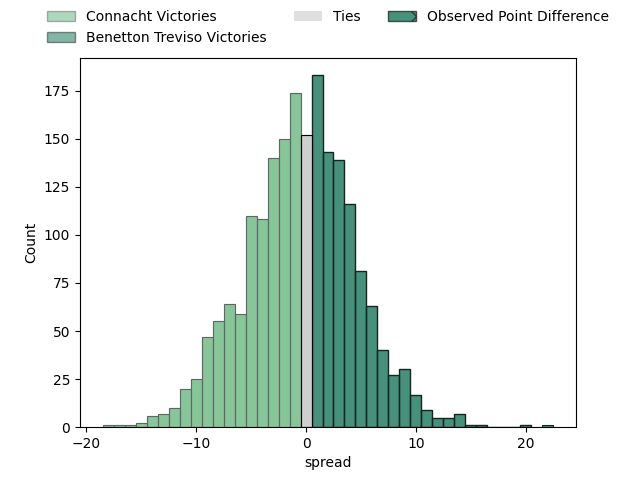

---  
layout: page  
title: Connacht at Benetton Treviso; 19-41  
date: 2023-04-01 16:00:00 18:00:00 -0500  
categories: match review  
---
# Connacht at Benetton Treviso; 19-41

# Club Level Predictions

The first set of predictions treats a club as the smallest object, as the club develops its members, organizes a gameplan, and deploys its players as needed for each match. This club model has a prediction of 0.488, which translates to predicting Connacht to win by 0.4.

Each club has a rating and a rating deviation (simiar to a Glicko system), and expected performances can be generated. This allows for simulated matches and spreads like the ones below.
## Projected Performances

## Projected Spreads

## Projected Results

# Player Level Predictions

Treating teams instead as an entity made up of the currently active players, I have ratings for each player in an altogether different system. These can be combined to form team ratings once teamsheets are announced, weighting starters a bit higher than the reserves. After the match is played, players can be weighted by their minutes on the field, allowing for an accurate measure of the team's composition. With these compiled team ratings, we can make predictions, measure inaccuracy, and update the individual player ratings.
## Prediction with Player Minutes: Connacht by 3.5

Connacht by 7.5 on a neutral field

There were 7 large changes in win probability in this match
## Prediction without Player Minutes: Connacht by 0.4

Connacht by 4.4 on a neutral pitch

|   Away Minutes | Away Player           |   Away elo |   Away Percentile |   Number |   Home Percentile |   Home elo | Home Player                     |   Home Minutes |
|---------------:|:----------------------|-----------:|------------------:|---------:|------------------:|-----------:|:--------------------------------|---------------:|
|             47 | Peter Dooley          |     105.87 |                82 |        1 |                48 |      94.77 | Francisco Nahuel Tetaz Chaparro |             68 |
|             41 | David Heffernan       |     100.28 |                69 |        2 |                97 |     126.76 | Giacomo Nicotera                |             57 |
|             47 | Jack Aungier          |     104.5  |                80 |        3 |                43 |      93.91 | Tiziano Pasquali                |             57 |
|             55 | Leva Fifita           |      92.94 |                39 |        4 |                 2 |      59.32 | Niccolo Cannone                 |             69 |
|             80 | Niall Murray          |     107.16 |                79 |        5 |                82 |     109.36 | Federico Ruzza                  |             80 |
|             80 | Cian Prendergast      |     107.53 |                78 |        6 |                26 |      87.81 | Sebastian Negri                 |             80 |
|             80 | Conor Oliver          |     106.85 |                77 |        7 |                87 |     113.62 | Michele Lamaro                  |             68 |
|             47 | Paul Boyle            |      89.77 |                29 |        8 |                18 |      88.46 | Henry Stowers                   |             54 |
|             57 | Caolin Blade          |      97.33 |                55 |        9 |                44 |      93.39 | Dewald Otto Duvenage            |             80 |
|             80 | David Hawkshaw        |     106.07 |                76 |       10 |                66 |     101.13 | Jacob Umaga                     |             80 |
|             80 | Mack Hansen           |      84.47 |                18 |       11 |                70 |     102.68 | Marcus Watson                   |             80 |
|             80 | Bundee Aki            |     133.71 |                98 |       12 |                94 |     123.34 | Tommaso Menoncello              |             73 |
|             80 | Thomas Farrell        |     101.69 |                66 |       13 |                75 |     106.15 | Juan Ignacio Brex               |             80 |
|             80 | John Porch            |     113.08 |                85 |       14 |                72 |     103.93 | Edoardo Padovani                |             62 |
|             55 | Tiernan O'Halloran    |      99.74 |                60 |       15 |                18 |      83.06 | Rhyno Christo Smith             |             80 |
|             33 | Jordan Duggan         |     100.9  |               nan |       16 |                41 |      92.72 | Siua Maile                      |             23 |
|             39 | Dylan Tierney-Martin  |      99.13 |                65 |       17 |               nan |      92.21 | Thomas Gallo                    |             12 |
|             33 | Sam Illo              |      91.05 |                49 |       18 |                53 |      96.64 | Riccardo Favretto               |             11 |
|             25 | Oisin Dowling         |      99.13 |                61 |       19 |               nan |      93.38 | Filipo Alongi                   |             23 |
|             33 | Shamus Hurley-Langton |      95.29 |                39 |       20 |                44 |      93.41 | Alessandrio Izekor              |             12 |
|             23 | Kieran Marmion        |     104.71 |                60 |       21 |                37 |      91.27 | Manuel Zuliani                  |             26 |
|             25 | Shane Jennings        |      96.58 |               nan |       22 |                27 |      90.36 | Alessandro Garbisi              |              7 |
|            nan | nan                   |     nan    |               nan |       23 |                16 |      83.34 | Tomas Albornoz                  |             18 |

