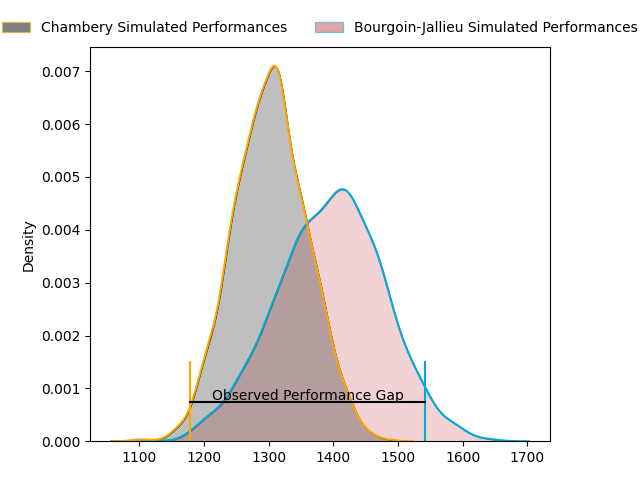
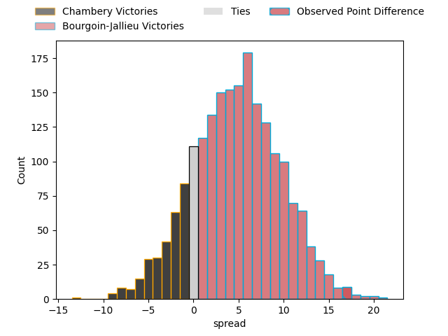
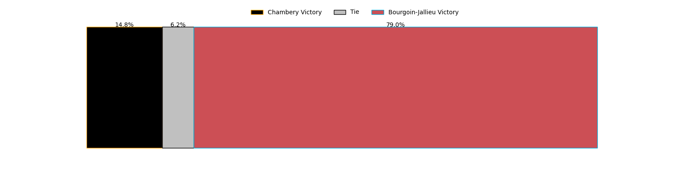

---  
layout: page  
title: Chambery at Bourgoin-Jallieu; 16-33  
date: 2023-04-01 18:30:00 18:00:00 -0500  
categories: match review  
---
# Chambery at Bourgoin-Jallieu; 16-33

# Club Level Predictions

The first set of predictions treats a club as the smallest object, as the club develops its members, organizes a gameplan, and deploys its players as needed for each match. This club model has a prediction of 0.63, which translates to predicting Bourgoin-Jallieu to win by 4.7.

Each club has a rating and a rating deviation (simiar to a Glicko system), and expected performances can be generated. This allows for simulated matches and spreads like the ones below.
## Projected Performances

## Projected Spreads

## Projected Results

# Player Level Predictions

Treating teams instead as an entity made up of the currently active players, I have ratings for each player in an altogether different system. These can be combined to form team ratings once teamsheets are announced, weighting starters a bit higher than the reserves. After the match is played, players can be weighted by their minutes on the field, allowing for an accurate measure of the team's composition. With these compiled team ratings, we can make predictions, measure inaccuracy, and update the individual player ratings.
## Prediction with Player Minutes: Bourgoin-Jallieu by 5.7

Bourgoin-Jallieu by 1.7 on a neutral field

There were 8 large changes in win probability in this match
## Prediction without Player Minutes: Bourgoin-Jallieu by 6.5

Bourgoin-Jallieu by 2.5 on a neutral pitch

|   Away Minutes | Away Player          |   Away elo |   Away Percentile |   Number |   Home Percentile |   Home elo | Home Player              |   Home Minutes |
|---------------:|:---------------------|-----------:|------------------:|---------:|------------------:|-----------:|:-------------------------|---------------:|
|             73 | Géraud Clermont      |      98.56 |                62 |        1 |                62 |      98.58 | Nugzar Somkhishvili      |             52 |
|             70 | Julien Primault      |      90.47 |                33 |        2 |                36 |      91.27 | Killian Tripier          |             52 |
|             73 | Giorgi Pertaia       |      99.29 |                64 |        3 |                70 |     100.7  | Maxime Caillet           |             57 |
|             80 | Steevy Cerqueira     |      95.73 |                51 |        4 |                24 |      87.38 | Jonathan Kpoku           |             62 |
|             59 | Romain Guyot         |      71.71 |                 6 |        5 |                19 |      84.49 | Robin Gascou             |             55 |
|             80 | Jean-Baptiste Grenod |     104.57 |                75 |        6 |                84 |     111.62 | Kevin Chaudouard         |             80 |
|             66 | Colin Lebian         |      86.31 |                21 |        7 |                74 |     104.73 | Bynjamin Rabatel         |             80 |
|             80 | Thomas Coignat       |     108.75 |                81 |        8 |                50 |      97.67 | Poutasi Luafutu          |             62 |
|             73 | Thibault Dufau       |     109.39 |                83 |        9 |                68 |     101.49 | Tomas Munilla            |             80 |
|             70 | Thibault Moreno      |      93.71 |                47 |       10 |                53 |      97.7  | Benjamin Noble           |             62 |
|             80 | Maewen Sao           |      87.78 |                25 |       11 |                60 |      99.02 | Quentin Lefort           |             80 |
|             70 | Mickael Blanc        |      86.35 |                23 |       12 |                80 |     108.95 | Isaiah Leota             |             62 |
|             80 | Victor Pisano        |      85.99 |                21 |       13 |                52 |      96.78 | Christopher Bosch        |             80 |
|             80 | Arthur Nennig        |     109.05 |                81 |       14 |                76 |     106.56 | Remi Bouet               |             80 |
|             80 | Thomas Hecquet       |     109.43 |                84 |       15 |                10 |      75.92 | Nicolas Cachet           |             80 |
|              7 | Luka Begic           |      86.85 |                25 |       16 |                54 |      98.12 | Romain Favaretto         |             28 |
|             10 | Enzo Segui           |      96.41 |                50 |       17 |                42 |      92.79 | Maxime Castant           |             28 |
|              7 | Nail Audoire         |      99.77 |                69 |       18 |                70 |     100.87 | Oktay Yilmaz             |             23 |
|             21 | Corentin Astier      |     116.21 |                92 |       19 |                60 |      98.73 | Joketani Raikabula Koroi |             18 |
|             14 | Matheo Triki         |     102.35 |                69 |       20 |                53 |      98.15 | Léandre Cotte            |             25 |
|              7 | Dylan Nocete         |      88.36 |                26 |       21 |                59 |     101.93 | Théo Lepage              |             18 |
|             10 | Jules Dorrival       |      85.55 |                21 |       22 |                53 |      93.47 | Romain Sola              |             18 |
|             10 | Aviata Silago        |      86.57 |                24 |       23 |                29 |      88.9  | Pablo Patilla            |             18 |

