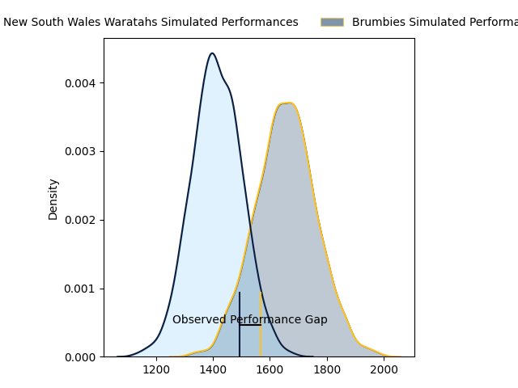
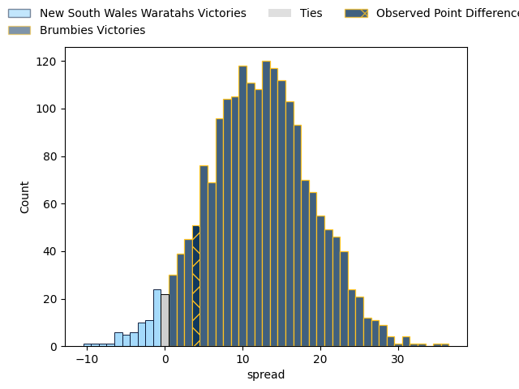

---  
layout: page  
title: New South Wales Waratahs at Brumbies; 36.0-40.0  
date: 2023-04-01 04:35:00 18:00:00 -0500  
categories: match review  
---
# New South Wales Waratahs at Brumbies; 36.0-40.0

# Club Level Predictions

The first set of predictions treats a club as the smallest object, as the club develops its members, organizes a gameplan, and deploys its players as needed for each match. This club model has a prediction of 0.793, which translates to predicting Brumbies to win by 12.1.

Each club has a rating and a rating deviation (simiar to a Glicko system), and expected performances can be generated. This allows for simulated matches and spreads like the ones below.
## Projected Performances

## Projected Spreads

## Projected Results

# Player Level Predictions

Treating teams instead as an entity made up of the currently active players, I have ratings for each player in an altogether different system. These can be combined to form team ratings once teamsheets are announced, weighting starters a bit higher than the reserves. After the match is played, players can be weighted by their minutes on the field, allowing for an accurate measure of the team's composition. With these compiled team ratings, we can make predictions, measure inaccuracy, and update the individual player ratings.
## Prediction with Player Minutes: Brumbies by 10.0

Brumbies by 6.0 on a neutral field

There were 11 large changes in win probability in this match
## Prediction without Player Minutes: Brumbies by 12.1

Brumbies by 8.1 on a neutral pitch

|   Away Minutes | Away Player          |   Away elo |   Away Percentile |   Number |   Home Percentile |   Home elo | Home Player      |   Home Minutes |
|---------------:|:---------------------|-----------:|------------------:|---------:|------------------:|-----------:|:-----------------|---------------:|
|             41 | Tetera Faulkner      |      93.87 |                45 |        1 |                97 |     126.19 | James Slipper    |             61 |
|             79 | Dave Porecki         |     113.65 |                90 |        2 |                12 |      81.24 | Lachlan Lonergan |             80 |
|             76 | Harry Johnson-Holmes |      77.41 |                 8 |        3 |                99 |     137.51 | Allan Alaalatoa  |             61 |
|             80 | Jed Holloway         |      85.34 |                20 |        4 |                21 |      85.09 | Nick Frost       |             80 |
|             80 | Ned Hanigan          |     111.6  |                85 |        5 |                96 |     126.96 | Cadeyrn Neville  |             80 |
|             69 | Taleni Seu           |     111.43 |                86 |        6 |                91 |     119.08 | Rob Valetini     |             80 |
|             80 | Michael Hooper       |     133.49 |                97 |        7 |                49 |      95.53 | Rory Scott       |             61 |
|             79 | Will Harris          |     102.31 |                66 |        8 |                49 |      97.09 | Pete Samu        |             80 |
|             80 | Jake Gordon          |     125.23 |                96 |        9 |                93 |     118.7  | Nic White        |             54 |
|             80 | Ben Donaldson        |     107.38 |                78 |       10 |                59 |      99.25 | Noah Lolesio     |             56 |
|             80 | Dylan Pietsch        |     108.66 |                81 |       11 |                47 |      94.89 | Corey Toole      |             80 |
|             66 | Lalakai Foketi       |     101.19 |                65 |       12 |                88 |     115.32 | Tamati Tua       |             80 |
|             80 | Izaia Perese         |      84.17 |                17 |       13 |                87 |     114.71 | Len Ikitau       |             41 |
|             80 | Mark Nawaqanitawase  |      96.64 |                52 |       14 |                95 |     126.65 | Andy Muirhead    |             80 |
|             73 | Max Jorgensen        |     104.72 |                70 |       15 |                82 |     110.32 | Tom Wright       |             80 |
|              1 | Tolu Latu            |     116.47 |               nan |       16 |                81 |     105.27 | Rhys Van Nek     |              0 |
|             44 | Tom Lambert          |      98.97 |                72 |       17 |               nan |      94.46 | Fred Kaihea      |             19 |
|             17 | Daniel Botha         |      94.75 |               nan |       18 |                33 |      91.01 | Sefo Kautai      |             19 |
|              0 | Zac Von Appen        |      94.76 |               nan |       19 |               nan |      95    | Sam Thomson      |              0 |
|              1 | Hunter Ward          |      95    |               nan |       20 |                88 |     117.68 | Jahrome Brown    |             19 |
|              0 | Harrison Goddard     |      94.81 |               nan |       21 |                97 |     126.68 | Ryan Lonergan    |             26 |
|             14 | Joey Walton          |     108.51 |                80 |       22 |                30 |      88.86 | Jack Debreczeni  |             24 |
|              0 | Harry Wilson         |      93.86 |               nan |       23 |                14 |      81.73 | Ben O'Donnell    |             39 |

