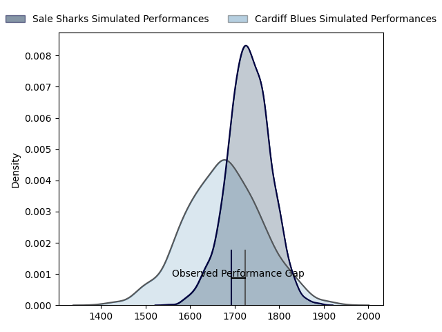
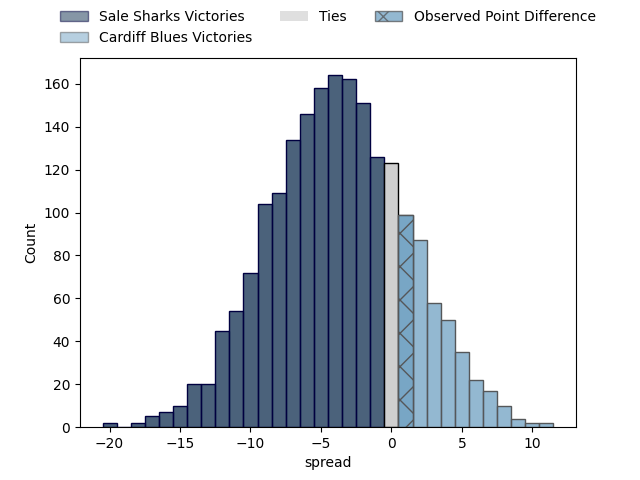

---  
layout: page  
title: Sale Sharks at Cardiff Blues; 27-28  
date: 2023-04-01 21:00:00 18:00:00 -0500  
categories: match review  
---
# Sale Sharks at Cardiff Blues; 27-28

# Club Level Predictions

The first set of predictions treats a club as the smallest object, as the club develops its members, organizes a gameplan, and deploys its players as needed for each match. This club model has a prediction of 0.42, which translates to predicting Sale Sharks to win by 2.8.

Each club has a rating and a rating deviation (simiar to a Glicko system), and expected performances can be generated. This allows for simulated matches and spreads like the ones below.
## Projected Performances

## Projected Spreads

## Projected Results

# Player Level Predictions

Treating teams instead as an entity made up of the currently active players, I have ratings for each player in an altogether different system. These can be combined to form team ratings once teamsheets are announced, weighting starters a bit higher than the reserves. After the match is played, players can be weighted by their minutes on the field, allowing for an accurate measure of the team's composition. With these compiled team ratings, we can make predictions, measure inaccuracy, and update the individual player ratings.
## Prediction with Player Minutes: Cardiff Blues by 4.2

Cardiff Blues by 0.2 on a neutral field

There were 9 large changes in win probability in this match
## Prediction without Player Minutes: Cardiff Blues by 3.7

Sale Sharks by 0.3 on a neutral pitch

|   Away Minutes | Away Player                                 |   Away elo |   Away Percentile |   Number |   Home Percentile |   Home elo | Home Player       |   Home Minutes |
|---------------:|:--------------------------------------------|-----------:|------------------:|---------:|------------------:|-----------:|:------------------|---------------:|
|             41 | Bevan Rodd                                  |     111.26 |                89 |        1 |                73 |     101.99 | Corey Domachowski |             54 |
|             53 | Armand Hendrik Petrus (Akker) van der Merwe |      89.28 |                30 |        2 |                52 |      95.41 | Liam Belcher      |             54 |
|             53 | Nic Schonert                                |      88.93 |                28 |        3 |                43 |      93.21 | Kieran Assirati   |             54 |
|             80 | Jean-Luc du Preez                           |     109.68 |                82 |        4 |                14 |      81.8  | Lopeti Timani     |              2 |
|             80 | Jonny Hill                                  |      97.15 |                55 |        5 |                75 |     103.76 | Teddy Williams    |             64 |
|             58 | Jono Ross                                   |     102.03 |                67 |        6 |                63 |      99.92 | Joshua Turnbull   |             64 |
|             80 | Ben Curry                                   |      91.75 |                36 |        7 |                19 |      85.41 | James Botham      |             80 |
|             63 | Daniel du Preez                             |      95    |               nan |        8 |                86 |     112    | Taulupe Faletau   |             80 |
|             52 | Gus Warr                                    |      81.8  |                15 |        9 |                91 |     120.62 | Tomos Williams    |             80 |
|             80 | George Ford                                 |     116.48 |                87 |       10 |                18 |      85.43 | Jarrod Evans      |             80 |
|             72 | Tom O'Flaherty                              |      82.8  |                16 |       11 |                81 |     108.7  | Josh Adams        |             80 |
|             80 | Manu Tuilagi                                |     137.92 |                99 |       12 |                55 |      98.09 | Max Llewellyn     |             67 |
|             80 | Robert du Preez                             |     108.03 |                79 |       13 |                53 |      97.44 | Mason Grady       |             80 |
|             80 | Tom Roebuck                                 |     106.23 |                76 |       14 |                64 |     100.82 | Owen Lane         |             80 |
|             80 | Joe Carpenter                               |      60.21 |                 2 |       15 |                49 |      95.96 | Rhys Priestland   |             80 |
|             39 | Simon McIntyre                              |      99.56 |                65 |       16 |                22 |      88.13 | Rhys Carre        |             26 |
|             27 | Ewan Ashman                                 |      88.69 |                34 |       17 |                43 |      94.07 | Kristian Dacey    |             26 |
|             27 | Coenie Oosthuizen                           |     120.68 |                96 |       18 |                61 |     103.38 | Dillon Lewis      |             26 |
|             22 | Sam Dugdale                                 |      84.6  |                17 |       19 |               nan |      96.22 | Thomas Young      |             78 |
|             17 | Josh Beaumont                               |      96.93 |                54 |       20 |                52 |      97.4  | Seb Davies        |             16 |
|              8 | Tom O'Flaherty                              |      82.8  |                16 |       21 |                20 |      85.52 | James Ratti       |             16 |
|             28 | Raffi Quirke                                |     102.16 |                70 |       22 |                40 |      91.73 | Ben Thomas        |             13 |

