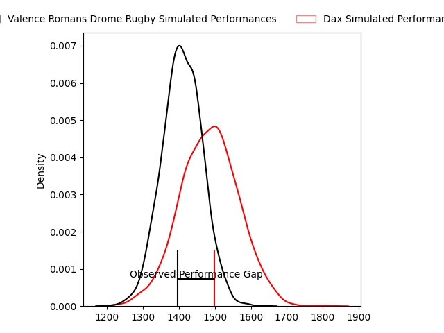
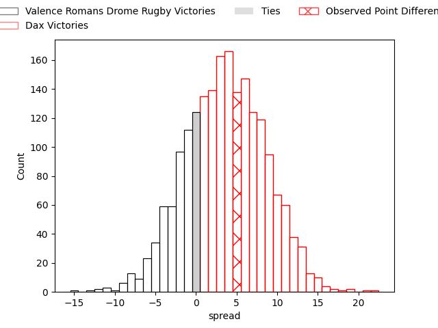
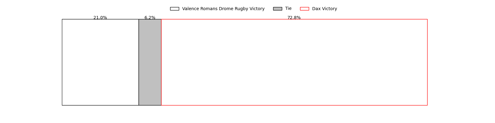

---  
layout: page  
title: Valence Romans Drome Rugby at Dax; 23-28  
date: 2023-04-01 19:00:00 18:00:00 -0500  
categories: match review  
---
# Valence Romans Drome Rugby at Dax; 23-28

# Club Level Predictions

The first set of predictions treats a club as the smallest object, as the club develops its members, organizes a gameplan, and deploys its players as needed for each match. This club model has a prediction of 0.605, which translates to predicting Dax to win by 3.8.

Each club has a rating and a rating deviation (simiar to a Glicko system), and expected performances can be generated. This allows for simulated matches and spreads like the ones below.
## Projected Performances

## Projected Spreads

## Projected Results

# Player Level Predictions

Treating teams instead as an entity made up of the currently active players, I have ratings for each player in an altogether different system. These can be combined to form team ratings once teamsheets are announced, weighting starters a bit higher than the reserves. After the match is played, players can be weighted by their minutes on the field, allowing for an accurate measure of the team's composition. With these compiled team ratings, we can make predictions, measure inaccuracy, and update the individual player ratings.
## Prediction with Player Minutes: Dax by 1.7

Valence Romans Drome Rugby by 2.3 on a neutral field

There were 16 large changes in win probability in this match
## Prediction without Player Minutes: Dax by 3.6

Valence Romans Drome Rugby by 0.4 on a neutral pitch

|   Away Minutes | Away Player                   |   Away elo |   Away Percentile |   Number |   Home Percentile |   Home elo | Home Player          |   Home Minutes |
|---------------:|:------------------------------|-----------:|------------------:|---------:|------------------:|-----------:|:---------------------|---------------:|
|             54 | Anthony Aléo                  |      94.74 |                28 |        1 |                77 |     106.66 | Louis Mary           |             48 |
|             52 | Yanis Gimenez                 |     109.69 |                81 |        2 |                66 |      99.34 | Louis Barrere        |             48 |
|             44 | Kevin Goze                    |     104.71 |               nan |        3 |                20 |      86.62 | Diogo Hasse Ferreira |             48 |
|             80 | François Uys                  |     100.87 |                62 |        4 |                34 |      92.18 | Étienne Loiret       |             80 |
|             52 | Darrell Dyer                  |     125.04 |                95 |        5 |                84 |     111.22 | Yoan Gaune           |             48 |
|             80 | Axel Bruchet                  |      61.33 |                 2 |        6 |                76 |     106.04 | Arnaud Aletti        |             54 |
|             61 | Sven Bernat Girlando          |     108.96 |                76 |        7 |                88 |     115.64 | Paul Arnaud Ausset   |             80 |
|             80 | Ioane Iashagashvili           |     107.03 |                78 |        8 |                12 |      80.12 | Brice Ferrer         |             80 |
|             80 | Tim Menzel                    |      79.79 |                11 |        9 |                36 |      91.2  | Simon Garrouteigt    |             80 |
|             80 | Joris Moura                   |     119.69 |                89 |       10 |                53 |      97.62 | Hugo Cerisier        |             80 |
|             80 | Mason Emerson                 |     110.87 |                83 |       11 |                84 |     110.95 | Théo Gatelier        |             80 |
|             48 | Akuila Joeli Tabualevu        |     104.58 |                72 |       12 |                40 |      92.41 | Ilikena Bolakoro     |             59 |
|             80 | Charles Bouldoire             |     106.19 |                71 |       13 |                72 |     104.35 | Rodrigo Marta        |             80 |
|             80 | Adam Vargas                   |     110.44 |                83 |       14 |                93 |     122.81 | Guillaume Bouche     |             57 |
|             44 | Quentin Gobet                 |     106.72 |                74 |       15 |                85 |     112.47 | Théo Duprat          |             70 |
|             26 | Sami Zouhair                  |     138.68 |                99 |       16 |                98 |     132.75 | Elvis Levi           |             32 |
|             28 | Mehdi Boundjema               |      95    |               nan |       17 |                25 |      88.38 | Joaquin Rodon        |             32 |
|             36 | John Henry Fincham            |     103.66 |                77 |       18 |                 2 |      69.97 | Thibaud Dréan        |             32 |
|             28 | John Adriaan (Ian) Groenewald |      94.3  |               nan |       19 |                39 |      92.29 | Matt Luamanu         |             32 |
|             19 | Charles Brayer                |      69.54 |                 6 |       20 |                27 |      88.1  | Diaby Doucouré       |             26 |
|             32 | Anatole Pauvert               |      82.54 |                15 |       21 |                75 |     105.66 | Sylvère Reteau       |             21 |
|             36 | Lucas Méret                   |     103.21 |                61 |       22 |                30 |      90.28 | Julien Dechavanne    |             23 |
|            nan | nan                           |     nan    |               nan |       23 |                12 |      80.57 | Gaëtan Robert        |             10 |

