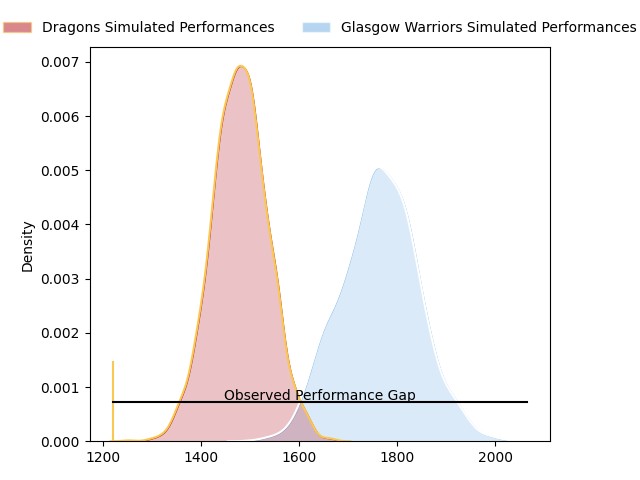
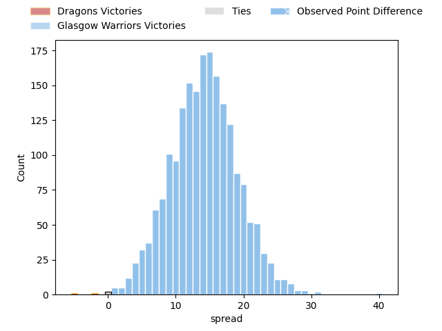

---  
layout: page  
title: Dragons at Glasgow Warriors; 33-73  
date: 2023-04-01 18:30:00 18:00:00 -0500  
categories: match review  
---
# Dragons at Glasgow Warriors; 33-73

# Club Level Predictions

The first set of predictions treats a club as the smallest object, as the club develops its members, organizes a gameplan, and deploys its players as needed for each match. This club model has a prediction of 0.833, which translates to predicting Glasgow Warriors to win by 14.2.

Each club has a rating and a rating deviation (simiar to a Glicko system), and expected performances can be generated. This allows for simulated matches and spreads like the ones below.
## Projected Performances

## Projected Spreads

## Projected Results

# Player Level Predictions

Treating teams instead as an entity made up of the currently active players, I have ratings for each player in an altogether different system. These can be combined to form team ratings once teamsheets are announced, weighting starters a bit higher than the reserves. After the match is played, players can be weighted by their minutes on the field, allowing for an accurate measure of the team's composition. With these compiled team ratings, we can make predictions, measure inaccuracy, and update the individual player ratings.
## Prediction with Player Minutes: Glasgow Warriors by 18.1

Glasgow Warriors by 14.1 on a neutral field

There were 5 large changes in win probability in this match
## Prediction without Player Minutes: Glasgow Warriors by 20.9

Glasgow Warriors by 16.9 on a neutral pitch

|   Away Minutes | Away Player       |   Away elo |   Away Percentile |   Number |   Home Percentile |   Home elo | Home Player              |   Home Minutes |
|---------------:|:------------------|-----------:|------------------:|---------:|------------------:|-----------:|:-------------------------|---------------:|
|             80 | Aki Seiuli        |      82.89 |                31 |        1 |                47 |      96.69 | Allan Michael Elgin Dell |             46 |
|             41 | Bradley Roberts   |      95.8  |                60 |        2 |                60 |     101.44 | Johnny Matthews          |             46 |
|             41 | Christian Coleman |      92.18 |                61 |        3 |                59 |      99.19 | Lucio Sordoni            |             46 |
|             80 | Ben Carter        |      91.17 |                36 |        4 |                73 |     103.4  | Scott Cummings           |             72 |
|             72 | George Nott       |      85.45 |                20 |        5 |                94 |     123.14 | Richie Gray              |             64 |
|             80 | Ross Moriarty     |      89.42 |                31 |        6 |                67 |     101.65 | Rory Darge               |             80 |
|             42 | Taine Basham      |      87.43 |                32 |        7 |                76 |     106.37 | Sione Vailanu            |             34 |
|             54 | Aaron Wainwright  |     107.8  |                80 |        8 |                12 |      80.89 | Jack Dempsey             |             80 |
|             80 | Rhodri Williams   |      88.84 |                28 |        9 |                64 |     102.69 | George Horne             |             80 |
|             80 | Will Reed         |      94.43 |                44 |       10 |                72 |     103.96 | Domingo Miotti           |             80 |
|             80 | Jared Lee Rosser  |      99.62 |                62 |       11 |                88 |     116.56 | Cole Forbes              |             80 |
|             80 | Max Clark         |      97.99 |                59 |       12 |                11 |      79.6  | Sione Tuipulotu          |             76 |
|             16 | Steffan Hughes    |      86.74 |                24 |       13 |                 4 |      68.75 | Huw Jones                |             80 |
|             80 | Rio Dyer          |      75.65 |                 8 |       14 |                61 |      99.22 | Kyle Steyn               |             80 |
|             80 | Jordan Williams   |      78.69 |                11 |       15 |                85 |     113.03 | Ollie Smith              |             64 |
|             39 | Leon Brown        |      98.16 |                60 |       16 |                78 |     104.07 | Nathan McBeth            |             34 |
|             39 | Elliott Dee       |      93.9  |                46 |       17 |                93 |     117.06 | George Turner            |             34 |
|              8 | Huw Taylor        |      92.03 |               nan |       18 |                69 |     100.6  | Simon Berghan            |             34 |
|             38 | Rhodri Jones      |      92.78 |                41 |       19 |                89 |     115.6  | Jean-Pierre du Preez     |              8 |
|             26 | Sean Lonsdale     |      83.15 |                16 |       20 |               nan |      95    | Ryan Wilson              |             46 |
|             48 | Ioan Davies       |      95    |               nan |       21 |                18 |      85.06 | Tom Jordan               |              4 |
|             16 | Ben Fry           |      87.65 |                25 |       22 |                81 |     108.89 | Jamie Dobie              |             16 |
|            nan | nan               |     nan    |               nan |       23 |                75 |     106.58 | Lewis Bean               |             16 |

