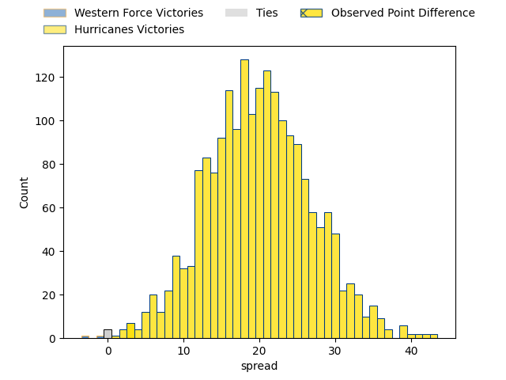

---  
layout: page  
title: Western Force at Hurricanes; 42.0-45.0  
date: 2023-04-01 23:35:00 18:00:00 -0500  
categories: match review  
---
# Western Force at Hurricanes; 42.0-45.0

# Club Level Predictions

The first set of predictions treats a club as the smallest object, as the club develops its members, organizes a gameplan, and deploys its players as needed for each match. This club model has a prediction of 0.9, which translates to predicting Hurricanes to win by 19.8.

Each club has a rating and a rating deviation (simiar to a Glicko system), and expected performances can be generated. This allows for simulated matches and spreads like the ones below.
## Projected Performances

## Projected Spreads

## Projected Results

# Player Level Predictions

Treating teams instead as an entity made up of the currently active players, I have ratings for each player in an altogether different system. These can be combined to form team ratings once teamsheets are announced, weighting starters a bit higher than the reserves. After the match is played, players can be weighted by their minutes on the field, allowing for an accurate measure of the team's composition. With these compiled team ratings, we can make predictions, measure inaccuracy, and update the individual player ratings.
## Prediction with Player Minutes: Hurricanes by 25.7

Hurricanes by 21.7 on a neutral field

There were 3 large changes in win probability in this match
## Prediction without Player Minutes: Hurricanes by 14.2

Hurricanes by 10.2 on a neutral pitch

|   Away Minutes | Away Player           |   Away elo |   Away Percentile |   Number |   Home Percentile |   Home elo | Home Player         |   Home Minutes |
|---------------:|:----------------------|-----------:|------------------:|---------:|------------------:|-----------:|:--------------------|---------------:|
|             66 | Tom Robertson         |     115.08 |                92 |        1 |                44 |      92.94 | Pouri Rakete-Stones |             41 |
|             69 | Tom Horton            |     104.47 |                74 |        2 |                98 |     129.66 | Dane Coles          |             62 |
|             66 | Santiago Medrano      |     119.67 |                95 |        3 |                99 |     143.63 | Tyrel Lomax         |             62 |
|             50 | Felix Kalapu          |      51.91 |                 1 |        4 |                56 |      97.58 | James Blackwell     |             88 |
|             88 | Jeremy Williams       |      84.89 |                19 |        5 |                95 |     123.83 | Dominic Bird        |             52 |
|             88 | Tim Anstee            |      63.55 |                 2 |        6 |               nan |      96.08 | TK Howden           |             72 |
|             88 | Ollie Callan          |      80.33 |                 7 |        7 |                92 |     119.37 | Du'Plessis Kirifi   |             88 |
|             63 | Rahboni Vosayaco      |      98.27 |                52 |        8 |                 1 |      58.37 | Brayden Iose        |             88 |
|             69 | Gareth Simpson        |     107.28 |                80 |        9 |                 4 |      67.8  | Jamie Booth         |             52 |
|             17 | Hamish Stewart        |     132.07 |                96 |       10 |                46 |      95.22 | Brett Cameron       |             73 |
|             88 | Manasa Mataele        |     118.66 |                90 |       11 |                51 |      96.36 | Salesi Rayasi       |             58 |
|             88 | Bayley Kuenzle        |      83.47 |                16 |       12 |                98 |     132.37 | Jordie Barrett      |             88 |
|             55 | Sam Spink             |     105.15 |                74 |       13 |                74 |     105.15 | Bailyn Sullivan     |             88 |
|             88 | Zach Kibirige         |      80.88 |                13 |       14 |               nan |      95    | Daniel Sinkinson    |             69 |
|             10 | Chase Tiatia          |     105.02 |                71 |       15 |                28 |      86.65 | Harry Godfrey       |             88 |
|             19 | Feleti Kaitu'u        |      84.59 |                14 |       16 |                19 |      86.18 | Hame Faiva          |             26 |
|             22 | Marley Pearce         |      98.16 |               nan |       17 |                82 |     107.72 | Tevita Mafileo      |             47 |
|             22 | Siosifa Amone         |      95.5  |               nan |       18 |                47 |      94.35 | Owen Franks         |             26 |
|             38 | Ryan McCauley         |      78.86 |                 9 |       19 |               nan |      95    | Hugo Plummer        |             16 |
|             25 | Jackson Pugh          |      86.5  |                33 |       20 |                75 |     105.52 | Peter Lakai         |             36 |
|             19 | Issak Fines-Leleiwasa |      96.06 |                51 |       21 |                52 |      96.55 | Cam Roigard         |             36 |
|             71 | Jake Strachan         |      79.04 |                14 |       22 |                92 |     118.9  | Riley Higgins       |             19 |
|             33 | George Poolman        |      93.42 |               nan |       23 |                84 |     111.84 | Kini Naholo         |             30 |

