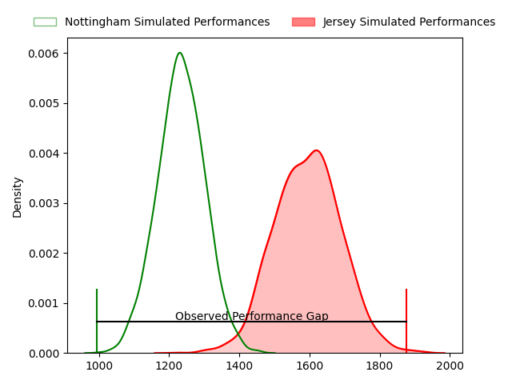
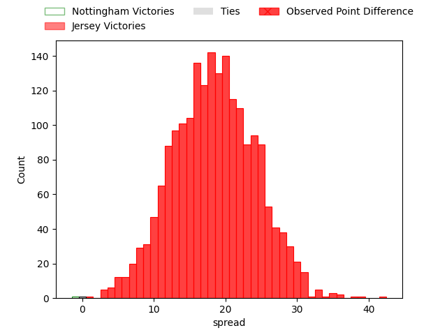

---  
layout: page  
title: Nottingham at Jersey; 10-52  
date: 2023-04-01 16:00:00 18:00:00 -0500  
categories: match review  
---
# Nottingham at Jersey; 10-52

# Club Level Predictions

The first set of predictions treats a club as the smallest object, as the club develops its members, organizes a gameplan, and deploys its players as needed for each match. This club model has a prediction of 0.887, which translates to predicting Jersey to win by 18.3.

Each club has a rating and a rating deviation (simiar to a Glicko system), and expected performances can be generated. This allows for simulated matches and spreads like the ones below.
## Projected Performances

## Projected Spreads

## Projected Results

# Player Level Predictions

Treating teams instead as an entity made up of the currently active players, I have ratings for each player in an altogether different system. These can be combined to form team ratings once teamsheets are announced, weighting starters a bit higher than the reserves. After the match is played, players can be weighted by their minutes on the field, allowing for an accurate measure of the team's composition. With these compiled team ratings, we can make predictions, measure inaccuracy, and update the individual player ratings.
## Prediction with Player Minutes: Jersey by 13.8

Jersey by 9.8 on a neutral field

There were 4 large changes in win probability in this match
## Prediction without Player Minutes: Jersey by 7.8

Jersey by 3.8 on a neutral pitch

|   Away Minutes | Away Player               |   Away elo |   Away Percentile |   Number |   Home Percentile |   Home elo | Home Player                 |   Home Minutes |
|---------------:|:--------------------------|-----------:|------------------:|---------:|------------------:|-----------:|:----------------------------|---------------:|
|             47 | Aniseko Sio               |      95.73 |                52 |        1 |                91 |     114.72 | Samuel Alexander Grahamslaw |             50 |
|             47 | Archie Vanes              |      75.83 |                 8 |        2 |                17 |      86.64 | James Hadfield              |             50 |
|             47 | Dan Richardson            |     101.9  |                67 |        3 |                56 |     100.13 | Adam Nicol                  |             50 |
|             40 | Callum Allen              |     113.02 |                88 |        4 |                22 |      86.52 | Tom Everard                 |             50 |
|             80 | Iosefa Danny Wayne Fiaola |     104.63 |                75 |        5 |                38 |      94.16 | James Scott                 |             58 |
|             80 | Carl Kirwan               |     106.06 |                76 |        6 |                67 |      99.6  | James Andrew Dun            |             80 |
|             54 | Nathan Tweedy             |     125.28 |                94 |        7 |               nan |      96.73 | Josh Gray                   |             80 |
|             80 | George Cox                |      92.92 |                37 |        8 |                39 |      93.2  | Alun Lawrence               |             80 |
|             54 | Micheal Stronge           |      97.65 |                55 |        9 |                80 |     107.7  | James Mitchell              |             54 |
|             80 | Morgan Bunting            |      89.44 |                27 |       10 |                48 |      98.4  | Russell Bennett             |             80 |
|             53 | Tayie Ryan Olowofela      |     110.97 |                83 |       11 |                93 |     122.33 | Will Brown                  |             80 |
|             80 | Javiah Pohe               |      77.33 |                 9 |       12 |                40 |      92.39 | Jordan Holgate              |             40 |
|             80 | Michael Green             |      81.48 |                10 |       13 |                55 |      98    | Charlie Powell              |             80 |
|             80 | David Williams            |      92.75 |                41 |       14 |                 6 |      74.52 | Ryan Hutler                 |              4 |
|             63 | Jordan Kehinde Olowofela  |      94.56 |                47 |       15 |                77 |     106.77 | Tomi Lewis                  |             80 |
|             40 | Jack Shine                |      95.21 |                40 |       16 |                67 |     101.65 | Ben Woollett                |             76 |
|             33 | Toby Williams             |      70.7  |                 3 |       17 |                97 |     129.26 | Dan Barnes                  |             40 |
|             33 | Jack Dickinson            |     102.99 |                64 |       18 |                66 |     102.53 | Brendan Owen                |             30 |
|             33 | Xavier Valentine          |      95.21 |                50 |       19 |                88 |     111.38 | Eoghan Clarke               |             30 |
|             27 | Harry Graham              |      97.99 |                56 |       20 |                93 |     115.95 | Steven Longwell             |             30 |
|             26 | Josh Poullet              |      84.1  |                17 |       21 |                94 |     123.48 | Sean O'Connor               |             30 |
|             26 | Josh Goodwin              |      93.63 |               nan |       22 |                 2 |      64.35 | James Elliott               |             26 |
|             17 | Sam Hollingsworth         |      89.4  |                29 |       23 |                51 |      96.48 | Max Argyle                  |             22 |

