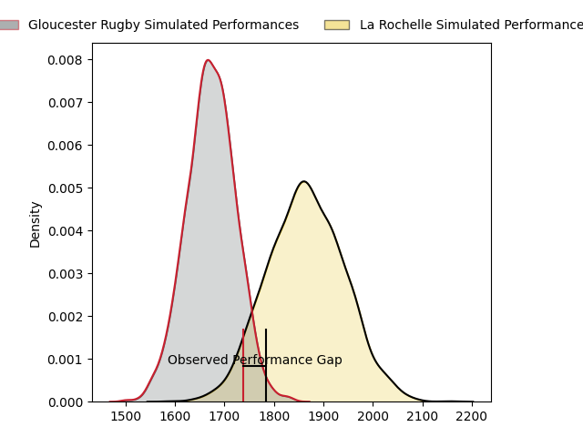
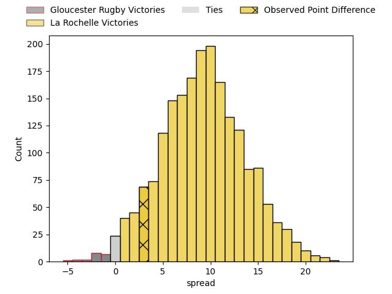
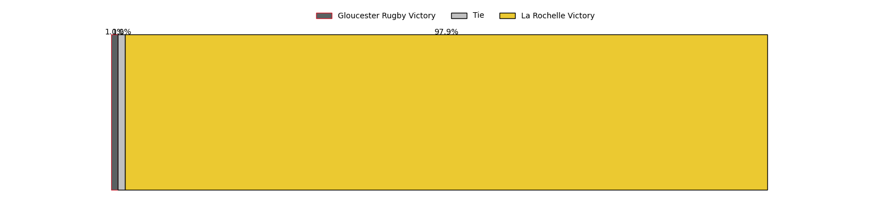

---  
layout: page  
title: Gloucester Rugby at La Rochelle; 26-29  
date: 2023-04-01 18:30:00 18:00:00 -0500  
categories: match review  
---
# Gloucester Rugby at La Rochelle; 26-29

# Club Level Predictions

The first set of predictions treats a club as the smallest object, as the club develops its members, organizes a gameplan, and deploys its players as needed for each match. This club model has a prediction of 0.748, which translates to predicting La Rochelle to win by 9.5.

Each club has a rating and a rating deviation (simiar to a Glicko system), and expected performances can be generated. This allows for simulated matches and spreads like the ones below.
## Projected Performances

## Projected Spreads

## Projected Results

# Player Level Predictions

Treating teams instead as an entity made up of the currently active players, I have ratings for each player in an altogether different system. These can be combined to form team ratings once teamsheets are announced, weighting starters a bit higher than the reserves. After the match is played, players can be weighted by their minutes on the field, allowing for an accurate measure of the team's composition. With these compiled team ratings, we can make predictions, measure inaccuracy, and update the individual player ratings.
## Prediction with Player Minutes: La Rochelle by 15.2

La Rochelle by 11.2 on a neutral field

There were 12 large changes in win probability in this match
## Prediction without Player Minutes: La Rochelle by 11.5

La Rochelle by 7.5 on a neutral pitch

|   Away Minutes | Away Player          |   Away elo |   Away Percentile |   Number |   Home Percentile |   Home elo | Home Player           |   Home Minutes |
|---------------:|:---------------------|-----------:|------------------:|---------:|------------------:|-----------:|:----------------------|---------------:|
|             62 | Mayco Geronimo Vivas |      95    |               nan |        1 |                46 |      96.19 | Joel Sclavi           |             26 |
|             62 | Sebastian Blake      |      67.74 |                 3 |        2 |                52 |      95.55 | Pierre Bourgarit      |             80 |
|             15 | Kirill Gotovtsev     |     110.84 |                89 |        3 |                97 |     125.06 | Uini Atonio           |             53 |
|             68 | Freddie Clarke       |      86.17 |                22 |        4 |                60 |      98.62 | Thomas Lavault        |             68 |
|             80 | Matias Alemanno      |     102.44 |                70 |        5 |                53 |      96.58 | William Skelton       |             80 |
|             68 | Ruan Ackermann       |      98    |                52 |        6 |                63 |      99.97 | Ultan Dillane         |             62 |
|             80 | Lewis Ludlow         |      95.5  |                48 |        7 |                80 |     108.58 | Levani Botia          |             56 |
|             57 | Jack Clement         |      98.2  |                56 |        8 |                86 |     113.82 | Gregory Alldritt      |             80 |
|             27 | Stephen Varney       |      73.26 |                 6 |        9 |                91 |     115.93 | Tawera Kerr-Barlow    |             80 |
|             80 | Billy Twelvetrees    |     133.87 |                96 |       10 |                63 |     100.35 | Antoine Hastoy        |             80 |
|             80 | Ollie Thorley        |     114.4  |                86 |       11 |                78 |     107.49 | Jules Favre           |             80 |
|             80 | Sebastien Atkinson   |      45.1  |                 0 |       12 |                70 |     103.46 | Jonathan Danty        |             80 |
|             80 | Chris Harris         |     109.57 |                81 |       13 |                88 |     115.5  | Raymond Rhule         |             80 |
|             80 | Louis Rees-Zammit    |     101.68 |                67 |       14 |                90 |     118.96 | Teddy Thomas          |             80 |
|             80 | Santiago Carreras    |     137.37 |                97 |       15 |                67 |     104.03 | Brice Dulin           |             80 |
|             18 | Harry Elrington      |      89.6  |                28 |       16 |                79 |     104.15 | Reda Wardi            |             54 |
|             18 | Henry Walker         |      95    |               nan |       17 |                43 |      96.78 | Georges-Henri Colombe |             27 |
|             12 | Cameron Jordan       |      82.17 |                28 |       18 |                66 |      98.78 | Paul Boudehent        |             18 |
|             65 | Jamal Ford-Robinson  |      95    |               nan |       19 |                59 |      99.79 | Yoan Tanga Mangene    |             24 |
|             12 | Freddie Thomas       |      99.17 |                61 |       20 |                78 |     108.03 | Romain Sazy           |             12 |
|             23 | Ben Morgan           |     122.84 |                93 |       21 |               nan |     nan    | nan                   |            nan |
|             53 | Charlie Chapman      |      95    |               nan |       22 |               nan |     nan    | nan                   |            nan |

