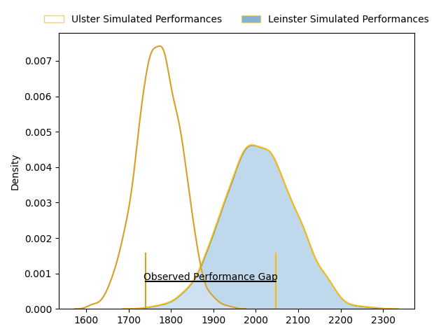
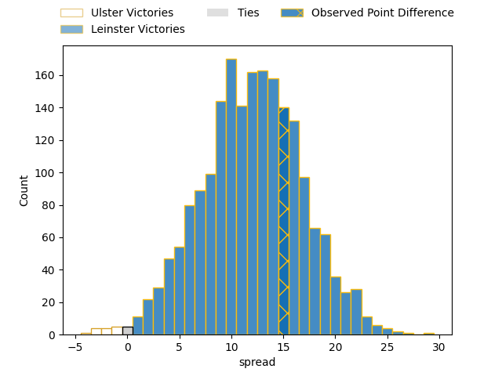

---  
layout: page  
title: Ulster at Leinster; 15-30  
date: 2023-04-01 18:30:00 18:00:00 -0500  
categories: match review  
---
# Ulster at Leinster; 15-30

# Club Level Predictions

The first set of predictions treats a club as the smallest object, as the club develops its members, organizes a gameplan, and deploys its players as needed for each match. This club model has a prediction of 0.794, which translates to predicting Leinster to win by 11.9.

Each club has a rating and a rating deviation (simiar to a Glicko system), and expected performances can be generated. This allows for simulated matches and spreads like the ones below.
## Projected Performances

## Projected Spreads

## Projected Results

# Player Level Predictions

Treating teams instead as an entity made up of the currently active players, I have ratings for each player in an altogether different system. These can be combined to form team ratings once teamsheets are announced, weighting starters a bit higher than the reserves. After the match is played, players can be weighted by their minutes on the field, allowing for an accurate measure of the team's composition. With these compiled team ratings, we can make predictions, measure inaccuracy, and update the individual player ratings.
## Prediction with Player Minutes: Leinster by 20.2

Leinster by 16.2 on a neutral field

There were 9 large changes in win probability in this match
## Prediction without Player Minutes: Leinster by 20.2

Leinster by 16.2 on a neutral pitch

|   Away Minutes | Away Player            |   Away elo |   Away Percentile |   Number |   Home Percentile |   Home elo | Home Player          |   Home Minutes |
|---------------:|:-----------------------|-----------:|------------------:|---------:|------------------:|-----------:|:---------------------|---------------:|
|             62 | Rory Sutherland        |     108.1  |                86 |        1 |                52 |      95.61 | Andrew Porter        |             59 |
|             58 | Rob Herring            |      81.76 |                14 |        2 |                76 |     103.4  | Dan Sheehan          |             69 |
|             41 | Tom O'Toole            |      96.05 |               nan |        3 |                79 |     104.29 | Tadhg Furlong        |             63 |
|             80 | Alan O'Connor          |     111.72 |                85 |        4 |                83 |     109.46 | Ross Molony          |             80 |
|             66 | Kieran Treadwell       |      98.39 |                59 |        5 |                80 |     107.56 | James Ryan           |             67 |
|             46 | David McCann           |      97.18 |                54 |        6 |                83 |     109.44 | Ryan Baird           |             80 |
|             80 | Nick Timoney           |     111.49 |                84 |        7 |                95 |     127.59 | Josh van der Flier   |             54 |
|             80 | Duane Vermeulen        |     107.09 |                77 |        8 |                95 |     125.51 | Jack Conan           |             80 |
|             50 | Nathan Doak            |     100.9  |                66 |        9 |                79 |     107.1  | Jamison Gibson-Park  |             66 |
|             54 | Billy Burns            |      98.82 |                58 |       10 |                85 |     114.22 | Ross Byrne           |             72 |
|             80 | Jacob Stockdale        |      97.32 |                55 |       11 |                99 |     139.97 | James Lowe           |             80 |
|             80 | Stuart McCloskey       |     135.12 |                98 |       12 |                97 |     131.23 | Robbie Henshaw       |             72 |
|             80 | James Hume             |      97.17 |                53 |       13 |                84 |     111.81 | Jimmy O'Brien        |             80 |
|             78 | Robert Baloucoune      |      90.04 |                33 |       14 |                72 |     106.41 | Jordan Larmour       |             80 |
|             80 | Michael Lowry          |     115.59 |                88 |       15 |                99 |     144.55 | Hugo Keenan          |             80 |
|             18 | Eric O'Sullivan        |      97.54 |                70 |       16 |                56 |     100.88 | Cian Healy           |             21 |
|             22 | Tom Stewart            |      94.19 |                47 |       17 |                84 |     107.1  | Michael Ala'alatoa   |             17 |
|             39 | Jeffery To'omaga-Allen |     108.27 |                86 |       18 |                60 |      98.04 | John McKee           |             11 |
|             14 | Marcus Rea             |      98.87 |                65 |       19 |                66 |     101.17 | Scott Penny          |             26 |
|             34 | Harry Sheridan         |      99.98 |                70 |       20 |                57 |      98.24 | Luke McGrath         |             14 |
|             30 | John Cooney            |     104.75 |                75 |       21 |                75 |     105.33 | Harry Byrne          |              8 |
|             26 | Stewart Moore          |     108.16 |                79 |       22 |                37 |      91.21 | Ciaran Frawley       |              8 |
|              2 | Ben Moxham             |     106.57 |                77 |       23 |                40 |      92.58 | Jason Howell Jenkins |             13 |

