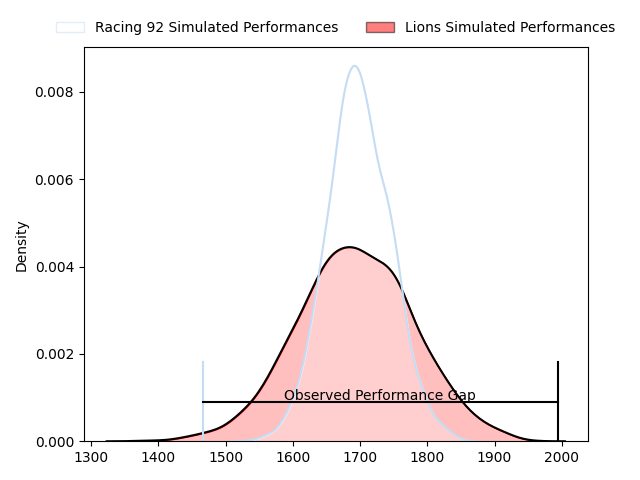
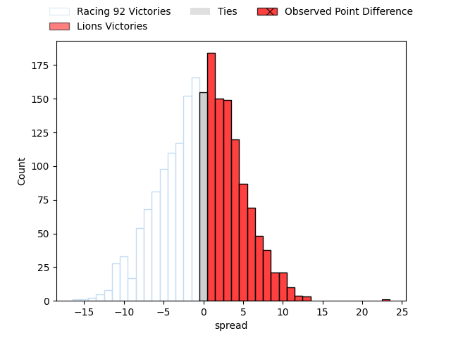

---  
layout: page  
title: Racing 92 at Lions; 28-51  
date: 2023-04-01 18:30:00 18:00:00 -0500  
categories: match review  
---
# Racing 92 at Lions; 28-51

# Club Level Predictions

The first set of predictions treats a club as the smallest object, as the club develops its members, organizes a gameplan, and deploys its players as needed for each match. This club model has a prediction of 0.496, which translates to predicting Racing 92 to win by 0.1.

Each club has a rating and a rating deviation (simiar to a Glicko system), and expected performances can be generated. This allows for simulated matches and spreads like the ones below.
## Projected Performances

## Projected Spreads

## Projected Results

# Player Level Predictions

Treating teams instead as an entity made up of the currently active players, I have ratings for each player in an altogether different system. These can be combined to form team ratings once teamsheets are announced, weighting starters a bit higher than the reserves. After the match is played, players can be weighted by their minutes on the field, allowing for an accurate measure of the team's composition. With these compiled team ratings, we can make predictions, measure inaccuracy, and update the individual player ratings.
## Prediction with Player Minutes: Lions by 6.8

Lions by 2.8 on a neutral field

There were 9 large changes in win probability in this match
## Prediction without Player Minutes: Lions by 6.0

Lions by 2.0 on a neutral pitch

|   Away Minutes | Away Player            |   Away elo |   Away Percentile |   Number |   Home Percentile |   Home elo | Home Player                 |   Home Minutes |
|---------------:|:-----------------------|-----------:|------------------:|---------:|------------------:|-----------:|:----------------------------|---------------:|
|             56 | Thomas Moukoro         |      93.26 |               nan |        1 |                60 |      98.25 | Jean-Pierre Smith           |             50 |
|             56 | Peniami Nasali Narisia |      91.93 |                33 |        2 |                58 |      97.06 | PJ Botha                    |             70 |
|             43 | Ali Oz                 |      95    |               nan |        3 |                10 |      79.68 | Asenathi Ntlabakanye        |             57 |
|             80 | Anthime Hemery         |      96.7  |                47 |        4 |                28 |      89.12 | Willem Alberts              |             68 |
|             62 | Anton Bresler          |      91.57 |               nan |        5 |               nan |      95    | Reinhardt Paul Nothnagel    |             70 |
|             80 | Wenceslas Lauret       |      94.82 |                40 |        6 |                65 |     101.03 | Emmanuel Tshituka           |             80 |
|             80 | Maxime Baudonne        |      92.21 |                36 |        7 |                48 |      94.88 | Ruan Venter                 |             80 |
|             80 | Cameron Woki           |     102.71 |                65 |        8 |                76 |     105.87 | Francke Horn                |             80 |
|             53 | Nolann Le Garrec       |     110.43 |                85 |        9 |                68 |     101.41 | Sanele Nohamba              |             75 |
|             80 | Ben Volavola           |      92.7  |               nan |       10 |                60 |      99.38 | Gianni Dean Lombard         |             75 |
|             56 | Juan Imhoff            |      98.85 |                59 |       11 |                64 |     100.49 | Edwill Charl van der Merwe  |             80 |
|             80 | Olivier Klemenczak     |      87.42 |                32 |       12 |                61 |     100.25 | Marius Louw                 |             68 |
|             80 | Warrick Wayne Gelant   |      98.45 |                51 |       13 |                38 |      91.6  | Manuel Johern (Mannie) Rass |             80 |
|             80 | Donovan Taofifenua     |      90.19 |                34 |       14 |                53 |      96.9  | Sibahle Ndiphiwe Maxwane    |             80 |
|             32 | Louis Dupichot         |      97.03 |                53 |       15 |                58 |      99.24 | Quan Horn                   |             80 |
|             24 | Guram Gogichashvili    |      97.08 |                55 |       16 |                82 |     105.51 | Rhynardt Rijnsburger        |             30 |
|             24 | Jonathan Maiau         |      94.11 |               nan |       17 |               nan |      94.34 | Ruan Martin Dreyer          |             23 |
|             37 | Biyi Alo               |      91.83 |               nan |       18 |                13 |      83.8  | Morné Brandon               |             10 |
|             18 | Baptiste Chouzenoux    |      88.07 |                26 |       19 |                83 |     109.41 | Ruben (Hobo) Schoeman       |             12 |
|              9 | Asaeli Tuivuaka        |      95    |               nan |       20 |                16 |      82.72 | Travis Gordon               |             10 |
|             27 | Max Spring             |      88.29 |                27 |       21 |                10 |      78.11 | Morne Van den Berg          |              5 |
|             48 | Martin Méliande        |     106.29 |                73 |       22 |                87 |     114.09 | Andries Coetzee             |              5 |
|             15 | Ibrahim Diallo         |      96.09 |                51 |       23 |                85 |     112.3  | Rynardt Jonker              |             12 |

