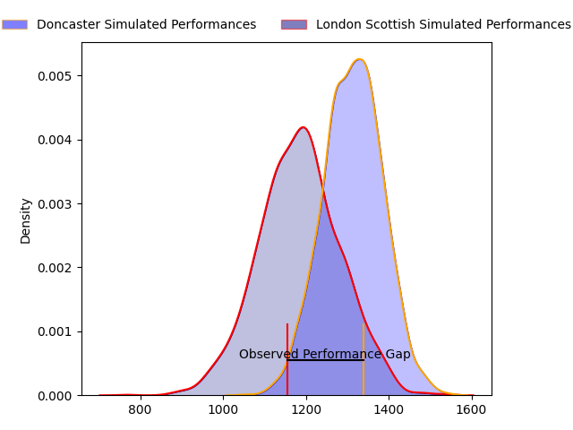
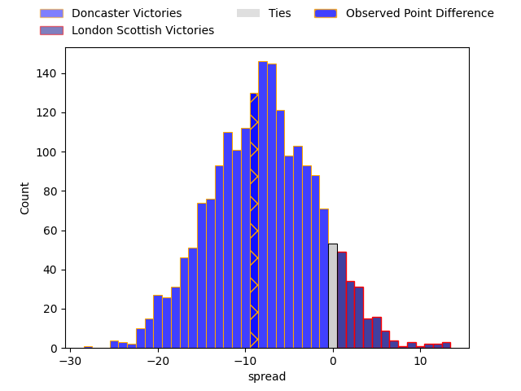

---  
layout: page  
title: Doncaster at London Scottish; 33-24  
date: 2023-04-01 16:00:00 18:00:00 -0500  
categories: match review  
---
# Doncaster at London Scottish; 33-24

# Club Level Predictions

The first set of predictions treats a club as the smallest object, as the club develops its members, organizes a gameplan, and deploys its players as needed for each match. This club model has a prediction of 0.327, which translates to predicting Doncaster to win by 6.4.

Each club has a rating and a rating deviation (simiar to a Glicko system), and expected performances can be generated. This allows for simulated matches and spreads like the ones below.
## Projected Performances

## Projected Spreads

## Projected Results

# Player Level Predictions

Treating teams instead as an entity made up of the currently active players, I have ratings for each player in an altogether different system. These can be combined to form team ratings once teamsheets are announced, weighting starters a bit higher than the reserves. After the match is played, players can be weighted by their minutes on the field, allowing for an accurate measure of the team's composition. With these compiled team ratings, we can make predictions, measure inaccuracy, and update the individual player ratings.
## Prediction with Player Minutes: Doncaster by 9.5

Doncaster by 13.5 on a neutral field

There were 9 large changes in win probability in this match
## Prediction without Player Minutes: Doncaster by 4.6

Doncaster by 8.6 on a neutral pitch

|   Away Minutes | Away Player          |   Away elo |   Away Percentile |   Number |   Home Percentile |   Home elo | Home Player        |   Home Minutes |
|---------------:|:---------------------|-----------:|------------------:|---------:|------------------:|-----------:|:-------------------|---------------:|
|             78 | Conor Davidson       |      77.36 |                 7 |        1 |                53 |      93.02 | Jordan Els         |             60 |
|             77 | George Roberts       |      80.89 |                11 |        2 |                48 |      92.56 | Austin Wallis      |             75 |
|             48 | Andrew Foster        |      98.38 |                61 |        3 |                24 |      88.28 | Joe Rees           |             43 |
|             80 | Max Williamson       |      94.51 |                27 |        4 |                80 |     105.81 | Matt Wilkinson     |             70 |
|             80 | Adam Hopkinson       |      96.22 |               nan |        5 |                19 |      85.06 | Matas Jurevicius   |             60 |
|             80 | Martin Sigren Molina |      93.84 |               nan |        6 |                84 |     110.86 | Bailey Ransom      |             80 |
|             80 | Rhys Tait            |      92.62 |                41 |        7 |                 0 |      53.13 | Jack Ingall        |             80 |
|             80 | John Kelly           |      95.89 |                45 |        8 |                20 |      86    | Will Trenholm      |             80 |
|             77 | Alex Dolly           |     109.23 |                83 |        9 |                 1 |      60.21 | Daniel Nutton      |             75 |
|             75 | Sam Olver            |      95.38 |                46 |       10 |                18 |      84.53 | Nathan Chamberlain |             75 |
|             80 | Maliq Holden         |     120.13 |                91 |       11 |                 0 |      38.25 | Noah Ferdinand     |             69 |
|             77 | Connor Edwards       |      93.96 |                45 |       12 |                11 |      79.43 | Will Simonds       |             80 |
|             80 | Joe Margetts         |      81.69 |                14 |       13 |                54 |      97.55 | Lennox Anyanwu     |             80 |
|             80 | George Simpson       |      77.23 |                10 |       14 |                41 |      92.79 | Luke Mehson        |             80 |
|             80 | Billy McBryde        |     103.93 |                68 |       15 |                29 |      88.39 | Cameron Anderson   |             80 |
|             32 | Karl Garside         |      79.25 |                 9 |       16 |               nan |      93.23 | Rhys Litterick     |             37 |
|              5 | Jack Metcalf         |      97.83 |                55 |       17 |                46 |      96.28 | Viliami Taulani    |             20 |
|              3 | Robbie Smith         |      61.91 |                 2 |       18 |               nan |      95    | Will Prior         |             20 |
|              3 | Will Yarnell         |      93.52 |               nan |       19 |               nan |      95    | Charlie Ingall     |             11 |
|              3 | Will Holling         |      95.08 |                48 |       20 |                 7 |      75.24 | Brian Tuilagi      |             10 |
|              2 | Kai Owen             |      93.3  |                45 |       21 |               nan |      94.7  | Luca Petrozzi      |              5 |
|            nan | nan                  |     nan    |               nan |       22 |                56 |      96.29 | Connor Slevin      |              5 |
|            nan | nan                  |     nan    |               nan |       23 |               nan |      90.46 | Lawrence Mason     |              5 |

