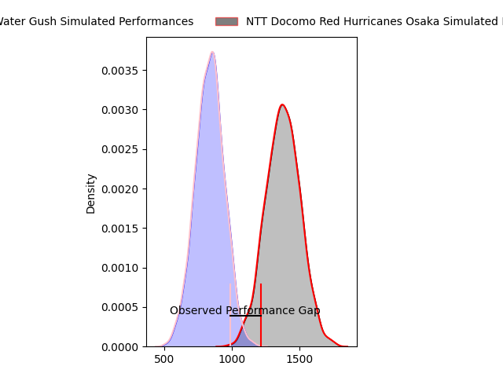
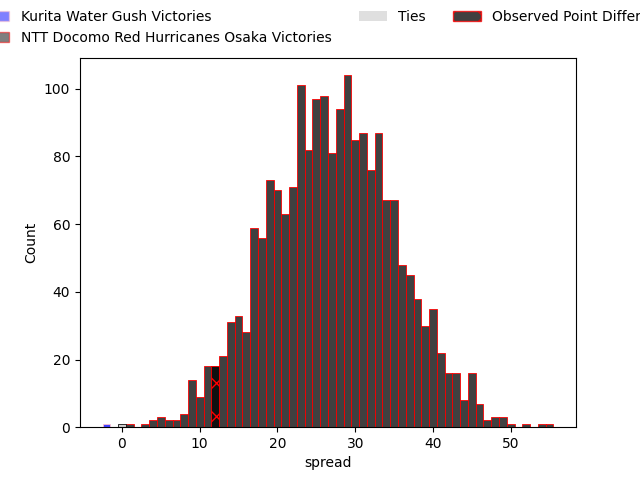

---  
layout: page  
title: Kurita Water Gush at NTT Docomo Red Hurricanes Osaka; 20-32  
date: 2023-04-01 00:00:00 18:00:00 -0500  
categories: match review  
---
# Kurita Water Gush at NTT Docomo Red Hurricanes Osaka; 20-32

# Club Level Predictions

The first set of predictions treats a club as the smallest object, as the club develops its members, organizes a gameplan, and deploys its players as needed for each match. This club model has a prediction of 0.95, which translates to predicting NTT Docomo Red Hurricanes Osaka to win by 27.0.

Each club has a rating and a rating deviation (simiar to a Glicko system), and expected performances can be generated. This allows for simulated matches and spreads like the ones below.
## Projected Performances

## Projected Spreads

## Projected Results

# Player Level Predictions

Treating teams instead as an entity made up of the currently active players, I have ratings for each player in an altogether different system. These can be combined to form team ratings once teamsheets are announced, weighting starters a bit higher than the reserves. After the match is played, players can be weighted by their minutes on the field, allowing for an accurate measure of the team's composition. With these compiled team ratings, we can make predictions, measure inaccuracy, and update the individual player ratings.
## Prediction with Player Minutes: NTT Docomo Red Hurricanes Osaka by 15.6

NTT Docomo Red Hurricanes Osaka by 11.6 on a neutral field

There were 6 large changes in win probability in this match
## Prediction without Player Minutes: NTT Docomo Red Hurricanes Osaka by 12.0

NTT Docomo Red Hurricanes Osaka by 8.0 on a neutral pitch

|   Away Minutes | Away Player            |   Away elo |   Away Percentile |   Number |   Home Percentile |   Home elo | Home Player          |   Home Minutes |
|---------------:|:-----------------------|-----------:|------------------:|---------:|------------------:|-----------:|:---------------------|---------------:|
|             54 | Kei Shibuya            |      92.36 |                39 |        1 |                17 |      85.35 | Yosuke Nishiura      |             50 |
|             54 | Ryota Kuribara         |      72.91 |                 5 |        2 |                79 |     104.44 | Hisamitsu Shimada    |             80 |
|             54 | Masachi Debuchi        |      86.16 |                19 |        3 |                75 |     102.75 | Yuichiro Hosono      |             50 |
|             80 | Kota Nakamura          |      73.06 |                 7 |        4 |                78 |     106.9  | Willie Britz         |             80 |
|             80 | Gideon Koegelenberg    |     116.05 |                90 |        5 |                84 |     110.58 | Tom Jeffries         |             80 |
|             80 | Tebita Oto             |     107.62 |                79 |        6 |                 7 |      78.48 | Toru Sugishita       |             80 |
|             50 | Yosuke Ishii           |      94.64 |                47 |        7 |                95 |     127.15 | Taro Sato            |             40 |
|             67 | Feinga Kihe Lotu Fakai |      82.7  |                14 |        8 |                75 |     105.68 | Colin Bourke         |             77 |
|             40 | Kakeru Sugihara        |      97.91 |                56 |        9 |                99 |     140.97 | Ryo Tsuruda          |             80 |
|             80 | Andrew Deegan          |      94.99 |                44 |       10 |                11 |      80.33 | Ei Kawamuko          |             55 |
|             50 | Keigo Hamazoe          |      87.42 |                24 |       11 |                 3 |      62.89 | Kanta Yamamoto       |             50 |
|             54 | Jamie Vakalahi         |     113.09 |                85 |       12 |                84 |     111.71 | Mifiposeti Paea      |             80 |
|             80 | Antonio Mikaele-Tu'u   |      97.88 |                55 |       13 |                55 |      97.96 | Daisuke Iba          |             80 |
|             80 | Tom English            |     101.09 |                63 |       14 |                85 |     112.96 | Masaki Kobayashi     |             67 |
|             80 | Koshi Emoto            |     117.16 |                89 |       15 |                 8 |      72.76 | Taichi Yoshizawa     |             80 |
|             40 | Yoshitaka Motomura     |      74.07 |                 6 |       16 |                 6 |      73.87 | Tatsunari Fujita     |             40 |
|             30 | Mitsuo Nakao           |      59.89 |                 2 |       17 |                35 |      91.17 | Munekata Sashida     |             30 |
|             30 | Kentaro Sugimori       |      51.45 |                 1 |       18 |                58 |      98.44 | Kenta Komura         |             30 |
|             26 | Shoya Koyama           |      75.15 |                 5 |       19 |               nan |      95    | Takai Shota          |             30 |
|             26 | Kota Hojo              |     101.59 |                63 |       20 |                98 |     133.63 | Benjamin Saunders    |             25 |
|             26 | Aki Kajiwara           |      80.89 |                 9 |       21 |                82 |     108.85 | Toshihiro Yamamouchi |             13 |
|             26 | Takuro Hayashida       |      83.37 |                16 |       22 |               nan |      88.84 | Tsukasa Yasuda       |              3 |
|             13 | Kengo Nakamura         |      68.92 |                 4 |       23 |               nan |     nan    | nan                  |            nan |

