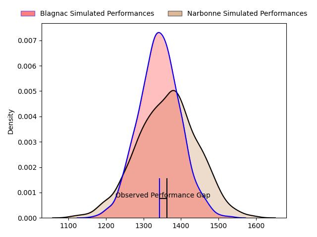
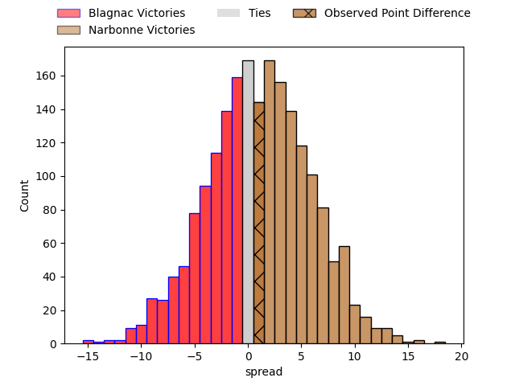

---  
layout: page  
title: Blagnac at Narbonne; 37-38  
date: 2023-04-01 18:30:00 18:00:00 -0500  
categories: match review  
---
# Blagnac at Narbonne; 37-38

# Club Level Predictions

The first set of predictions treats a club as the smallest object, as the club develops its members, organizes a gameplan, and deploys its players as needed for each match. This club model has a prediction of 0.527, which translates to predicting Narbonne to win by 1.0.

Each club has a rating and a rating deviation (simiar to a Glicko system), and expected performances can be generated. This allows for simulated matches and spreads like the ones below.
## Projected Performances

## Projected Spreads

## Projected Results

# Player Level Predictions

Treating teams instead as an entity made up of the currently active players, I have ratings for each player in an altogether different system. These can be combined to form team ratings once teamsheets are announced, weighting starters a bit higher than the reserves. After the match is played, players can be weighted by their minutes on the field, allowing for an accurate measure of the team's composition. With these compiled team ratings, we can make predictions, measure inaccuracy, and update the individual player ratings.
## Prediction with Player Minutes: Blagnac by 10.7

Blagnac by 14.7 on a neutral field

There were 21 large changes in win probability in this match
## Prediction without Player Minutes: Blagnac by 5.1

Blagnac by 9.1 on a neutral pitch

|   Away Minutes | Away Player          |   Away elo |   Away Percentile |   Number |   Home Percentile |   Home elo | Home Player           |   Home Minutes |
|---------------:|:---------------------|-----------:|------------------:|---------:|------------------:|-----------:|:----------------------|---------------:|
|             40 | Jean-Baptiste Martin |      88.11 |                19 |        1 |                57 |      97.45 | Geoffrey Moise        |             45 |
|             55 | Gabin Villerouge     |     108.41 |                87 |        2 |                36 |      90.96 | Christophe David      |             63 |
|             80 | Marc Ruiz            |      95    |               nan |        3 |                39 |      92.37 | Levi Tikoipau         |             42 |
|             80 | Vincent Mutel        |     116.39 |                90 |        4 |                26 |      88.2  | Morgan Maga           |             80 |
|             80 | Lucas Tolofua        |      68.12 |                 2 |        5 |                84 |     107.57 | Mauro Rebussone       |             55 |
|             40 | Alexandre Perrin     |      99.22 |                63 |        6 |                16 |      83.98 | Arthur Christienne    |             80 |
|             80 | Ianis Ponsole        |     106.57 |                77 |        7 |                38 |      91.66 | Paul Belzons          |             80 |
|             40 | Nekolo Tolofua       |      90.31 |                31 |        8 |                 4 |      71.05 | Flavien Nouhaillaguet |             42 |
|             80 | Paul Ravier          |     108.88 |                77 |        9 |                53 |      92.23 | Pablo Barbaste        |             63 |
|             40 | Antoine Renaud       |      73.51 |                 7 |       10 |                 9 |      78.41 | Tom Chauvet           |             80 |
|             80 | Dorian Terrou        |     109.96 |                83 |       11 |                29 |      88.87 | Pierre-Hugo Ducom     |             46 |
|             80 | Clément Vareilles    |     105.22 |                74 |       12 |                83 |     110.94 | José Lima             |             56 |
|             44 | Lukas Doyhenard      |      85.34 |                18 |       13 |                24 |      86.83 | Sébastien Giorgis     |             80 |
|             55 | Francois Tardieu     |      83.42 |                17 |       14 |                12 |      79.92 | Baptiste Tsague       |             80 |
|             80 | Jean-Andre Vernetti  |     122.74 |                93 |       15 |                25 |      87.29 | Paul Auradou          |             80 |
|             40 | Alexis Decaux        |     104.17 |                78 |       16 |                93 |     113.49 | Théo Castinel         |             35 |
|             25 | Leeroy Cloostermans  |     118.41 |                94 |       17 |               nan |      93.7  | Gabriel Atlan         |             17 |
|             40 | Benjamin Collet      |      96.91 |                53 |       18 |                37 |      84.08 | Matthieu Loudet       |             38 |
|             40 | Lilian Rousset       |     107.19 |                79 |       19 |                24 |      87.43 | Mohamed Kbaier        |             25 |
|             40 | Valentin Delpy       |     101.01 |                65 |       20 |                70 |     100.67 | Luke Nakobukobua      |             38 |
|             36 | Aurelien Labau       |      96.47 |                50 |       21 |                37 |      91.27 | Christopher Kaiser    |             17 |
|             25 | Lucas Martins        |      91.92 |                39 |       22 |                63 |      99.46 | Pierre Nueno          |             34 |
|            nan | nan                  |     nan    |               nan |       23 |                13 |      80.24 | Étienne Ducom         |             24 |

