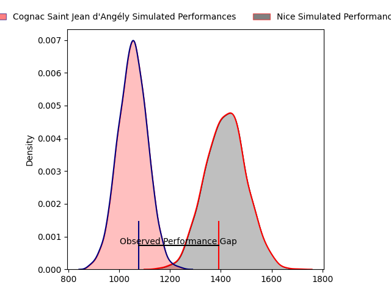
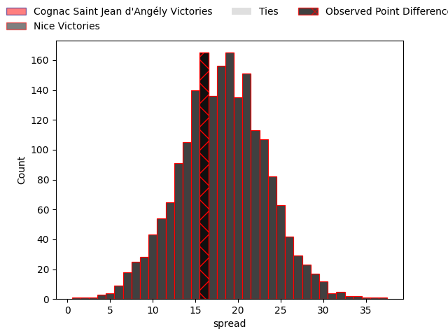

---  
layout: page  
title: Cognac Saint Jean d'Angély at Nice; 22-38  
date: 2023-04-01 17:00:00 18:00:00 -0500  
categories: match review  
---
# Cognac Saint Jean d'Angély at Nice; 22-38

# Club Level Predictions

The first set of predictions treats a club as the smallest object, as the club develops its members, organizes a gameplan, and deploys its players as needed for each match. This club model has a prediction of 0.886, which translates to predicting Nice to win by 18.1.

Each club has a rating and a rating deviation (simiar to a Glicko system), and expected performances can be generated. This allows for simulated matches and spreads like the ones below.
## Projected Performances

## Projected Spreads

## Projected Results

# Player Level Predictions

Treating teams instead as an entity made up of the currently active players, I have ratings for each player in an altogether different system. These can be combined to form team ratings once teamsheets are announced, weighting starters a bit higher than the reserves. After the match is played, players can be weighted by their minutes on the field, allowing for an accurate measure of the team's composition. With these compiled team ratings, we can make predictions, measure inaccuracy, and update the individual player ratings.
## Prediction with Player Minutes: Nice by 24.4

Nice by 20.4 on a neutral field

There were 3 large changes in win probability in this match
## Prediction without Player Minutes: Nice by 25.0

Nice by 21.0 on a neutral pitch

|   Away Minutes | Away Player          |   Away elo |   Away Percentile |   Number |   Home Percentile |   Home elo | Home Player          |   Home Minutes |
|---------------:|:---------------------|-----------:|------------------:|---------:|------------------:|-----------:|:---------------------|---------------:|
|             74 | Kevin Tougne         |     100.99 |                71 |        1 |                29 |      92.47 | Nika Neparidze       |             54 |
|             55 | Bryan Bruno          |      90.49 |               nan |        2 |                75 |     103.13 | Badri Alkhazashvili  |             54 |
|             80 | Manasa Saulo Romumu  |      98.8  |                63 |        3 |                33 |      91.01 | Jeronimo Negrotto    |             60 |
|             74 | Thomas Toevalu       |      57.56 |                 2 |        4 |                32 |      90.78 | Jérôme Mondoulet     |             54 |
|             80 | Clément Praud        |      57.17 |                 2 |        5 |                 8 |      76.2  | Martin Freytes       |             60 |
|             67 | Matthieu Thomas      |      94.73 |                47 |        6 |                83 |     110.39 | Steffon Armitage     |             80 |
|             80 | Damien Bonnet        |     107.18 |                72 |        7 |                59 |      98.89 | Arthur Vignolles     |             80 |
|             55 | Filipe Manu          |      89.11 |                29 |        8 |                94 |     123.41 | Laijiasa Bolenaivalu |             80 |
|             55 | William Beaudon      |      92.56 |                39 |        9 |                28 |      89.99 | Mathieu Lorée        |             60 |
|             80 | Mathis Garnier       |      56.45 |                 1 |       10 |                79 |     109.16 | Mathis Viard         |             80 |
|             58 | Vincent Pageneau     |      66.25 |                 3 |       11 |                61 |      99.17 | Clement Egiziano     |             80 |
|             80 | Serafin Bordoli      |      97.03 |                51 |       12 |                69 |     104.09 | Julien Fritz         |             65 |
|             80 | Henry Tuilagi        |      96.54 |                51 |       13 |                54 |      97.38 | Baptiste Delage      |             80 |
|             80 | Eneri Lotawa         |      80.48 |                13 |       14 |                50 |      95.91 | Augustin Slowik      |             80 |
|             80 | Nils Guyon           |      92.83 |                42 |       15 |                41 |      92.43 | Loic Le Gal          |             60 |
|              6 | Enrique Manukawera   |      95.21 |               nan |       16 |               nan |      93.39 | Nicolas Lemaire      |             26 |
|             25 | Maxime Gau           |      98.21 |                61 |       17 |                33 |      90.25 | Kurt Stanley Haupt   |             26 |
|              6 | Ratu Jone Naulunisau |      97.51 |                55 |       18 |                40 |      92.62 | Nicolas Ciancio      |             20 |
|             13 | Dany Antunes         |      84.63 |                20 |       19 |                67 |     101.13 | Marvin Woki          |             20 |
|             25 | Utu Maninoa          |      53.19 |                 1 |       20 |                34 |      90.3  | Louis Vincent        |             26 |
|             25 | Khaled Hammouten     |     100.47 |               nan |       21 |                67 |     101.1  | Agustin Ormaechea    |             20 |
|             22 | Mathieu Billou       |      84.94 |                18 |       22 |                84 |     112.02 | Luca Cutayar         |             15 |
|            nan | nan                  |     nan    |               nan |       23 |                52 |      96.88 | David Odiete         |             20 |

