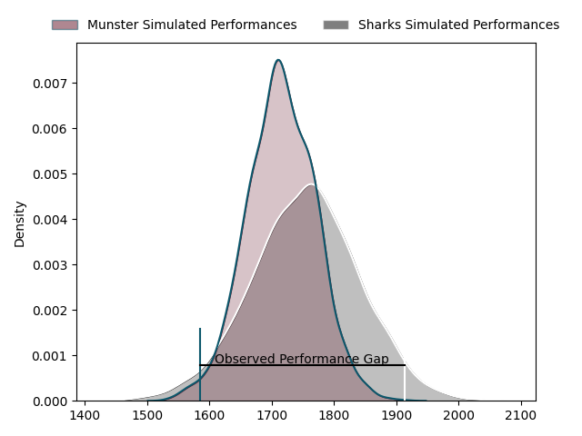
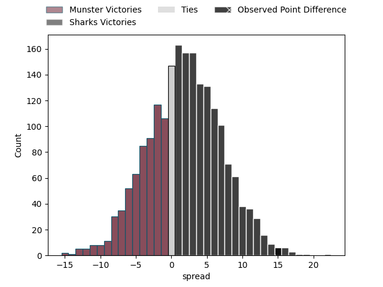

---  
layout: page  
title: Munster at Sharks; 35-50  
date: 2023-04-01 13:30:00 18:00:00 -0500  
categories: match review  
---
# Munster at Sharks; 35-50

# Club Level Predictions

The first set of predictions treats a club as the smallest object, as the club develops its members, organizes a gameplan, and deploys its players as needed for each match. This club model has a prediction of 0.553, which translates to predicting Sharks to win by 1.9.

Each club has a rating and a rating deviation (simiar to a Glicko system), and expected performances can be generated. This allows for simulated matches and spreads like the ones below.
## Projected Performances

## Projected Spreads

## Projected Results

# Player Level Predictions

Treating teams instead as an entity made up of the currently active players, I have ratings for each player in an altogether different system. These can be combined to form team ratings once teamsheets are announced, weighting starters a bit higher than the reserves. After the match is played, players can be weighted by their minutes on the field, allowing for an accurate measure of the team's composition. With these compiled team ratings, we can make predictions, measure inaccuracy, and update the individual player ratings.
## Prediction with Player Minutes: Sharks by 8.8

Sharks by 4.8 on a neutral field

There were 5 large changes in win probability in this match
## Prediction without Player Minutes: Sharks by 9.0

Sharks by 5.0 on a neutral pitch

|   Away Minutes | Away Player              |   Away elo |   Away Percentile |   Number |   Home Percentile |   Home elo | Home Player               |   Home Minutes |
|---------------:|:-------------------------|-----------:|------------------:|---------:|------------------:|-----------:|:--------------------------|---------------:|
|             60 | Dave Kilcoyne            |      98.52 |                61 |        1 |                72 |     101.67 | Retshegofaditswe Nche     |             59 |
|             50 | Niall Scannell           |     110.68 |                89 |        2 |                61 |      98.12 | Mbongeni Mbonambi         |             59 |
|             18 | Roman Salanoa            |      99.61 |                66 |        3 |                76 |     103.27 | Thomas Joubert du Toit    |             59 |
|             80 | Jean Kleyn               |     103.55 |                73 |        4 |                84 |     110.27 | Eben Etzebeth             |             41 |
|             48 | Rudolph Gerhardus Snyman |      91.74 |               nan |        5 |                39 |      93.05 | Douw Gerbrandt Grobler    |             80 |
|             54 | Peter O'Mahony           |      79.77 |                11 |        6 |                83 |     110.27 | Siya Kolisi               |             80 |
|             80 | John Hodnett             |     101.48 |                66 |        7 |                80 |     108.68 | Vincent Tshikaya Tshituka |             80 |
|             54 | Gavin Coombes            |      99.73 |                59 |        8 |                76 |     106.63 | Sikhumbuzo Notshe         |             80 |
|             48 | Craig Casey              |     110.87 |                87 |        9 |                80 |     107.42 | Jaden Hendrikse           |             17 |
|             80 | Jack Crowley             |      95.66 |                48 |       10 |                68 |     102.23 | Curwin Dominique Bosch    |             80 |
|             72 | Shane Daly               |     105.32 |                75 |       11 |                74 |     105.07 | Makazole Mapimpi          |             80 |
|             80 | Malakai Fekitoa          |      98.17 |                55 |       12 |                60 |      99.88 | Rohan Janse van Rensburg  |             62 |
|             80 | Antoine Frisch           |     111.02 |                83 |       13 |                82 |     110.27 | Lukhanyo Am               |             80 |
|             80 | Calvin Nash              |      93.37 |                43 |       14 |                76 |     105.77 | Werner Kok                |             80 |
|             80 | Michael Haley            |      94.78 |                48 |       15 |                66 |     102.7  | Boeta Chamberlain         |             69 |
|             20 | Josh Wycherley           |     102.33 |                83 |       16 |                72 |     101.53 | Khuthuzani Kingdom Mchunu |             21 |
|             30 | Diarmuid Barron          |      92.38 |                41 |       17 |                55 |      98.43 | Kerron van Vuuren         |             21 |
|             26 | Jack O'Donoghue          |      93.6  |                44 |       18 |                82 |     105.94 | Carlu Johann Sadie        |             21 |
|             62 | Stephen Archer           |      95.17 |               nan |       19 |                40 |      92.54 | Emile van Heerden         |              7 |
|             32 | Fineen Wycherley         |      94.86 |                47 |       20 |                72 |     103.94 | Grant Williams            |             63 |
|             26 | Alex Kendellen           |     101.62 |                68 |       21 |                37 |      92.37 | Ben Tapuai                |             18 |
|              8 | Joey Carbery             |     105.51 |                75 |       22 |                20 |      85.2  | Thaakir Abrahams          |             11 |
|             32 | Conor Murray             |     147.17 |                99 |       23 |                63 |     101.01 | Phendulani Buthelezi      |             32 |

