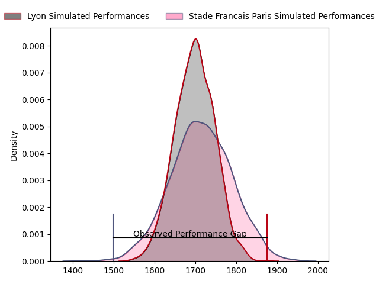
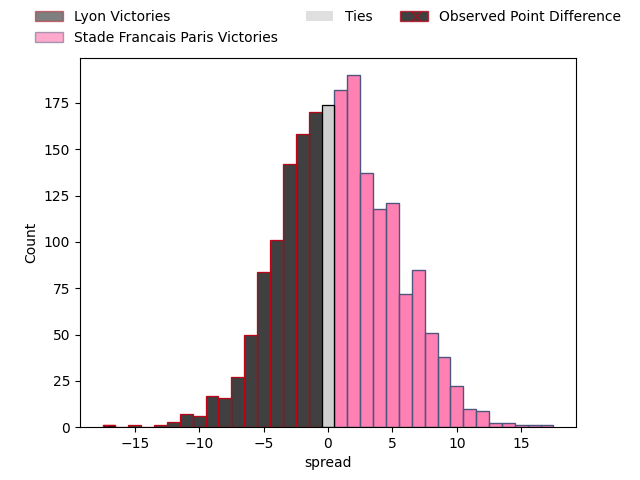

---  
layout: page  
title: Lyon at Stade Francais Paris; 41-24  
date: 2023-04-01 16:00:00 18:00:00 -0500  
categories: match review  
---
# Lyon at Stade Francais Paris; 41-24

# Club Level Predictions

The first set of predictions treats a club as the smallest object, as the club develops its members, organizes a gameplan, and deploys its players as needed for each match. This club model has a prediction of 0.525, which translates to predicting Stade Francais Paris to win by 0.9.

Each club has a rating and a rating deviation (simiar to a Glicko system), and expected performances can be generated. This allows for simulated matches and spreads like the ones below.
## Projected Performances

## Projected Spreads

## Projected Results

# Player Level Predictions

Treating teams instead as an entity made up of the currently active players, I have ratings for each player in an altogether different system. These can be combined to form team ratings once teamsheets are announced, weighting starters a bit higher than the reserves. After the match is played, players can be weighted by their minutes on the field, allowing for an accurate measure of the team's composition. With these compiled team ratings, we can make predictions, measure inaccuracy, and update the individual player ratings.
## Prediction with Player Minutes: Stade Francais Paris by 4.1

Stade Francais Paris by 0.1 on a neutral field

There were 3 large changes in win probability in this match
## Prediction without Player Minutes: Stade Francais Paris by 3.7

Lyon by 0.3 on a neutral pitch

|   Away Minutes | Away Player            |   Away elo |   Away Percentile |   Number |   Home Percentile |   Home elo | Home Player                   |   Home Minutes |
|---------------:|:-----------------------|-----------:|------------------:|---------:|------------------:|-----------:|:------------------------------|---------------:|
|             57 | Jerome Rey             |      94.6  |               nan |        1 |               nan |      92.8  | Vasil Kakovin                 |             50 |
|             48 | Liam Coltman           |      99.71 |                67 |        2 |                55 |      94.63 | Laurent Panis                 |             59 |
|             48 | Francisco Gomez Kodela |      91.68 |                41 |        3 |                65 |      95.03 | Vincent Philip Koch           |             53 |
|             80 | Killian Geraci         |      89.41 |               nan |        4 |               nan |      95    | Baptiste Pesenti              |             58 |
|             60 | Loann Goujon           |      84.5  |                24 |        5 |               nan |      95    | Pierre-Henri Azagoh           |             64 |
|             59 | Félix Lambey           |      94.15 |                46 |        6 |                44 |      93.7  | Ryan Chapuis                  |             58 |
|             80 | Liam Allen             |      95    |               nan |        7 |                42 |      90.74 | Mathieu Hirigoyen             |             80 |
|             80 | Arno Botha             |      94.93 |                42 |        8 |                30 |      89.97 | Giovanni Habel Kuffner        |             80 |
|             80 | Baptiste Couilloud     |      83.4  |                15 |        9 |                66 |     101.25 | Arthur Coville                |             80 |
|             80 | Lima Sopoaga           |      84.78 |                24 |       10 |                15 |      82.77 | Joris Segonds                 |             80 |
|             50 | Davit Niniashvili      |     116.37 |                88 |       11 |                35 |      88.31 | Peniasi Dakuwaqa              |             80 |
|             60 | Josua Tuisova          |      99.75 |                60 |       12 |                68 |     102.27 | Théo Dachary                  |             59 |
|             80 | Tavite Veredamu        |      94.85 |                47 |       13 |               nan |      92.78 | Paolo Odogwu                  |             80 |
|             48 | Ethan Dumortier        |     106.64 |                77 |       14 |                97 |     134.56 | Stéphane Ahmed                |             66 |
|             80 | Fletcher Smith         |     100.26 |                62 |       15 |                54 |      96.95 | Kylan Hamdaoui                |             80 |
|             23 | Feao Fotuaika          |      93.03 |               nan |       16 |                23 |      87.8  | Giorgi Melikidze              |             27 |
|             32 | Guillaume Marchand     |      97.83 |                60 |       17 |               nan |      95    | Nemo Gunther Roelofse         |             30 |
|             32 | Demba Bamba            |      99.07 |                64 |       18 |                31 |      89.77 | Mickaël Ivaldi                |             21 |
|             32 | Noa Nakaitaci          |      86.41 |                22 |       19 |                33 |      90.93 | Juan Martin Scelzo            |             22 |
|             30 | Kyle Godwin            |     107.38 |                65 |       20 |                53 |      96.87 | Juan John (JJ) van der Mescht |             22 |
|             20 | Jonathan Pelissié      |      90.43 |                38 |       21 |                20 |      85.13 | Paul Gabrillagues             |             16 |
|             21 | Beka Saghinadze        |     125.8  |                94 |       22 |                45 |      94.38 | Alex Arrate                   |             21 |
|             20 | Joel Kpoku             |      90.92 |                35 |       23 |                30 |      81.25 | James Hall                    |             14 |

