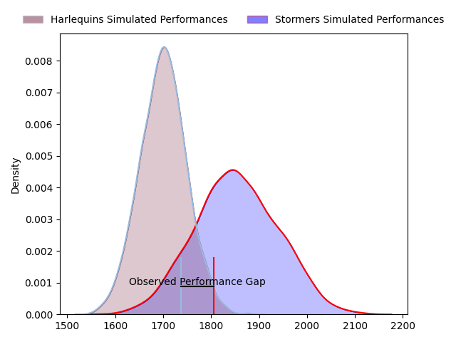
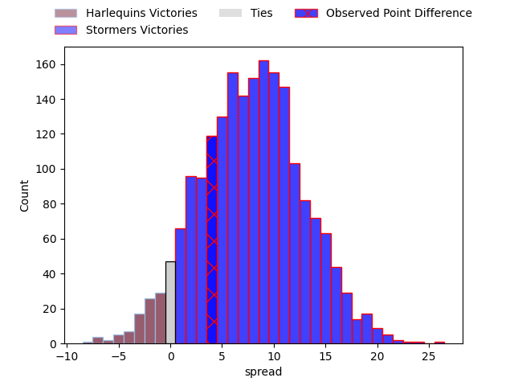
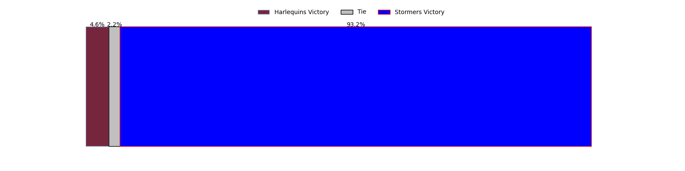

---  
layout: page  
title: Harlequins at Stormers; 28-32  
date: 2023-04-01 16:00:00 18:00:00 -0500  
categories: match review  
---
# Harlequins at Stormers; 28-32

# Club Level Predictions

The first set of predictions treats a club as the smallest object, as the club develops its members, organizes a gameplan, and deploys its players as needed for each match. This club model has a prediction of 0.708, which translates to predicting Stormers to win by 7.8.

Each club has a rating and a rating deviation (simiar to a Glicko system), and expected performances can be generated. This allows for simulated matches and spreads like the ones below.
## Projected Performances

## Projected Spreads

## Projected Results

# Player Level Predictions

Treating teams instead as an entity made up of the currently active players, I have ratings for each player in an altogether different system. These can be combined to form team ratings once teamsheets are announced, weighting starters a bit higher than the reserves. After the match is played, players can be weighted by their minutes on the field, allowing for an accurate measure of the team's composition. With these compiled team ratings, we can make predictions, measure inaccuracy, and update the individual player ratings.
## Prediction with Player Minutes: Harlequins by 0.4

Harlequins by 4.4 on a neutral field

There were 2 large changes in win probability in this match
## Prediction without Player Minutes: Stormers by 0.5

Harlequins by 3.5 on a neutral pitch

|   Away Minutes | Away Player       |   Away elo |   Away Percentile |   Number |   Home Percentile |   Home elo | Home Player                  |   Home Minutes |
|---------------:|:------------------|-----------:|------------------:|---------:|------------------:|-----------:|:-----------------------------|---------------:|
|             70 | Joe Marler        |      99.02 |                63 |        1 |                73 |     101.92 | Steven Kitshoff              |             60 |
|             69 | Jack Walker       |      76.28 |                 6 |        2 |                81 |     105.43 | Joseph Dweba                 |             56 |
|             56 | Wilco Louw        |     115.44 |                93 |        3 |                71 |     100.95 | Jozua Francois Malherbe      |             56 |
|             80 | Dino Lamb         |     115.93 |                90 |        4 |                27 |      89.04 | Ernst van Rhyn               |             80 |
|             69 | Irne Herbst       |     109.93 |                83 |        5 |                61 |      99.04 | Marvin Orie                  |             80 |
|             69 | Jack Kenningham   |      91.87 |                39 |        6 |                72 |     104.34 | Deon Fourie                  |             65 |
|             80 | Will Evans        |      82.98 |                14 |        7 |                82 |     109.73 | Ben-Jason Dixon              |             69 |
|             80 | Alex Dombrandt    |     137.37 |                98 |        8 |                52 |      98.15 | Hacjivah Dayimani            |             60 |
|             78 | Danny Care        |     107.96 |                81 |        9 |                64 |     100.06 | Herschel Jerome Jantjies     |             65 |
|             80 | Marcus Smith      |     127.61 |                94 |       10 |                78 |     107.71 | Immanuel Libbok              |             80 |
|             78 | Cadan Murley      |      95.11 |                47 |       11 |                81 |     109.51 | Seabelo Senatla              |             63 |
|             80 | Andre Esterhuizen |     114.42 |                87 |       12 |                80 |     109    | Daniel Michael du Plessis    |             80 |
|             60 | Luke Northmore    |     120.38 |                92 |       13 |                47 |      95.18 | Adriaan Ruhan Nel            |             80 |
|             80 | Joe Marchant      |     100.55 |                65 |       14 |                87 |     114.68 | Suleiman  Hartzenberg        |             80 |
|             80 | Nick David        |      95.46 |                49 |       15 |                73 |     104.61 | Damian Willemse              |             80 |
|             10 | Fin Baxter        |      89.11 |                26 |       16 |                68 |      99.63 | Juan Brok Harris             |             20 |
|             11 | Tom Lawday        |      87.43 |                23 |       17 |                40 |      91.62 | JJ Kotze                     |             24 |
|             11 | Sam Riley         |      95.37 |                49 |       18 |                65 |     102.13 | Johan Neethling Fouche       |             24 |
|             24 | Will Collier      |      95    |               nan |       19 |                17 |      85.7  | Willem Gerhardus Engelbrecht |             15 |
|              2 | Lewis Gjaltema    |      98.2  |                57 |       20 |                38 |      91.58 | Gary Porter                  |             11 |
|              2 | Tommaso Allan     |     100.03 |                61 |       21 |                23 |      88.33 | Marcel Theunissen            |             20 |
|             20 | Oscar Beard       |     105.78 |                75 |       22 |                61 |      99.5  | Albertus Paul de Wet         |             15 |
|             11 | George Hammond    |      80.65 |                10 |       23 |                47 |      94.64 | Clayton Blommetjies          |             17 |

