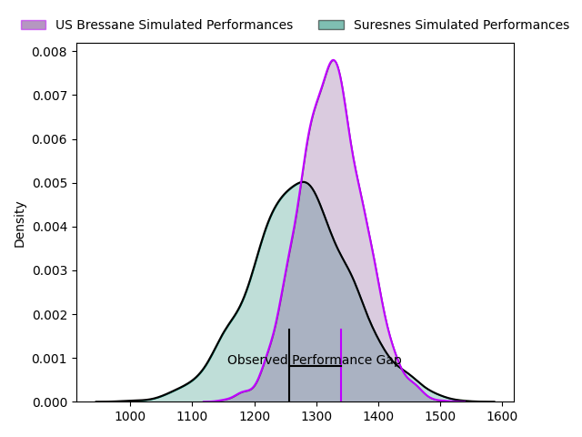
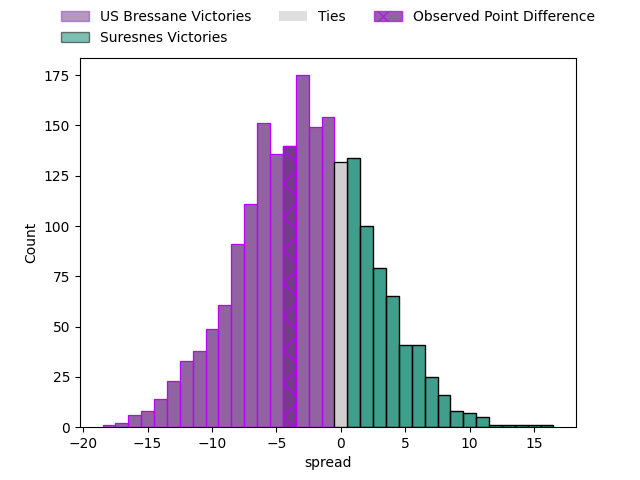

---  
layout: page  
title: US Bressane at Suresnes; 20-16  
date: 2023-04-01 18:00:00 18:00:00 -0500  
categories: match review  
---
# US Bressane at Suresnes; 20-16

# Club Level Predictions

The first set of predictions treats a club as the smallest object, as the club develops its members, organizes a gameplan, and deploys its players as needed for each match. This club model has a prediction of 0.427, which translates to predicting US Bressane to win by 2.6.

Each club has a rating and a rating deviation (simiar to a Glicko system), and expected performances can be generated. This allows for simulated matches and spreads like the ones below.
## Projected Performances

## Projected Spreads

## Projected Results

# Player Level Predictions

Treating teams instead as an entity made up of the currently active players, I have ratings for each player in an altogether different system. These can be combined to form team ratings once teamsheets are announced, weighting starters a bit higher than the reserves. After the match is played, players can be weighted by their minutes on the field, allowing for an accurate measure of the team's composition. With these compiled team ratings, we can make predictions, measure inaccuracy, and update the individual player ratings.
## Prediction with Player Minutes: Suresnes by 1.0

US Bressane by 3.0 on a neutral field

There were 9 large changes in win probability in this match
## Prediction without Player Minutes: Suresnes by 1.0

US Bressane by 3.0 on a neutral pitch

|   Away Minutes | Away Player                 |   Away elo |   Away Percentile |   Number |   Home Percentile |   Home elo | Home Player             |   Home Minutes |
|---------------:|:----------------------------|-----------:|------------------:|---------:|------------------:|-----------:|:------------------------|---------------:|
|             65 | Vazha Kapanadze             |      79.44 |                12 |        1 |                50 |      95.38 | Beka Kakabadze          |             46 |
|             56 | Clément Jullien             |      83.49 |                18 |        2 |                32 |      90.11 | Thomas Bordes           |             52 |
|             59 | Willem Johannes Harmse      |      85.82 |                23 |        3 |                57 |      97.46 | Leandro Mario Assi      |             38 |
|             68 | Koen Bloemen                |      95.91 |                52 |        4 |                 3 |      66.56 | Sacha Yahi              |             80 |
|             80 | Marius Constantin Antonescu |      90.08 |                32 |        5 |                25 |      87.99 | Yakine Djebarri         |             63 |
|             80 | Nicolas Tachat              |      79.73 |                25 |        6 |                26 |      88.47 | Florian Desbordes       |             80 |
|             61 | Loïc Baradel                |      87.79 |                25 |        7 |                36 |      91.44 | Wian Vosloo             |             52 |
|             44 | Wael May                    |     104.86 |                71 |        8 |                46 |      96.42 | Antonie Delport Claasen |             80 |
|             54 | Nicolas Faure               |     118.36 |                94 |        9 |                12 |      79.9  | Quentin Dauvergne       |             54 |
|             80 | Sebastian Poet              |     110.92 |                82 |       10 |                50 |      96.4  | Ignacio Mieres          |             80 |
|             80 | Kavekini Tabu               |      89.98 |                33 |       11 |                53 |      97.01 | Pierre Le Huby          |             57 |
|             80 | Parataiso Silafai-Lea'ana   |     125.75 |                95 |       12 |                57 |      98.9  | Arthur Proult           |             80 |
|             62 | Maile Mamao                 |      72.98 |                 7 |       13 |                60 |      99.74 | Lilan Savioz Fouillet   |             80 |
|             80 | Élie De Fleurian            |      86.41 |                22 |       14 |                33 |      89.95 | Alexis Clement          |             80 |
|             80 | Audric Sanlaville           |      85.82 |                22 |       15 |                17 |      82.05 | Goulwen Gueho           |             40 |
|             15 | Teo Bordenave               |      84.63 |                16 |       16 |                19 |      87.93 | Hayam El Bibouji        |             28 |
|             24 | Sione Anga'aelangi          |      95.74 |                54 |       17 |                55 |      94.79 | Elias Coulibaly         |             34 |
|             21 | Erich de Jager              |      38.02 |                 0 |       18 |                66 |     100.91 | Victor Damian Arias     |             42 |
|             12 | Thomas Déliance             |     108.77 |                78 |       19 |                75 |     105.88 | Bastien Berenguel       |             17 |
|             36 | TJ Ioane                    |     103.7  |                72 |       20 |                67 |     101.62 | Théo David Nathan Tanda |             28 |
|             19 | Dimitri Jean Etienne        |      75    |                 6 |       21 |                31 |      89.88 | Théo Bachiri            |             26 |
|             26 | Jérémy Valençot             |      98.53 |                56 |       22 |                 0 |      46.97 | Jean-Baptiste Fuster    |             23 |
|             18 | Christian Lacombe           |      81.96 |                14 |       23 |                12 |      79.98 | Thomas Baudy            |             40 |

