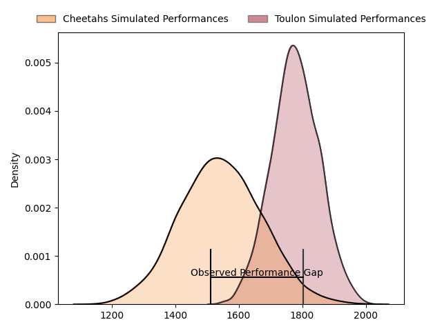
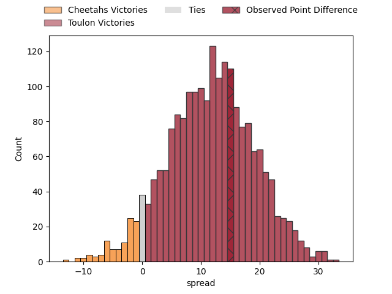

---  
layout: page  
title: Cheetahs at Toulon; 21-36  
date: 2023-04-01 13:30:00 18:00:00 -0500  
categories: match review  
---
# Cheetahs at Toulon; 21-36

# Club Level Predictions

The first set of predictions treats a club as the smallest object, as the club develops its members, organizes a gameplan, and deploys its players as needed for each match. This club model has a prediction of 0.782, which translates to predicting Toulon to win by 11.9.

Each club has a rating and a rating deviation (simiar to a Glicko system), and expected performances can be generated. This allows for simulated matches and spreads like the ones below.
## Projected Performances

## Projected Spreads

## Projected Results

# Player Level Predictions

Treating teams instead as an entity made up of the currently active players, I have ratings for each player in an altogether different system. These can be combined to form team ratings once teamsheets are announced, weighting starters a bit higher than the reserves. After the match is played, players can be weighted by their minutes on the field, allowing for an accurate measure of the team's composition. With these compiled team ratings, we can make predictions, measure inaccuracy, and update the individual player ratings.
## Prediction with Player Minutes: Toulon by 6.7

Toulon by 2.7 on a neutral field

There were 7 large changes in win probability in this match
## Prediction without Player Minutes: Toulon by 6.1

Toulon by 2.1 on a neutral pitch

|   Away Minutes | Away Player                    |   Away elo |   Away Percentile |   Number |   Home Percentile |   Home elo | Home Player         |   Home Minutes |
|---------------:|:-------------------------------|-----------:|------------------:|---------:|------------------:|-----------:|:--------------------|---------------:|
|             51 | Schalk Ferreira                |     104.57 |                80 |        1 |                64 |     102.48 | Bruce Devaux        |             48 |
|             41 | Marnus van der Merwe           |      99.69 |                67 |        2 |                85 |     108.83 | Teddy Baubigny      |             48 |
|             41 | Hencus van Wyk                 |     112.15 |                90 |        3 |                75 |     102.51 | Kieran Brookes      |             48 |
|             80 | Rynier Mark Bernardo           |     105.92 |                77 |        4 |                75 |     104.33 | Swan Rebbadj        |             80 |
|             75 | Victor Kutlwano Sekekete       |      96.91 |                54 |        5 |                35 |      92.06 | Adrien Warion       |             80 |
|             55 | Gideon van der Merwe           |     121.71 |                92 |        6 |                49 |      95.38 | Jules Coulon        |             69 |
|             57 | Oupa Mohoje                    |      94.81 |                48 |        7 |                70 |     105.48 | Facundo Isa         |             80 |
|             80 | Jeandre Rudolph                |     101.48 |                65 |        8 |                41 |      94.23 | Sergio Parisse      |             59 |
|             80 | Ruan Pienaar                   |     108.98 |                83 |        9 |                21 |      88.64 | Benoit Paillaugue   |             55 |
|             75 | Reinhardt Fortuin              |      96.56 |                50 |       10 |                98 |     139.66 | Dan Biggar          |             55 |
|             80 | Munier Hartzenberg             |     107.61 |                79 |       11 |                70 |     104.97 | Aymeric Luc         |             80 |
|             80 | Robert Thompson Ebersohn       |     101.25 |                64 |       12 |                65 |     101.83 | Waisea Nayacavelu   |             69 |
|             80 | David Benjamin Brits           |      93.01 |                46 |       13 |               nan |      98.64 | Jérémy Sinzelle     |             80 |
|             80 | Daniel Kasende Kalepula        |      93.35 |                43 |       14 |                66 |     101.56 | Jiuta Wainiqolo     |             80 |
|             57 | Tapiwa Lloyd Mafura            |      83.81 |                19 |       15 |                73 |     106.44 | Thomas Salles       |             80 |
|             29 | Alulutho Tshakweni             |      97.59 |                71 |       16 |                73 |     102.04 | Dany Priso          |             32 |
|             39 | Marko Louis Janse van Rensburg |      80.01 |                12 |       17 |               nan |      94.95 | Christopher Tolofua |             32 |
|              5 | Mzwanele Richman Zito          |     103.15 |                72 |       18 |                91 |     114.03 | Beka Gigashvili     |             32 |
|             39 | Ngobisizwe Mxoli               |      94.94 |               nan |       19 |                66 |     101.21 | Matthias Halagahu   |             11 |
|             25 | Daniel Johannes Maartens       |     124.29 |                89 |       20 |                55 |      98.92 | Mathieu Bastareaud  |             21 |
|             23 | Sibabalo Qoma                  |     102.3  |                72 |       21 |                71 |     100.76 | Jules Danglot       |             25 |
|              5 | Rewan Kruger                   |      95.29 |                33 |       22 |                69 |     102.66 | Ihaia West          |             25 |
|             23 | Cohen Jasper                   |     104.97 |                70 |       23 |                16 |      83.5  | Maëlan Rabut        |             11 |

