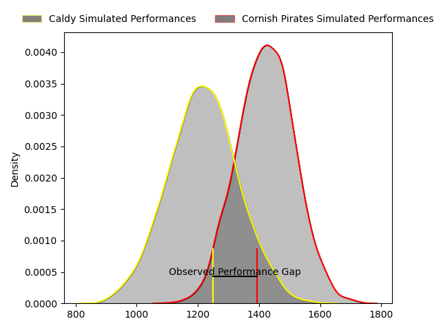
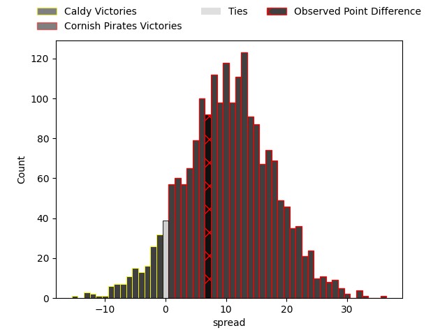

---  
layout: page  
title: Caldy at Cornish Pirates; 21-28  
date: 2023-04-02 15:30:00 18:00:00 -0500  
categories: match review  
---
# Caldy at Cornish Pirates; 21-28

# Club Level Predictions

The first set of predictions treats a club as the smallest object, as the club develops its members, organizes a gameplan, and deploys its players as needed for each match. This club model has a prediction of 0.75, which translates to predicting Cornish Pirates to win by 10.2.

Each club has a rating and a rating deviation (simiar to a Glicko system), and expected performances can be generated. This allows for simulated matches and spreads like the ones below.
## Projected Performances

## Projected Spreads

## Projected Results

# Player Level Predictions

Treating teams instead as an entity made up of the currently active players, I have ratings for each player in an altogether different system. These can be combined to form team ratings once teamsheets are announced, weighting starters a bit higher than the reserves. After the match is played, players can be weighted by their minutes on the field, allowing for an accurate measure of the team's composition. With these compiled team ratings, we can make predictions, measure inaccuracy, and update the individual player ratings.
## Prediction with Player Minutes: Cornish Pirates by 7.1

Cornish Pirates by 3.1 on a neutral field

There were 11 large changes in win probability in this match
## Prediction without Player Minutes: Cornish Pirates by 7.4

Cornish Pirates by 3.4 on a neutral pitch

|   Away Minutes | Away Player       |   Away elo |   Away Percentile |   Number |   Home Percentile |   Home elo | Home Player       |   Home Minutes |
|---------------:|:------------------|-----------:|------------------:|---------:|------------------:|-----------:|:------------------|---------------:|
|             55 | Adam Aigbokhae    |     102.44 |                74 |        1 |                98 |     129.97 | Jack Andrew       |             40 |
|             50 | Ethan Caine       |      92.43 |               nan |        2 |                48 |      93.98 | Morgan Nelson     |             48 |
|             71 | Ryan Higginson    |      95.92 |                54 |        3 |               nan |      97.82 | Hayden King       |             48 |
|             80 | Josiah Dickinson  |      96.97 |                54 |        4 |                 4 |      66.19 | Cory Teague       |             55 |
|             71 | Thomas Sanders    |      91.17 |                35 |        5 |                36 |      91.4  | Will Britton      |             80 |
|             80 | Harrison Crowe    |      74.44 |                 6 |        6 |                25 |      87.87 | Alex Everett      |             80 |
|             50 | Nyle Davidson     |      98.46 |                57 |        7 |                93 |     122.97 | John Stevens      |             80 |
|             80 | Callum Ridgway    |      88.75 |                29 |        8 |                29 |      89.15 | Ben Grubb         |             55 |
|             50 | Joseph Murray     |      83.64 |                15 |        9 |                10 |      78.44 | Alex Schwarz      |             55 |
|             55 | Ezra Hinchcliffe  |      97.61 |                56 |       10 |                51 |      96.91 | Harry Bazalgette  |             55 |
|             80 | Michael Cartmill  |      95.95 |                50 |       11 |                42 |      92.9  | Arthur Relton     |             65 |
|             55 | Lewis Barker      |      95.96 |                49 |       12 |                46 |      89.61 | Garyn Smith       |             80 |
|             80 | Dan Bibby         |      87.97 |                26 |       13 |                48 |      95.27 | Rory Parata       |             80 |
|             80 | Nick Royle        |      92.46 |                40 |       14 |                42 |      92.94 | Robin Wedlake     |             80 |
|             80 | Elliott Gourlay   |      97.49 |                54 |       15 |                87 |     114.04 | Alexander AJ Cant |             80 |
|             30 | Oliver Hearn      |      96.11 |                55 |       16 |                 6 |      74.93 | Ollie Adkins      |             40 |
|             30 | Chris Pilgrim     |      97.41 |                55 |       17 |               nan |      91.72 | Max Norey         |             32 |
|             30 | Thomas Parry      |      97.1  |               nan |       18 |                62 |      94.11 | Matt Johnson      |             32 |
|             25 | Rhys Hayes        |      84.5  |                19 |       19 |                41 |      92.9  | Arwel Robson      |             25 |
|             25 | Michael Barlow    |      97.72 |                55 |       20 |                40 |      92.39 | James Fender      |             25 |
|             25 | William Sanderson |      90.9  |               nan |       21 |                31 |      89.89 | Jarrad Hayler     |             25 |
|              9 | Sam Olyott        |      95    |               nan |       22 |                61 |      98.23 | Ruaridh Dawson    |             25 |
|              9 | Thomas Clarke     |      93.97 |               nan |       23 |                19 |      84.9  | Joe Elderkin      |             15 |

