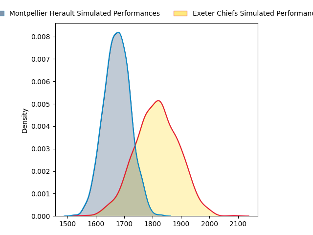
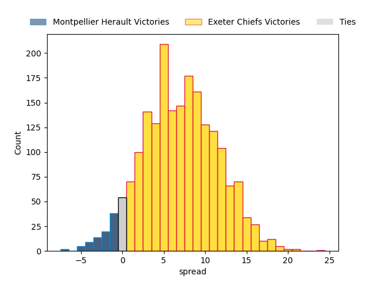
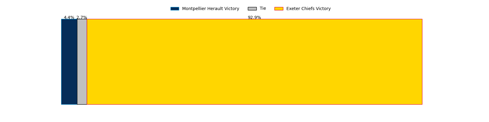

---  
layout: page  
title: Montpellier Herault at Exeter Chiefs; 33-33  
date: 2023-04-02 13:30:00 18:00:00 -0500  
categories: match review  
---
# Montpellier Herault at Exeter Chiefs; 33-33

# Club Level Predictions

The first set of predictions treats a club as the smallest object, as the club develops its members, organizes a gameplan, and deploys its players as needed for each match. This club model has a prediction of 0.682, which translates to predicting Exeter Chiefs to win by 6.7.

Each club has a rating and a rating deviation (simiar to a Glicko system), and expected performances can be generated. This allows for simulated matches and spreads like the ones below.
## Projected Performances

## Projected Spreads

## Projected Results

# Player Level Predictions

Treating teams instead as an entity made up of the currently active players, I have ratings for each player in an altogether different system. These can be combined to form team ratings once teamsheets are announced, weighting starters a bit higher than the reserves. After the match is played, players can be weighted by their minutes on the field, allowing for an accurate measure of the team's composition. With these compiled team ratings, we can make predictions, measure inaccuracy, and update the individual player ratings.
## Prediction with Player Minutes: Exeter Chiefs by 29.3

Exeter Chiefs by 25.3 on a neutral field

There were 13 large changes in win probability in this match
## Prediction without Player Minutes: Exeter Chiefs by 0.1

Montpellier Herault by 3.9 on a neutral pitch

|   Away Minutes | Away Player                         |   Away elo |   Away Percentile |   Number |   Home Percentile |   Home elo | Home Player       |   Home Minutes |
|---------------:|:------------------------------------|-----------:|------------------:|---------:|------------------:|-----------:|:------------------|---------------:|
|             80 | Enzo Forletta                       |     100.63 |                64 |        1 |                63 |      99.03 | Scott Sio         |             70 |
|              3 | Brandon Paenga-Amosa                |     100.78 |                65 |        2 |                99 |     136.17 | Dan Frost         |             57 |
|             53 | Henry Thomas                        |      97.3  |               nan |        3 |                 9 |      79.2  | Marcus Street     |             52 |
|             80 | Elliott Stooke                      |     104.79 |                64 |        4 |                54 |      96.98 | Jonny Gray        |             80 |
|             68 | Tyler Evan Duguid                   |     101.33 |                68 |        5 |                94 |     121.82 | Dafydd Jenkins    |             80 |
|             80 | Nicolaas Jacobus Janse van Rensburg |     101.12 |                65 |        6 |                91 |     117.51 | Jannes Kirsten    |             51 |
|             60 | Masivesi Dakuwaqa                   |     106.48 |                76 |        7 |                25 |      87.84 | Christ Tshiunza   |             63 |
|             80 | Zach Mercer                         |     105.59 |                75 |        8 |                92 |     121.63 | Sam Simmonds      |             80 |
|             57 | Jacobus Meyer Reinach               |     110.62 |                86 |        9 |               nan |      95.65 | Will Becconsall   |             60 |
|             80 | Paolo Garbisi                       |     107.97 |                79 |       10 |                46 |      94.87 | Joe Simmonds      |             80 |
|             63 | Vincent Rattez                      |     100.28 |                63 |       11 |                52 |      97.09 | Rory O'Loughlin   |             73 |
|             57 | Jan Lodewyk Serfontein              |     117.84 |                91 |       12 |               nan |      95    | Sean O'Brien      |             80 |
|             80 | Thomas Darmon                       |     103.03 |                68 |       13 |                63 |     100.73 | Henry Slade       |             80 |
|             80 | Ben Lam                             |      94.73 |               nan |       14 |                11 |      79.15 | Jack Nowell       |             80 |
|             80 | Anthony Bouthier                    |     105.06 |                70 |       15 |                38 |      91.79 | Tom Wyatt         |             80 |
|             96 | Curtis Langdon                      |      96.4  |               nan |       16 |               nan |      91.91 | Jack Yeandle      |             42 |
|             46 | Mohamed Haouas                      |      99.62 |                66 |       17 |                91 |     113.5  | Nika Abuladze     |             29 |
|             31 | Marco Tauleigne                     |      97.05 |                48 |       18 |                51 |      95.59 | Josh Iosefa-Scott |             47 |
|             39 | Lenni Nouchi                        |     101    |                53 |       19 |                97 |     134.69 | Dave Ewers        |             48 |
|             42 | Léo Coly                            |     101.18 |                68 |       20 |               nan |      95    | Tom Cairns        |             39 |
|             36 | George Bridge                       |     114.48 |                86 |       21 |               nan |      95    | Aidon Davis       |             36 |
|             42 | Louis Carbonel                      |      93.01 |                34 |       22 |                 6 |      71.02 | Josh Hodge        |             26 |

